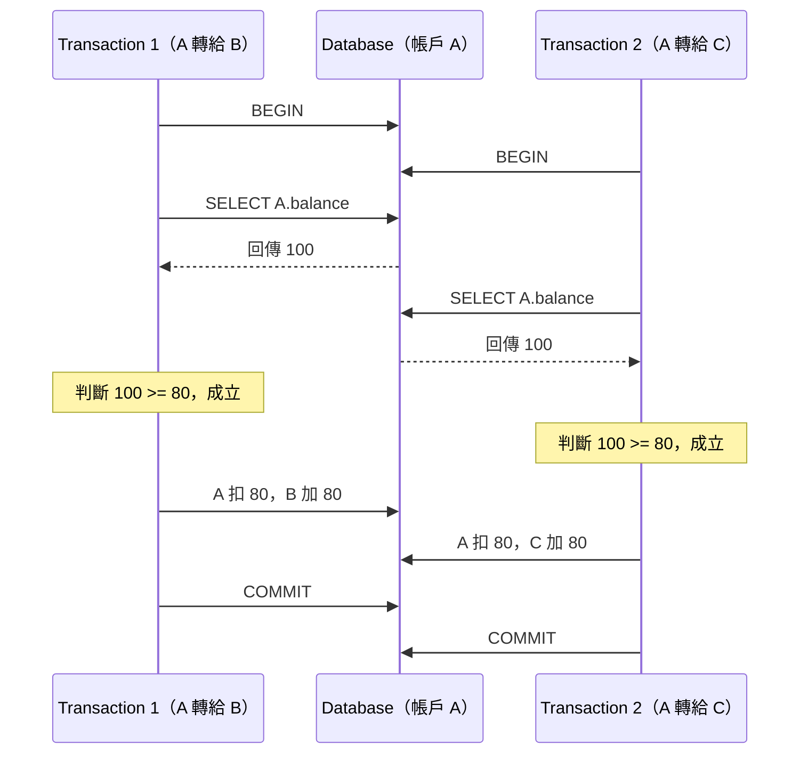
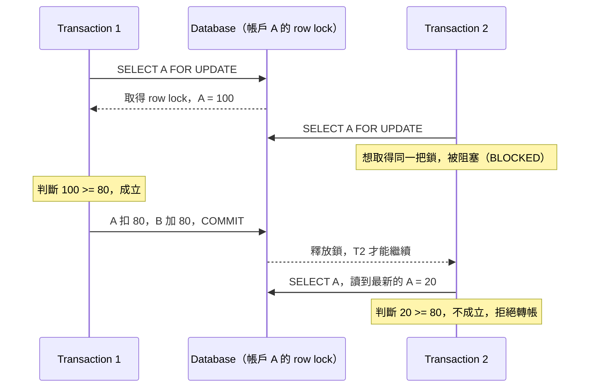
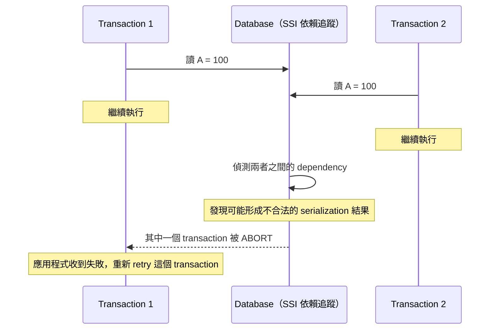



<!-- tab 情境切入-->

Database · Concurrency Control
<h1>🐘 為什麼加了 Transaction，帳戶餘額還是會算錯</h1>

轉帳這種先查詢、再判斷、最後修改的邏輯，就算包在 <code>BEGIN</code> 與 <code>COMMIT</code> 之間，同時有兩筆請求進來時，餘額還是有可能算錯。原因不是 transaction 沒生效，而是 transaction 保證的東西，跟表面上看起來的並不完全一樣。

<section>

01

<h2>情境</h2>

有三個帳戶

<table>
<thead><tr><th>帳戶</th><th>餘額</th></tr></thead>
<tbody>
<tr><td>A</td><td>100 元</td></tr>
<tr><td>B</td><td>100 元</td></tr>
<tr><td>C</td><td>100 元</td></tr>
</tbody>
</table>

現在幾乎同時來了兩個請求，一個要從 <code>A</code> 轉 80 元給 <code>B</code>，另一個要從 <code>A</code> 轉 80 元給 <code>C</code>。應用程式常見的寫法是這樣：

<pre class="pg-pre" data-lang="sql">BEGIN;
balance = SELECT balance FROM accounts WHERE id = 'A';
IF balance >= 80 THEN
    UPDATE accounts SET balance = balance - 80 WHERE id = 'A';
    UPDATE accounts SET balance = balance + 80 WHERE id = 'B';
END IF;
COMMIT;</pre>

另一個處理另一筆轉帳的執行緒，同時做著幾乎一模一樣的事情，只是把最後的收款帳戶換成 <code>C</code>。

⚠️

即使整段邏輯用 <code>BEGIN</code> 與 <code>COMMIT</code> 包起來，也不代表這兩筆轉帳彼此看不到對方、不會互相干擾。因為 transaction 其實同時在處理兩件不同的事，一件是這段操作要嘛全部成功、要嘛全部失敗，另一件是多個 transaction 同時執行時，彼此能看到什麼、會不會互相踩到對方的資料。

這兩件事分別對應 <code>ACID</code> 的

<h4>Atomicity（原子性）</h4>

保證一個 transaction 內的多個操作，要嘛全部成功，要嘛全部沒發生，不會卡在做一半的狀態。

<h4>Isolation（隔離性）</h4>

決定多個 transaction 同時執行時，彼此能看到什麼版本的資料，能不能同時修改同一筆資料。

其中又以 Isolation 最關鍵，因為 Atomicity 只保證單一 transaction 不會做一半失敗，並不保證兩個同時執行的 transaction 不會互相干擾。

</section>

<!-- endtab -->

<!-- tab Atomicity-->

<section>

02

<h2>Atomicity</h2>

假設一筆轉帳需要兩個操作，先扣款再加款：

A 扣 80

→

B 加 80

如果沒有 transaction 保護，這兩步之間任何一個環節出狀況，都可能只完成一半。

1

A 扣款成功

<code>A</code> 的餘額從 100 變成 20，這一步已經寫入資料庫。

2

伺服器在這裡當機

<code>B</code> 加款的那一步還沒執行，程式就中斷了。

💥

<strong>結果：</strong><code>A</code> 變成 20，<code>B</code> 還是 100，中間的 80 元從系統裡憑空消失，帳目對不起來。

Transaction 的 Atomicity 能保證的是，把這兩個操作包進同一個 <code>BEGIN</code> 到 <code>COMMIT</code> 之間之後，最終只會有兩種結果，不會停在半途。

<table>
<thead><tr><th>情境</th><th>A 餘額</th><th>B 餘額</th><th>是否允許</th></tr></thead>
<tbody>
<tr><td>全部成功</td><td>20</td><td>180</td><td>允許</td></tr>
<tr><td>全部失敗（rollback）</td><td>100</td><td>100</td><td>允許</td></tr>
<tr><td>只扣款、沒加款</td><td>20</td><td>100</td><td>不允許</td></tr>
</tbody>
</table>

所以 Atomicity 解決的問題，是一個 transaction 做到一半失敗這種情境，可以理解成整組操作只有全部成功或全部失敗兩種結局，這就是 <code>ACID</code> 裡的 <code>A</code>。不過這件事完全沒有觸及另一個同時執行的 transaction 會不會看到中間狀態、會不會跟這筆轉帳互相干擾，那是 Isolation 要處理的範圍。

</section>

<!-- endtab -->

<!-- tab Isolation-->

<section>

03

<h2>Isolation</h2>

多個 transaction 同時執行的時候，彼此可以看到什麼，會不會互相踩到對方還沒確定的資料。回到最開始的情境，兩筆轉帳同時進行時，實際發生的時序可能像這樣：

兩邊都讀到 <code>A = 100</code>，都判斷餘額足夠，於是都各自完成了自己的轉帳。最後的結果是：

<table>
<thead><tr><th>帳戶</th><th>最終餘額</th></tr></thead>
<tbody>
<tr><td>A</td><td>20</td></tr>
<tr><td>B</td><td>180</td></tr>
<tr><td>C</td><td>180</td></tr>
</tbody>
</table>

🚨

系統實際上等於發出去了 160 元（B 收到 80，C 收到 80），但 <code>A</code> 一開始只有 100 元。這種兩個 transaction 各自檢查條件時都成立，合併起來卻超出實際限制的狀況，就是 race condition。

而最容易被忽略的地方在於，<code>BEGIN</code> 與 <code>COMMIT</code> 本身並不會自動保證這種事不會發生。以 PostgreSQL 為例，預設的 isolation level 是 <code>READ COMMITTED</code>。這個等級能保證的仍然是 Atomicity 那部分，但如果應用程式的邏輯是先 <code>SELECT</code>、在應用程式裡判斷、之後才 <code>UPDATE</code>，這種讀取與判斷之間的空窗期，並不會被 <code>READ COMMITTED</code> 自動堵住，仍然需要額外處理 concurrency，例如接下來提到的三種方法。

</section>

<!-- endtab -->

<!-- tab 方法一：鎖住 A-->

<section>

04

<h2>方法一：用 FOR UPDATE 鎖住那一筆資料</h2>

以 PostgreSQL 為例，可以在 <code>SELECT</code> 的時候加上 <code>FOR UPDATE</code>：

<pre class="pg-pre" data-lang="sql">BEGIN;
SELECT balance
FROM accounts
WHERE id = 'A'
FOR UPDATE;</pre>

這裡的 <code>FOR UPDATE</code> 是關鍵，效果可以理解成，先執行的 transaction 等於在跟資料庫說，正在處理帳戶 <code>A</code>，在這筆處理完成之前，其他 transaction 不准修改這一筆資料。實際的執行時序如下：

先執行的 <code>T1</code> 完成扣款並提交之後，鎖才釋放，接手的 <code>T2</code> 這時讀到的已經是最新的餘額 20，判斷 20 是否大於等於 80 不成立，於是拒絕這筆轉帳。最終結果會是正確的：

結果
<strong>兩筆轉帳依序處理，沒有超額</strong>

<code>A</code> 剩下 20，<code>B</code> 收到轉帳變成 180，<code>C</code> 因為餘額不足被擋下，維持 100。

這個做法的核心概念，是先讀資料、再由應用程式根據資料做判斷，所以在 <code>SELECT</code> 的當下就把這筆資料鎖住，屬於悲觀式的做法，先阻止其他 transaction 有機會碰到這筆還在處理中的資料。

</section>

<!-- endtab -->

<!-- tab 方法二：Conditional UPDATE-->

<section>

05

<h2>方法二：把檢查條件寫進 UPDATE 本身</h2>

另一種做法是不要先 <code>SELECT</code>、判斷、再 <code>UPDATE</code>，而是讓 <code>UPDATE</code> 本身就帶有條件：

<pre class="pg-pre" data-lang="sql">UPDATE accounts
SET balance = balance - 80
WHERE id = 'A'
  AND balance >= 80;</pre>

接著只要檢查這行語句實際影響了幾筆資料，也就是 <code>affected rows</code>，如果是 1 才代表扣款真的成功。

T1 執行 UPDATE

→

A 扣款成功，變成 20

→

T2 執行 UPDATE

→

balance >= 80 不成立

→

affected rows = 0，轉帳失敗

假設 <code>T1</code> 與 <code>T2</code> 幾乎同時對 <code>A = 100</code> 發出這個條件式 <code>UPDATE</code>，資料庫層級會保證這兩個 <code>UPDATE</code> 不會同時套用在同一筆資料上。先完成的那一個會把 <code>A</code> 改成 20，後面那一個再檢查 <code>balance >= 80</code> 時，因為 20 已經不滿足這個條件，這次 <code>UPDATE</code> 影響的資料筆數就是 0，代表這筆轉帳沒有真的發生。

這個做法之所以重要，是因為原本讀 <code>balance</code>、應用程式判斷、修改 <code>balance</code> 三個分開的步驟，被壓縮成資料庫裡的一個 atomic operation，也就是把檢查與寫入合併成同一個原子動作，不再留下讓兩個 transaction 都通過檢查的空窗期。

</section>

<!-- endtab -->

<!-- tab 方法三：Serializable-->

<section>

06

<h2>方法三：使用 Serializable isolation</h2>

<code>SERIALIZABLE</code> 這個 isolation level 想表達的概念是，這些 transaction 就算實際上是同時執行的，最終呈現出來的結果，必須等價於把它們一個接一個依序執行過一次。

<h4>實際發生的狀況</h4>

<code>T1</code> 與 <code>T2</code> 在時間軸上是真正並行、互相重疊執行的。

<h4>資料庫保證看到的結果</h4>

結果必須等同於 <code>T1</code> 先跑完、<code>T2</code> 才開始，或是反過來 <code>T2</code> 先跑完、<code>T1</code> 才開始，兩種順序中的其中一種。

<h4>做不到的時候</h4>

資料庫判斷兩者無法安全地排出一個合法順序，就會讓其中一個 transaction 發生 serialization conflict 而被 <code>ROLLBACK</code>。

當發生 serialization conflict 而被回滾時，應用程式必須自行 retry 這個 transaction，這個重試機制是使用 <code>SERIALIZABLE</code> 時很重要的一部分。所以 <code>SERIALIZABLE</code> 並不是資料庫用某種魔法讓所有 transaction 永遠都成功，而是如果沒辦法得到一個合法的序列化執行結果，資料庫寧願讓其中一個 transaction 失敗，交給應用程式重試。這種做法允許多個 transaction 同時執行，但資料庫保證最終結果等價於某一種依序執行的排列方式，至於底層具體怎麼實作這件事，屬於各家資料庫自己的實作細節，可能用鎖、MVCC、predicate 或 range locking、conflict detection 加上 abort 及 retry，甚至混合使用多種手段。

PostgreSQL 的 <code>SERIALIZABLE</code> 是一個很好的例子，它採用的機制叫做 Serializable Snapshot Isolation，簡稱 <code>SSI</code>。它並不是單純看到某個 transaction 讀了 <code>A</code> 就把 <code>A</code> 整個鎖死、不准其他 transaction 再讀取，而是允許兩邊都正常讀取與繼續執行，改由資料庫在背後持續追蹤彼此的依賴關係：

所以方法三的核心精神，比較接近不一定要一開始就阻止兩個 transaction 同時執行，但保證最後不會產生一個不可能由任何一種依序執行方式得到的結果，跟方法一那種一開始就悲觀鎖住資料的做法，在設計哲學上是不同方向。

</section>

<!-- endtab -->

<!-- tab RDBMS-->

<section>

07

<h2>RDBMS</h2>

如果把問題範圍限定在多筆資料之間存在複雜關係，而且在 concurrency 之下仍然必須維持 business invariant 這一類情境，關聯式資料庫通常確實有比較成熟、完整、自然的處理方式。這不是說 NoSQL 完全做不到，而是關聯式資料庫從設計核心開始，就把 transaction、concurrency control、constraints、關聯性當成第一級公民在對待。以 PostgreSQL、MySQL 的 InnoDB 引擎、SQL Server 為例，通常可以直接取得一整套現成工具。

<table>
<thead><tr><th>能力分類</th><th>包含項目</th></tr></thead>
<tbody>
<tr><td>Transaction 控制</td><td><code>BEGIN</code> / <code>COMMIT</code> / <code>ROLLBACK</code>，以及 Atomicity 保證</td></tr>
<tr><td>Isolation Level</td><td><code>READ COMMITTED</code>、<code>REPEATABLE READ</code>、<code>SERIALIZABLE</code></td></tr>
<tr><td>Concurrency Control</td><td>MVCC、Row Lock、<code>SELECT ... FOR UPDATE</code></td></tr>
<tr><td>Constraints</td><td><code>PRIMARY KEY</code>、<code>UNIQUE</code>、<code>FOREIGN KEY</code>、<code>CHECK</code>、<code>NOT NULL</code></td></tr>
</tbody>
</table>

這些工具可以互相組合，用來維護資料上的種種前提條件。舉例來說，一套銀行系統裡通常會有帳戶、交易紀錄、客戶、卡片、貸款這些彼此之間存在大量關聯的資料，而且系統通常要同時滿足下面這些前提。

<ul class="pg-checklist">
<li>帳戶不能被提領超過實際餘額</li>
<li>一筆交易不能只完成一半就停在中間狀態</li>
<li>帳戶不存在的情況下，不能產生對應的交易紀錄</li>
<li>同一個 <code>payment_id</code> 不能被扣款兩次</li>
<li>刪除客戶資料時，不能留下沒有對應客戶的孤兒帳戶</li>
<li>多人同時操作同一筆資料時，結果仍然必須正確</li>
</ul>

</section>

<!-- endtab -->

<!-- tab DynamoDB 的差異-->

<section>

08

<h2>換成 DynamoDB，思考方式差異更明顯</h2>

DynamoDB 目前也提供 ACID transaction，可以透過 <code>TransactWriteItems</code> 把多個操作組成一個 all-or-nothing 的 transaction。所以「NoSQL 沒有 transaction」這個說法，已經不成立。不過 DynamoDB 有一個非常關鍵的設計概念，就是 <code>Partition Key</code>，整個資料模型、擴充能力與效能表現，都高度圍繞著 partition 在運作。

因此在設計 DynamoDB 的資料結構時，思考的起點通常跟關聯式資料庫不太一樣：

<h4>DynamoDB 的思考起點</h4>

存取模式（access pattern）長什麼樣子。<code>Partition Key</code> 該怎麼設計。資料要不要 denormalize、哪些資料應該放在一起、怎麼避免 hot partition。

<h4>關聯式資料庫的思考起點</h4>

Entity 之間的關聯是什麼、要 normalize 成哪些資料表、foreign key 怎麼建立、查詢時要怎麼 <code>JOIN</code>。

💡

兩者並不是誰優誰劣的關係，而是在優化不同的問題。用 DynamoDB 硬做複雜關聯查詢，等於是在使用它比較昂貴、比較複雜的能力；相反地，這正是 PostgreSQL 這類關聯式資料庫本來就擅長的 workload。

</section>

<!-- endtab -->

<!-- tab 總覽-->

<section>

09

<h2>整體回顧</h2>

轉帳這類先讀取、再判斷、最後修改的邏輯，光靠 <code>BEGIN</code> 與 <code>COMMIT</code> 包起來並不足夠，因為 <code>ACID</code> 裡的 Atomicity 只保證單一 transaction 不會做到一半失敗，真正決定多個 transaction 同時執行會不會互相干擾的，是 Isolation。要解決 Isolation 帶來的 race condition，常見有三種方向，各自的取捨如下。

<h4>方法一：FOR UPDATE</h4>

在 <code>SELECT</code> 當下就悲觀鎖住那一筆資料，其他 transaction 必須等待，實作直覺，但等待中的 transaction 會被阻塞。

<h4>方法二：Conditional UPDATE</h4>

把檢查條件寫進 <code>UPDATE</code> 語句本身，靠 <code>affected rows</code> 判斷是否成功，把檢查與寫入合併成一個原子操作，不需要額外鎖。

<h4>方法三：Serializable</h4>

允許 transaction 同時執行，資料庫在背後偵測衝突，一旦發現無法排出合法順序就讓其中一方失敗，交由應用程式 retry。

再往上一層看，這類多筆資料互有關聯，又要求 concurrency 下仍然正確的問題，關聯式資料庫從設計核心開始就把 transaction、isolation level、row lock、各種 constraint 當成第一級公民，通常能提供比較完整的現成工具。DynamoDB 這類 NoSQL 資料庫雖然也已經有 ACID transaction，但設計思維更圍繞在 <code>Partition Key</code> 與存取模式上，跟關聯式資料庫的正規化、外鍵、<code>JOIN</code> 思維是不同的優化方向，兩者是在解決不同性質的問題，而不是互相取代的關係。

🐘

</section>

<footer>整理自 Concurrency-safe 系列筆記</footer>

<!-- endtab -->


