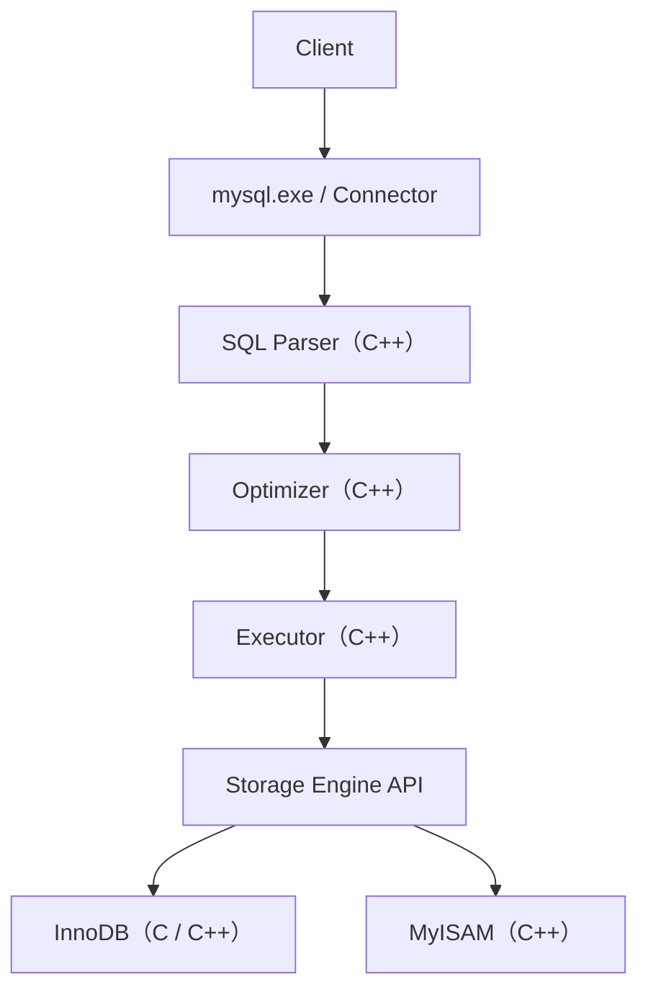




<!-- tab MySQL-->

<style>
/* MySQL 品牌配色：海豚藍 Navy #00618A / 品牌橘 Orange #F29111，危險紅、結案綠僅作語意輔助色 */
.case-timeline { position: relative; margin: 20px 0 30px; padding-left: 36px; }
.case-timeline::before {
content: ''; position: absolute; left: 9px; top: 4px; bottom: 4px; width: 2px;
background: repeating-linear-gradient(180deg, #bcdce6 0 8px, transparent 8px 16px);
}
.tl-event { position: relative; margin-bottom: 18px; }
.tl-event:last-child { margin-bottom: 0; }
.tl-event::before {
content: ''; position: absolute; left: -31px; top: 3px; width: 12px; height: 12px;
border-radius: 50%; background: #00618A; border: 2px solid #f5fafc; box-shadow: 0 0 0 1.5px #00618A;
}
.tl-event.warn::before   { background: #F29111; box-shadow: 0 0 0 1.5px #F29111; }
.tl-event.danger::before { background: #b3341f; box-shadow: 0 0 0 1.5px #b3341f; }
.tl-event.done::before   { background: #1f7a5c; box-shadow: 0 0 0 1.5px #1f7a5c; }
.tl-event .tl-card { background: #f5fafc; border: 1px solid #cfe3ea; border-radius: 4px; padding: 8px 16px; }
.tl-event.warn .tl-card   { border-left: 3px solid #F29111; }
.tl-event.danger .tl-card { border-left: 3px solid #b3341f; }
.tl-event.done .tl-card   { border-left: 3px solid #1f7a5c; }
.tl-head { display: flex; align-items: baseline; gap: 8px; flex-wrap: wrap; }
.tl-head .tl-step {
font-family: 'Courier New', Consolas, monospace; font-size: 0.68rem; color: #4c7a8c;
border: 1px solid #a9cdd8; border-radius: 2px; padding: 0 6px; background: #e6f2f6; flex-shrink: 0;
}
.tl-head .tl-title { font-weight: 700; color: #00405a; font-size: 0.92rem; }
.tl-desc { font-size: 0.86rem; color: #1f2a30; margin-top: 4px; line-height: 1.7; }
.tl-desc code { background: #fdeedd; padding: 1px 6px; border-radius: 3px; color: #b3590a; font-size: 0.85em; }

.stage-grid { display: flex; gap: 20px; margin: 20px 0 24px; flex-wrap: wrap; }
.stage-card {
flex: 1; min-width: 280px; background: #f5fafc; border: 1px solid #a9cdd8; border-radius: 4px;
box-shadow: 0 1px 3px rgba(0,0,0,0.06); overflow: hidden;
}
.stage-card .stage-head { display: flex; align-items: center; gap: 10px; padding: 10px 16px; background: #00618A; color: #fff; }
.stage-card .stage-head .stage-tag {
font-family: 'Courier New', Consolas, monospace; font-size: 0.7rem; letter-spacing: 1px;
color: #F29111; border: 1px solid #F29111; border-radius: 2px; padding: 1px 6px; opacity: 0.95;
}
.stage-card .stage-head .stage-name { font-weight: 700; font-size: 0.95rem; letter-spacing: 1px; }
.stage-card .stage-head .stage-loc { font-size: 0.7rem; opacity: 0.8; margin-left: auto; font-family: 'Courier New', Consolas, monospace; }
.stage-card ol { margin: 0; padding: 14px 20px 16px 34px; list-style: none; counter-reset: stage-step; }
.stage-card ol li {
counter-increment: stage-step; position: relative; padding: 6px 0 6px 6px;
border-bottom: 1px dashed #cfe3ea; font-size: 0.88rem; color: #1f2a30; line-height: 1.7;
}
.stage-card ol li:last-child { border-bottom: none; }
.stage-card ol li::before {
content: counter(stage-step); position: absolute; left: -26px; top: 6px;
width: 18px; height: 18px; border-radius: 50%; background: #F29111; color: #fff;
font-size: 0.68rem; font-weight: 700; display: flex; align-items: center; justify-content: center;
}
.stage-card ol li code { background: #fdeedd; padding: 1px 6px; border-radius: 3px; color: #b3590a; font-size: 0.85em; }

.flow-banner {
display: flex; align-items: center; gap: 12px;
background: #e6f2f6; border-left: 4px solid #00618A;
padding: 10px 18px; margin: 30px 0 16px; border-radius: 2px;
}
.flow-banner .flow-num {
font-family: 'Courier New', 'Consolas', monospace; font-weight: 700; font-size: 0.82rem;
color: #F29111; border: 1px solid #F29111; border-radius: 50%;
width: 26px; height: 26px; flex-shrink: 0;
display: flex; align-items: center; justify-content: center; background: #fff;
}
.flow-banner .flow-text { line-height: 1.5; }
.flow-banner .flow-title { font-weight: 700; color: #00405a; letter-spacing: 1px; font-size: 0.98rem; }
.flow-banner .flow-desc { font-size: 0.78rem; color: #4c7a8c; letter-spacing: 0.5px; margin-top: 1px; }

.flow-note {
background: #f5fafc; border: 1px dashed #a9cdd8; border-left: 4px solid #F29111;
padding: 10px 18px; margin: 14px 0 20px; border-radius: 2px;
font-size: 0.92rem; color: #1f2a30; line-height: 1.8;
}
.flow-note code { background: #fdeedd; padding: 1px 6px; border-radius: 3px; color: #b3590a; }
.flow-note.danger { background: #fbeeeb; border-color: #e3b3a6; border-left-color: #b3341f; color: #7a2417; }
.flow-note.danger code { background: #f3ddd6; color: #8c2f1a; }

.plan-card { background: #f5fafc; border: 1px solid #a9cdd8; border-radius: 4px; margin: 22px 0; box-shadow: 0 1px 3px rgba(0,0,0,0.06); overflow: hidden; }
.plan-card .plan-head { display: flex; align-items: center; gap: 12px; padding: 12px 18px; background: #00618A; color: #fff; }
.plan-card .plan-num {
font-family: 'Courier New', Consolas, monospace; font-weight: 700; font-size: 0.85rem;
border: 1px solid #F29111; color: #F29111; border-radius: 50%; width: 26px; height: 26px;
display: flex; align-items: center; justify-content: center; flex-shrink: 0; background: #fff;
}
.plan-card .plan-title { font-weight: 700; font-size: 0.98rem; letter-spacing: 1px; }
.plan-card .plan-body { padding: 16px 20px 18px; font-size: 0.9rem; line-height: 1.8; color: #1f2a30; }
.plan-card .plan-body > p:first-child { margin-top: 0; }
.plan-card .plan-body pre { margin: 12px 0 0; }
.plan-card .plan-body code { background: #fdeedd; padding: 1px 6px; border-radius: 3px; color: #b3590a; font-size: 0.85em; }
</style>

MySQL 為什麼會被叫做「MySQL」、又為什麼現在官網寫的是「Oracle MySQL」，這背後其實是一連串的公司併購故事，跟資料庫技術本身沒什麼關係

<div class="flow-banner">
<div class="flow-num">1</div>
<div class="flow-text">
<div class="flow-title">MySQL 身世時間軸</div>
<div class="flow-desc">從瑞典公司誕生，到被 Sun、再被 Oracle 收購</div>
</div>
</div>

<div class="case-timeline">

<div class="tl-event">
<div class="tl-card">
<div class="tl-head"><span class="tl-step">1995</span><span class="tl-title">MySQL 誕生</span></div>
<div class="tl-desc">最初由瑞典公司 <code>MySQL AB</code> 開發，創辦人是 Michael "Monty" Widenius、David Axmark。Monty 有一個女兒叫做 My Widenius，所以 <code>MySQL = My + SQL</code>，也就是「My 的 SQL 資料庫」。當時 Oracle 跟 MySQL 還是競爭對手。</div>
</div>
</div>

<div class="tl-event warn">
<div class="tl-card">
<div class="tl-head"><span class="tl-step">2008</span><span class="tl-title">Sun Microsystems 收購 MySQL</span></div>
<div class="tl-desc">那時候 <code>Java</code> 也是 Sun 的資產，所以 Java、MySQL 一度都在 Sun 旗下。</div>
</div>
</div>

<div class="tl-event done">
<div class="tl-card">
<div class="tl-head"><span class="tl-step">2010</span><span class="tl-title">Oracle 收購 Sun</span></div>
<div class="tl-desc">Oracle 這次收購一口氣拿到 <code>Java</code>、<code>MySQL</code>、<code>Solaris</code>、<code>VirtualBox</code> 一整批技術資產。</div>
</div>
</div>

<div class="tl-event">
<div class="tl-card">
<div class="tl-head"><span class="tl-title">現況：Oracle MySQL</span></div>
<div class="tl-desc">所以現在到 MySQL 官網，看到的品牌會是「Oracle MySQL」，就是這段併購歷史留下來的痕跡。</div>
</div>
</div>

</div>

<!-- endtab -->


<!-- tab C 與 C++-->


現在的 MySQL 8.0，核心幾乎都是用 C++ 寫的；最早期是以 C 為主，後來才逐漸轉成 C++。如果去下載 MySQL 的 source code（GitHub 或 Oracle 官方的 source），會看到大量的 `.cc`、`.cpp`、`.h` 檔案，這一段就是把「一條 SQL 從進來到跑出結果」的內部分層畫出來，看看哪些環節是 C++ 的地盤。

<div class="flow-banner">
<div class="flow-num">2</div>
<div class="flow-text">
<div class="flow-title">MySQL 內部分層架構</div>
<div class="flow-desc">從 Client 連線到底層 Storage Engine 的執行路徑</div>
</div>
</div>



<div class="flow-note">
💡 從 <code>SQL Parser</code> 解析 SQL、<code>Optimizer</code> 決定 Execution Plan、<code>Executor</code> 真正執行，一路到 Join 演算法、Cost Model、B+ Tree 操作，這些核心邏輯全部都是 C++ 寫的；C 主要只留在最底層、最早期就存在的一些相容性程式碼。
</div>

<!-- endtab -->


<!-- tab Index-->


建了兩個 index，明明其中一個明顯比較好，MySQL 卻選了比較差的那個——這是 [Oracle 官方有紀錄的一個真實 Bug（#36817）](https://bugs.mysql.com/bug.php?id=36817)，它很有代表性，反映的是 `Optimizer` 的 `Cost Model` 不夠成熟，而不是某一行程式寫錯。

問題是這樣：2008 年有人回報，若今天有兩個 index <code>A</code>、<code>B</code>，是先後建在資料庫裡的，就算某個情境下使用 <code>B</code> 可以避免 <code>filesort</code>，MySQL 還是可能會選擇 <code>A</code>，原因只是因為 <code>A</code> 比較早被建立。也就是說，只要改變 <code>CREATE INDEX</code> 的先後順序，Execution Plan 就跟著變了——舊版 MySQL Optimizer 因為成本估算能力不足，可能受到 Index Metadata（通常就是建立順序）的影響，因此選到並非最佳的 Index。

實例如下圖，即使 <code>origin -> price</code> 會是更合理的 index 選擇，也會因為建立時間較晚而不被選中：


<div class="flow-banner">
<div class="flow-num">3</div>
<div class="flow-text">
<div class="flow-title">Bug #36817 時間軸</div>
<div class="flow-desc">從回報、確認、第一次修補，到至今仍未真正結案</div>
</div>
</div>

<div class="case-timeline">

<div class="tl-event">
<div class="tl-card">
<div class="tl-head"><span class="tl-step">2008-05-20</span><span class="tl-title">Bug 提出</span></div>
<div class="tl-desc">有人回報 <code>Bug #36817</code>：Index 建立順序會影響 Optimizer 的選擇結果。</div>
</div>
</div>

<div class="tl-event warn">
<div class="tl-card">
<div class="tl-head"><span class="tl-step">2008-06-17</span><span class="tl-title">MySQL 官方確認（Verified）</span></div>
<div class="tl-desc">官方確認這是真實存在的問題，列為待處理。</div>
</div>
</div>

<div class="tl-event done">
<div class="tl-card">
<div class="tl-head"><span class="tl-step">2008-12-12</span><span class="tl-title">提交第一個 Patch</span></div>
<div class="tl-desc">改善 Optimizer 在選擇 Index 時的邏輯，讓需要 <code>filesort</code> 的索引增加對應的成本（cost）。</div>
</div>
</div>

<div class="tl-event danger">
<div class="tl-card">
<div class="tl-head"><span class="tl-step">2009-07-05</span><span class="tl-title">原作者再次回報</span></div>
<div class="tl-desc">即使沒有 <code>ORDER BY</code>，仍然存在因索引建立順序導致選錯 Index 的案例，代表根因並未完全解決。</div>
</div>
</div>

<div class="tl-event warn">
<div class="tl-card">
<div class="tl-head"><span class="tl-title">之後：至今未結案</span></div>
<div class="tl-desc">這個 Bug 一直維持在 <code>Verified</code> 狀態，沒有被標成 Fixed 或 Closed。</div>
</div>
</div>

</div>

<div class="flow-note danger">
⚠ 根因不是某一行程式碼寫錯，而是 Optimizer 的 <code>Cost Model</code> 在早期版本還不夠成熟，才會讓「建立順序」這種跟查詢效率無關的 Metadata，意外影響到 Execution Plan 的選擇。
</div>

大約從 MySQL 5.5 開始，Optimizer 針對這類問題做了不少改善，例如更好的 `Cost Model`、更好的統計資訊（statistics）、更好的 `ORDER BY` 最佳化、更好的 index 選擇邏輯，所以後續 MySQL 5.5、5.6、5.7、8.0 的 Optimizer 也持續在演進。

<div class="flow-banner">
<div class="flow-num">4</div>
<div class="flow-text">
<div class="flow-title">Patch 實際改了什麼</div>
<div class="flow-desc">官方修補訊息：selecting among the available indexes, the optimizer can take into account that certain indexes may require sorting</div>
</div>
</div>

實際修改的位置是 `sql_optimizer.cc` 附近的 Cost Calculation，概念大致如下（僅為示意，並非原始碼）：

<div class="stage-grid">

<div class="stage-card">
<div class="stage-head">
<span class="stage-tag">BEFORE</span>
<span class="stage-name">修正前的成本計算</span>
</div>
<ol>
<li><code>cost = rows * row_cost;</code></li>
<li>完全沒有把「是否需要額外排序」算進成本裡</li>
</ol>
</div>

<div class="stage-card">
<div class="stage-head">
<span class="stage-tag">AFTER</span>
<span class="stage-name">修正後的成本計算</span>
</div>
<ol>
<li><code>cost = rows * row_cost;</code></li>
<li><code>if (need_filesort) cost += filesort_penalty;</code></li>
</ol>
</div>

</div>

<div class="flow-note">
💡 這個修補的重點不是「哪個 index 先建立就選哪個」這種寫死的規則，而是讓 Cost Model 多考慮一項「Sorting Cost」，藉由更真實的成本估算，讓 Optimizer 自己算出比較合理的選擇。
</div>


<!-- endtab -->


<!-- tab 取最大最小-->

同一份 <code>Role</code> 欄位資料，換一個資料庫，取最大最小值、排序的結果居然完全不一樣——問題出在 MySQL 特有的 <code>ENUM</code> 型別，它的底層儲存方式跟排序邏輯根本是兩套不同的規則，而 MSSQL 因為沒有這個型別，反而規則單純很多。

<div class="flow-banner">
<div class="flow-num">5</div>
<div class="flow-text">
<div class="flow-title">MySQL ENUM 是什麼</div>
<div class="flow-desc">預先定義好選項清單的字串型別，底層卻是用數字儲存</div>
</div>
</div>

MySQL 支援 <code>ENUM</code>（列舉）資料型別，這是一種字串物件，值必須從建立資料表時就定義好的清單中挑選。欄位的值只能是清單裡的其中一個（或是空白、<code>NULL</code>），否則寫入會直接失敗。雖然看起來、寫起來都是字串，但 MySQL 在底層其實會自動編碼成整數索引來節省空間——如果選項數量在 1 到 255 個之間，一筆資料只需要 1 個位元組的儲存空間。

<div class="stage-grid">

<div class="stage-card">
<div class="stage-head">
<span class="stage-name">優點：自我說明＋防呆</span>
</div>
<ol>
<li>欄位本身就列出所有合法值，具備自我說明性（Self-documenting）</li>
<li>能直接擋掉不在清單內的亂碼輸入，不用額外加 <code>CHECK</code> 約束</li>
</ol>
</div>

<div class="stage-card">
<div class="stage-head">
<span class="stage-name">缺點：異動麻煩＋排序不直覺</span>
</div>
<ol>
<li>未來要新增/修改列舉選項得靠 <code>ALTER TABLE</code>，在大型或高流量資料表上改起來比較麻煩</li>
<li>排序依據不夠直覺（下面會展開說明），實務上不少人改用 <code>TINYINT</code> 搭配對照表、或直接存 <code>VARCHAR</code></li>
</ol>
</div>

</div>

讓我們看一下原子能影片中提及的例子：


<div class="flow-banner">
<div class="flow-num">6</div>
<div class="flow-text">
<div class="flow-title">MAX/MIN 與 ORDER BY 的反直覺陷阱</div>
<div class="flow-desc">同一個 ENUM 欄位，兩種操作各自套用不同的排序規則</div>
</div>
</div>

<div class="flow-note danger">
⚠ <code>ENUM</code> 底層是用整數索引儲存的（建立時排在第一個的選項索引為 <code>1</code>，第二個為 <code>2</code>，依此類推），但 <code>MAX()</code> / <code>MIN()</code> 會以字串的字典順序（Alphabetical order）來比大小，並不是照定義的先後順序。若想依「定義的先後順序」取最大/最小值，必須把欄位 <code>+ 0</code> 強制轉換成底層的數字索引才行。反過來，對 <code>ENUM</code> 欄位做 <code>ORDER BY</code> 時，MySQL 預設卻是照「定義列舉時的先後順序」排序，不是英文字母——同一個欄位，兩種操作各套用一套規則，邏輯本身並不一致。
</div>

MSSQL 沒有 <code>ENUM</code> 這個型別，欄位本質上就是 <code>VARCHAR</code>（搭配 <code>CHECK</code> 約束）或另外建一張數字對照表，規則反而單純很多：

<div class="stage-grid">

<div class="stage-card">
<div class="stage-head">
<span class="stage-name">MySQL：ENUM 欄位的規則</span>
</div>
<ol>
<li>底層用整數索引儲存，但只是儲存方式，不代表操作也照這個順序</li>
<li><code>MAX()</code> / <code>MIN()</code> 依字串字典順序比大小</li>
<li><code>ORDER BY</code> 卻依「定義時的先後順序」排序，跟 <code>MAX()</code> / <code>MIN()</code> 的邏輯不一樣</li>
</ol>
</div>

<div class="stage-card">
<div class="stage-head">
<span class="stage-name">MSSQL：VARCHAR 或數字對照表</span>
</div>
<ol>
<li>方案 A：欄位存 <code>VARCHAR</code>（搭配 <code>CHECK</code>），<code>MAX()</code> / <code>MIN()</code> 一樣依字典順序比大小</li>
<li>方案 B：另建數字代碼對照表，直接對數字欄位取 <code>MAX()</code> / <code>MIN()</code>，最符合邏輯也最有效率</li>
<li><code>ORDER BY</code> 不管 <code>ASC</code> 還是 <code>DESC</code>，一律照英文字母/字典順序排序，沒有例外規則</li>
</ol>
</div>

</div>

方案 A 的字典順序範例：

```sql
-- 假設 Role 內有 'admin', 'editor', 'user'
-- 依字串排序：'user' 最大，'admin' 最小
SELECT MAX(Role), MIN(Role) FROM Users;
```

方案 B 的數字代碼範例（例如 1=admin, 2=editor, 3=user）：

```sql
-- 取得目前使用者中，權限代碼最大與最小的值
SELECT MAX(RoleCode), MIN(RoleCode) FROM Users;
```

ORDER BY 一律依字典順序，沒有例外：

```sql
-- 狀況 A：字母 A 到 Z 排序，取第 1 筆
SELECT TOP 1 Role FROM Users ORDER BY Role ASC;
-- 傳回結果：'admin'（因為 a 開頭最小）

-- 狀況 B：字母 Z 到 A 排序，取第 1 筆
SELECT TOP 1 Role FROM Users ORDER BY Role DESC;
-- 傳回結果：'user'（因為 u 開頭最大）
```

<!-- endtab -->


<!-- tab trigger-->

想像資料庫裡有一個「守門員」，只要有人對某張表做新增、修改或刪除，它就會自動跳出來多做一些事——不用後端程式特別呼叫，這就是 MySQL 的 <code>Trigger</code>（觸發器）：一種會在資料變更的「之前」或「之後」自動執行的預存程序。

<div class="flow-banner">
<div class="flow-num">7</div>
<div class="flow-text">
<div class="flow-title">Trigger 三大核心要素</div>
<div class="flow-desc">建立一個 Trigger 時，必須明確定義這三件事</div>
</div>
</div>

<div class="stage-grid">

<div class="stage-card">
<div class="stage-head">
<span class="stage-name">觸發時機</span>
</div>
<ol>
<li><code>BEFORE</code>：在資料實際寫入或變更之前執行，常用於欄位值的檢查、攔截或自動修正</li>
<li><code>AFTER</code>：在資料實際寫入或變更之後執行，常用於同步更新其他表、寫入 Log 紀錄</li>
</ol>
</div>

<div class="stage-card">
<div class="stage-head">
<span class="stage-name">觸發事件</span>
</div>
<ol>
<li><code>INSERT</code>、<code>UPDATE</code> 或 <code>DELETE</code> 三選一，對應要攔截的資料變更動作</li>
</ol>
</div>

<div class="stage-card">
<div class="stage-head">
<span class="stage-name">觸發對象</span>
</div>
<ol>
<li>綁定在特定的某一張資料表（Table）上，離開這張表就不會觸發</li>
</ol>
</div>

</div>

<div class="flow-banner">
<div class="flow-num">8</div>
<div class="flow-text">
<div class="flow-title">關鍵字：OLD 與 NEW</div>
<div class="flow-desc">Trigger 程式碼裡用來看「變更前」與「變更後」資料的兩個虛擬表</div>
</div>
</div>

<div class="flow-note">
💡 <code>NEW</code> 代表即將寫入或更新後的新資料（可用於 <code>INSERT</code> 和 <code>UPDATE</code>）；<code>OLD</code> 代表被修改前或被刪除的舊資料（可用於 <code>UPDATE</code> 和 <code>DELETE</code>）。
</div>

<div class="flow-banner">
<div class="flow-num">9</div>
<div class="flow-text">
<div class="flow-title">實際範例</div>
<div class="flow-desc">一個做資料防呆，一個自動寫入異動日誌</div>
</div>
</div>

<div class="plan-card">
<div class="plan-head">
<div class="plan-num">A</div>
<div class="plan-title">BEFORE INSERT：自動資料防呆與修正</div>
</div>
<div class="plan-body">

假設有一張 <code>users</code> 表，如果使用者寫入年齡小於 0，自動將其修正為 0：

```sql
DELIMITER //

CREATE TRIGGER before_user_insert
BEFORE INSERT ON users
FOR EACH ROW
BEGIN
    -- 如果新寫入的年齡小於 0，強制改成 0
    IF NEW.age < 0 THEN
        SET NEW.age = 0;
    END IF;
END //

DELIMITER ;
```

</div>
</div>

<div class="plan-card">
<div class="plan-head">
<div class="plan-num">B</div>
<div class="plan-title">AFTER UPDATE：自動記錄修改日誌</div>
</div>
<div class="plan-body">

當使用者的資料被修改時，自動把舊資料和新資料寫入到另一張 <code>user_logs</code> 表中備份：

```sql
DELIMITER //

CREATE TRIGGER after_user_update
AFTER UPDATE ON users
FOR EACH ROW
BEGIN
    -- 記錄誰被改了名字，舊名字是什麼，新名字是什麼
    INSERT INTO user_logs (user_id, old_name, new_name, change_time)
    VALUES (OLD.id, OLD.name, NEW.name, NOW());
END //

DELIMITER ;
```

</div>
</div>

<div class="flow-banner">
<div class="flow-num">10</div>
<div class="flow-text">
<div class="flow-title">使用 Trigger 的優缺點</div>
<div class="flow-desc">是最後一道防線，但也容易變成難以排查的隱藏邏輯</div>
</div>
</div>

<div class="stage-grid">

<div class="stage-card">
<div class="stage-head">
<span class="stage-name">優點</span>
</div>
<ol>
<li>確保資料完整性：不管後端程式（PHP、Java、Node.js）怎麼寫，只要進到資料庫都會被強制執行，是最後一道防線</li>
<li>自動化維護：不需要在後端程式碼裡重複寫入 Log、同步更新其他表的邏輯</li>
</ol>
</div>

<div class="stage-card">
<div class="stage-head">
<span class="stage-name">缺點（實務上不建議濫用）</span>
</div>
<ol>
<li>隱藏邏輯、難以排查 Bug：後端開發者看程式碼以為只做了一次 <code>INSERT</code>，卻不知道資料庫底層偷偷跑了 5 個 Trigger，出錯時很難追蹤</li>
<li>效能隱憂：Trigger 是 <code>FOR EACH ROW</code>（逐筆觸發），一口氣更新 10 萬筆資料，Trigger 就會被執行 10 萬次，可能導致資料庫瞬間卡死</li>
</ol>
</div>

</div>

<div class="flow-note">
💡 在 MSSQL 中也有完全對應的 Trigger 功能，但其運作邏輯（底層是用 <code>Inserted</code> 和 <code>Deleted</code> 虛擬表，而不是 <code>NEW</code>/<code>OLD</code>）與 MySQL 有些微不同。
</div>


## MySql Bug


例如我們今天建立一個 trigger，用來監聽服裝表格的異動，如果服裝資料被修改，trigger 會正常被觸發，但是若修改是被動發生的，例如它儲存買家的 ID 作為 fk，因為買家被刪掉了導致她變成 NULL，這種被動修改在 MYSQL 中就不會觸發 trigger


[Bug 11472](https://bugs.mysql.com/bug.php?id=11472)


## Postgres


官方文件直接舉

```bash
ON UPDATE CASCADE
ON DELETE SET NULL
```

這類 FK 自動造成的修改，affected table 上相關 trigger 會被觸發


```bash
DELETE Buyer
    ↓
FK ON DELETE SET NULL
    ↓
Clothes.BuyerId = NULL
    ↓
✅ Clothes UPDATE Trigger 觸發
```

也就是 PostgreSQL 會把 Buyer 被 DELETE 和它產生的 Clothes 被 UPDATE 看成同一個 SQL command 所引發的一連串資料異動


## MSSQL


SQL Server 在這點也會處理 cascade 造成的 trigger。

Microsoft 文件明確說明 cascading referential actions 會觸發 AFTER UPDATE / AFTER DELETE triggers。
流程基本上是：

```bash
DELETE Buyer
    ↓
ON DELETE SET NULL
    ↓
Clothes 更新
    ↓
✅ Clothes UPDATE Trigger
```

而且 SQL Server 的順序設計得很明確是 referential cascade action 與 constraint check 成功完成之後，相關 AFTER trigger 才執行


<!-- endtab -->



