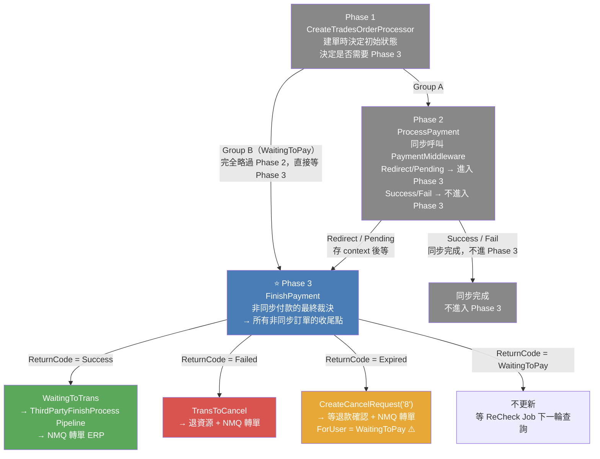
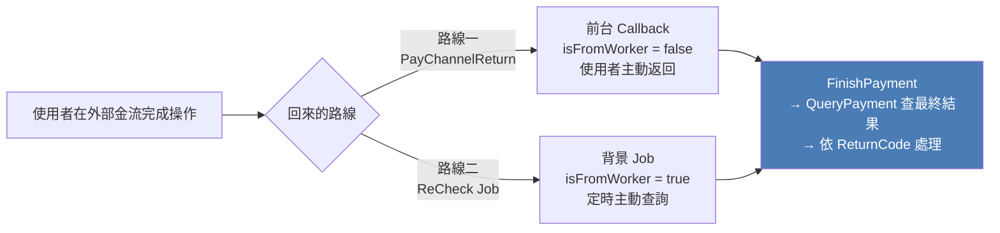
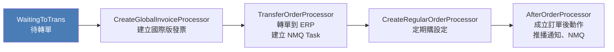
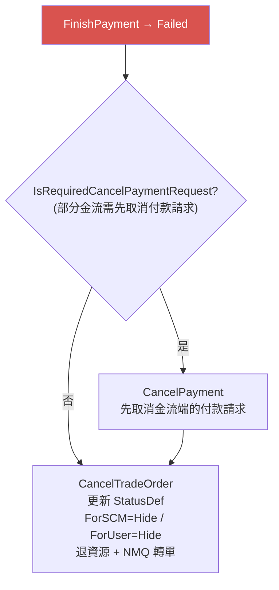
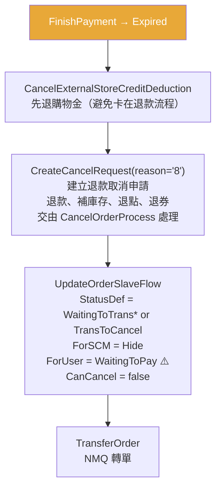
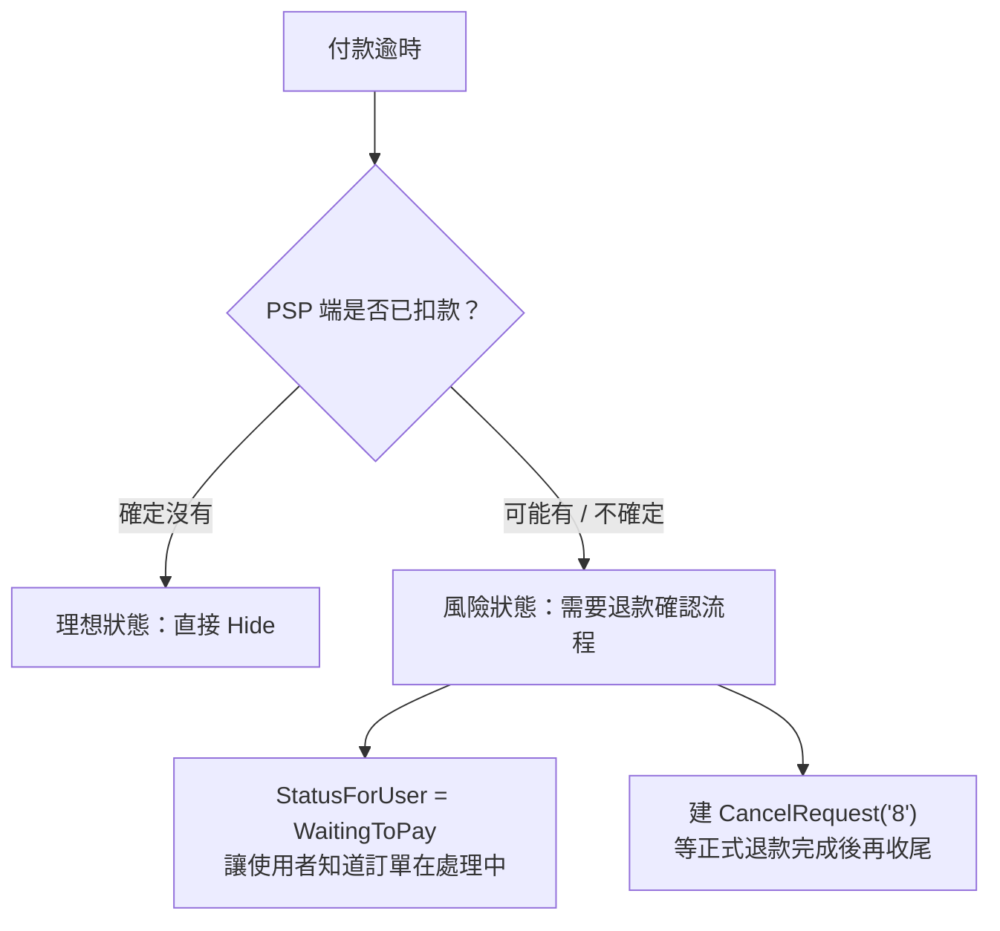
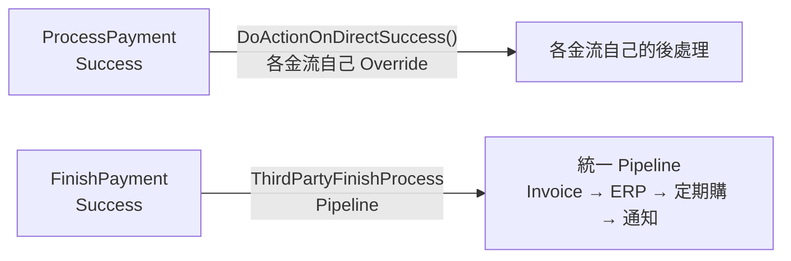
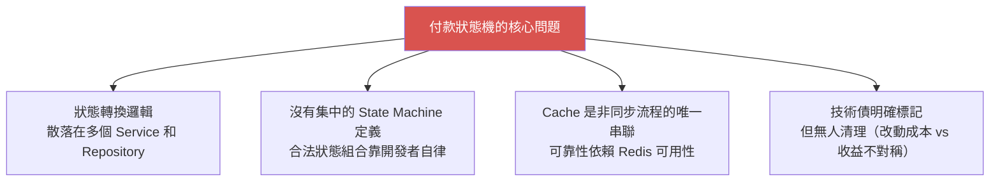




<!-- tab 大局觀-->

付款流程分為三個階段，本文聚焦 **Phase 3：FinishPayment**



## Phase 3 在整個流程中扮演什麼角色？

> Phase 3 是**所有非同步付款的最終收尾點** — 無論是使用者跳頁後 Callback 回來，還是背景 Job 主動查詢，最終都在這裡決定訂單「成立」或「取消」

| 階段 | 入口 | 觸發者 | 時機 |
|:---:|:---|:---:|:---|
| Phase 1 | `CreateTradesOrderProcessor.cs` | 使用者按下結帳 | 同步，在同一 Request Pipeline 內 |
| Phase 2 | `TradesOrderPaymentService.ProcessPayment()` | mweb 前台 | 緊接在建單 Pipeline 之後，同步呼叫 PaymentMiddleware |
| **⭐ Phase 3** | `TradesOrderPaymentService.FinishPayment()` | PayChannelReturn（前台）或 ReCheck Job（背景） | 使用者在外部金流完成操作後，或 Job 主動查詢 |


**哪些訂單會進入 Phase 3？**

- **Group B 全部**：LinePay、Razer 系列等非同步導頁金流，建單後等待，Phase 3 是它們唯一的付款確認入口
- **Group A 的 Redirect/Pending**：信用卡 3DS、ApplePay 3DS、部分跨國金流，Phase 2 取得導頁 URL 後等待

**哪些訂單不會進入 Phase 3？**
- Group A 的 ProcessPayment → Success：Stripe Direct、信用卡同步授權成功 — 在 Phase 2 就結束了
- Group A 的 ProcessPayment → Fail：同步取消，不需要 Phase 3


<!-- endtab -->


<!-- tab 兩條回來的路線-->


使用者在外部金流完成付款後，回到系統有兩條路線，兩者最終都呼叫同一個 `FinishPayment()`




## 兩條路線的差異

| | 路線一：前台 Callback | 路線二：ReCheck Job |
|:---:|:---:|:---:|
| **觸發者** | 使用者操作（導頁回來） | 背景 Job 定時執行 |
| **isFromWorker** | false | true |
| **時機** | 使用者付款後立刻 | 定時輪詢（可能數分鐘後） |
| **ReturnCode = WaitingToPay 時** | 完全不更新，等 Job | 未超時：不更新，等下一輪；超時：走 Expired |
| **是否可能重複觸發？** | ✅ 使用者可能多次跳回 | ✅ Job 定時執行 |

> 兩條路線可能**同時觸發** — 使用者付款完跳回（路線一），同一時間 ReCheck Job 也在跑（路線二）。這裡依賴 `UpdateOrderSlaveFlowWithRetry` 的重試保護，但沒有明確的分散式鎖保護並發更新

## 為什麼需要兩條路線？

**路線一（Callback）** 解決「即時性」問題：使用者付款完希望立刻看到訂單成立，而不是等 Job 下一輪
**路線二（Job）** 解決「可靠性」問題：
- 使用者付款後直接關閉 App，沒有返回 Callback
- 外部金流 Callback 遺失（網路問題、伺服器重啟）
- 路線一的 Callback 因為 Cache 失效拋 Exception

> 兩條路線互為備援。沒有 Job，Callback 失敗的訂單永遠卡住；沒有 Callback，所有訂單都只能等 Job，使用者體驗差


<!-- endtab -->


<!-- tab 四種 ReturnCode 處理-->

FinishPayment 呼叫 `PaymentMiddleware.QueryPayment()` 後，依 ReturnCode 走四條不同的路


## 各 ReturnCode 差異對照表

| ReturnCode | 三方表 IsClosed | OSF StatusDef | OSF ForSCM | OSF ForUser | 後段 Pipeline |
|------------|:--------------:|:-------------:|:----------:|:-----------:|:-------------:|
| **Success** | 各 Channel 決定 | `WaitingToTrans` | `Hide` | `OrderProcessing` | ✅ 執行 |
| **Expired** | `false` | `TransToCancel`\* | `Hide` | `WaitingToPay` | ❌ 不執行 |
| **Failed** | `true` | `TransToCancel`\* | `Hide` | `Hide` | ❌ 不執行 |
| **WaitingToPay**（逾時） | `false` | `TransToCancel`\* | `Hide` | `WaitingToPay` | ❌ 不執行 |
| **WaitingToPay**（未逾時） | 不變 | 不變 | 不變 | 不變 | ❌ 不執行 |
| **其他** | 不變 | 不變 | 不變 | 不變 | ❌ 不執行 |

> \* `TransToCancel`：Stripe / CheckoutDotCom 例外走 `WaitingToTrans`（歷史因素）


## ForUser 狀態語意說明

| ForUser 值 | 消費者看到的狀態 | 使用場景 |
|-----------|----------------|---------|
| `OrderProcessing` | 訂單處理中 | 付款成功，等待出貨流程 |
| `WaitingToPay` | 待繳費 | 逾時（可能已扣款，等退款） |
| `Hide` | 隱藏（不顯示） | 明確失敗，訂單取消 |


## ReturnCode = Success（付款成功）

這是最重要的路徑，有明確的狀態更新 + Processor Pipeline：

```csharp
// orderSlaveFlow Retry
// Success : WaitingToTrans / 後台 Hide / 前台 訂單處理中
this.UpdateOrderSlaveFlowWithRetry(
    status: OrderSlaveFlowStatusEnum.WaitingToTrans,
    statusForScm: OrderSlaveFlowStatusForSCMEnum.Hide,
    statusForUser: OrderSlaveFlowStatusForUserEnum.OrderProcessing,
    canCancel: false,
    canChange: false,
    canReturn: false
);
```


更新後觸發 **ThirdPartyFinishProcess Processor Pipeline**：




## ReturnCode = Failed（付款失敗）

FinishPayment 的付款失敗，走 `CancelTradeOrder()`，與 ProcessPayment 的 Fail 路徑共用同一套清理邏輯：




## ReturnCode = Expired（付款逾時）

逾時的處理**刻意不同於失敗**，原因是 PSP 可能已扣款但系統尚未知道：



## ReturnCode = WaitingToPay（仍在等待）

| 路線 | 是否更新大表 | 行為 |
|:---:|:---:|:---|
| 路線一（前台 Callback） | ❌ 完全不更新 | 等 ReCheck Job 來處理 |
| 路線二（ReCheck Job）未超時 | ❌ 完全不更新 | 等下一輪 Job 再查 |
| 路線二（ReCheck Job）已超時 | ✅ 走 Expired 邏輯 | `isTimeout = (now - 建立時間) > timeoutSeconds` |


<!-- endtab -->


<!-- tab Expired vs Failed 深度對比-->

Expired 和 Failed 都代表「付款不成功」，但系統對它們的處理方式截然不同。這個差異背後有明確的業務理由

## 核心差異

| | Failed | Expired |
|:---:|:---:|:---:|
| **語意** | 金流商明確回傳「付款失敗」 | 系統等待逾時，不知道金流端發生了什麼 |
| **PSP 是否可能已扣款？** | ❌ 否（明確失敗） | ⚠️ 不確定（可能已扣款） |
| **StatusForUser** | `Hide`（訂單消失） | `WaitingToPay`（訂單仍存在，使用者可見） |
| **退資源方式** | 直接在當前流程退 | 建 `CancelRequest("8")`，交由 CancelOrderProcess |
| **購物金處理** | 包含在 CancelTradeOrder 清理流程 | 先單獨退購物金，其餘交給 CancelOrderProcess |

## 為什麼 Expired 要讓前台顯示 WaitingToPay？



逾時時系統無法確認「金流端是否已扣款」。若直接 Hide，但 PSP 已扣款 → 使用者錢被扣、訂單消失、無從投訴。顯示 `WaitingToPay` 代表：

> **「系統知道有問題，正在處理，請稍後確認」**

這個設計保護了使用者的知情權，也確保退款有訂單依據可操作

## CancelRequest("8") 機制

Failed 路徑直接退資源；Expired 路徑建 `CancelRequest("8")` 後由 `CancelOrderProcess` 統一退。"8" 是取消原因代碼，代表「系統逾時取消」

這個分流的後果是：**兩套退資源邏輯在程式碼中各自獨立**

```
CancelTradeOrder（Failed / ProcessPayment Fail）：
  退購物金 → 退點數 → 回收 PromoCode → 退券 → 退首購 → NMQ 轉單

CancelOrderProcess（Expired）：
  購物金已在 Expired 入口先退 → 其餘交給 CancelOrderProcess 退
```

未來新增一種需要退款的資源 → 兩個地方都要改，任一遺漏 → 特定情境的資源不被退還


<!-- endtab -->


<!-- tab 設計解析-->


## 設計一：FinishPayment Success 走獨立 Processor Pipeline

FinishPayment Success 觸發的 `ThirdPartyFinishProcess Pipeline` 與 ProcessPayment Success 的 `DoActionOnDirectSuccess` 是**兩條不同的後處理路線**，但它們都代表「付款成功後的下一步」



**為什麼設計成兩條路？**
ProcessPayment Success 是同步路徑，早期的金流自己處理後續；FinishPayment 後來統一整理成 Pipeline，但已有的同步路徑沒有被回頭整理

> 風險：新增「付款成功後的動作」時，兩條路線都要確認覆蓋

## 設計二：WaitingToTrans 在失敗路徑的歷史技術債

失敗取消時，大表 StatusDef 有兩個可能的值，由 `GetCancelOrderSlaveFlowStatus()` 決定：

```csharp
private OrderSlaveFlowStatusEnum GetCancelOrderSlaveFlowStatus(string payType)
{
    // 舊金流維持走 WaitingToTrans (應調整為 TransToCancel)
    // 新金流走 TransToCancel
    var useWaitingToTrans = new List<string>
    {
        "CreditCardOnce_Stripe",
        "CreditCardOnce_CheckoutDotCom",
    };
    return useWaitingToTrans.Contains(payType)
        ? OrderSlaveFlowStatusEnum.WaitingToTrans
        : OrderSlaveFlowStatusEnum.TransToCancel;
}
```

| | WaitingToTrans（待轉單） | TransToCancel（失敗取消轉單） |
|:---:|:---:|:---:|
| **語意** | 正常成立後等轉 ERP | 訂單失敗，走取消轉單流程 |
| **現況** | 僅剩 Stripe / CheckoutDotCom 還在用 | 所有新金流標準做法 |
| **為何還留著** | 怕改動影響 Stripe 既有的失敗流程，尚未驗證 | — |

程式碼中兩處都有相同的 NOTE：`// 確認 Stripe 可使用後，可再將判斷式移除`。**同一個 StatusDef 值（WaitingToTrans）在 ERP 端代表兩種截然不同的意圖**，是最難偵錯的 bug 溫床

### 整體設計的核心問題



這套設計在當初只有少數金流時是 OK 的。隨著金流數量從個位數增長到數十個，各自有不同的付款時序和失敗語意，狀態機變得越來越難以全貌理解 — **這篇文章存在的原因，就是它已經複雜到需要文件才能看懂**


<!-- endtab -->


<!-- tab summary table-->


## ProcessPayment（結帳當下）

| 場景 | ThirdPartyPayment.ToStatus | ThirdPartyPayment.IsClosed | OSF.StatusDef | OSF.ForSCM | OSF.ForUser |
|------|--------------------------|--------------------------|--------------|-----------|------------|
| Success（同步）| 各 Channel 決定 | 各 Channel 決定 | 不更新 | 不更新 | 不更新 |
| Fail | `Fail` | `true` | `WaitingToTrans`/`TransToCancel` | `Hide` | `Hide` |
| Redirect（一般） | `WaitingToPay` | `false` | `WaitingToPay` | `Hide` | `WaitingToPay` |
| Redirect（3DS） | `WaitingToPay` | `false` | `WaitingTo3DAuth` | `Hide` | `WaitingToPay` |
| Pending | `WaitingToPay` | `false` | `WaitingToPay` | `Hide` | `WaitingToPay` |

## FinishPayment（Callback）

| 場景 | ThirdPartyPayment.IsClosed | OSF.StatusDef | OSF.ForSCM | OSF.ForUser |
|------|--------------------------|--------------|-----------|------------|
| Success | `true` | `WaitingToTrans` | `Hide` | `OrderProcessing` |
| Expired（逾時） | `false` | `WaitingToTrans`/`TransToCancel` | `Hide` | **`WaitingToPay`** |
| Failed | `true` | `WaitingToTrans`/`TransToCancel` | `Hide` | `Hide` |
| WaitingToPay（Worker 逾時） | `false` | `WaitingToTrans`/`TransToCancel` | `Hide` | **`WaitingToPay`** |
| 其他（Console 處理） | 不變 | 不變 | 不變 | 不變 |

> **WaitingToTrans vs TransToCancel**：
> - `CreditCardOnce_Stripe`、`CreditCardOnce_CheckoutDotCom` → 舊金流，維持 `WaitingToTrans`
> - 其他所有 PaymentMiddleware 金流 → `TransToCancel`（語意更精確）


<!-- endtab -->



