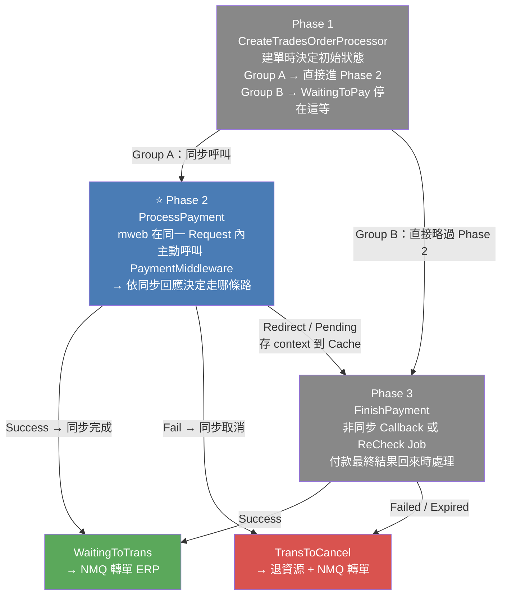
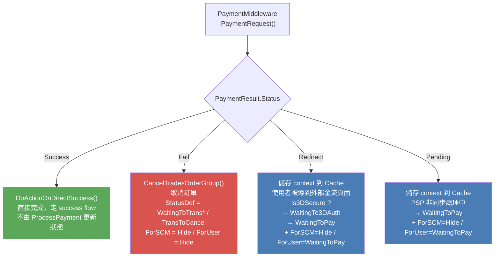
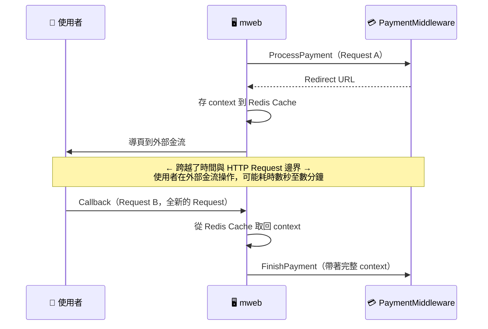
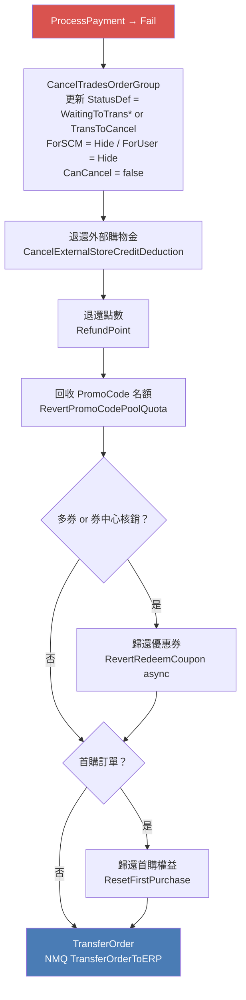
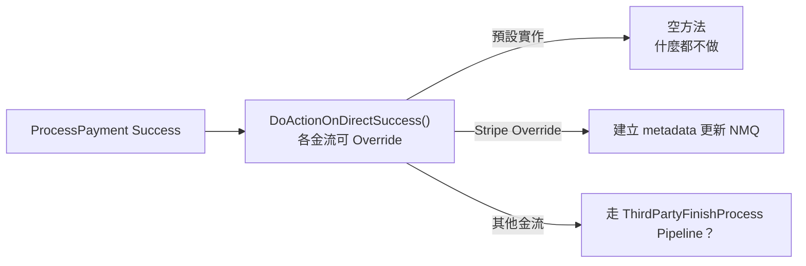
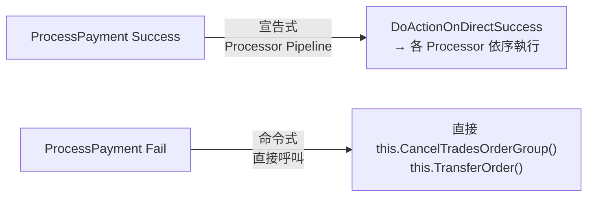




<!-- tab 大局觀-->

付款流程分為三個階段，本文聚焦 **Phase 2：ProcessPayment**



## Phase 2 在整個流程中扮演什麼角色？

> Phase 2 是**付款流程的第一次決策點** — mweb 在使用者按下結帳後，立刻向 PaymentMiddleware 發出付款請求，依據同步回應決定訂單要「就地完成」、「等待使用者跳頁」還是「直接取消」

| 階段 | 入口 | 觸發者 | 時機 |
|:---:|:---|:---:|:---|
| Phase 1 | `CreateTradesOrderProcessor.cs` | 使用者按下結帳 | 同步，在同一 Request Pipeline 內 |
| **⭐ Phase 2** | `TradesOrderPaymentService.ProcessPayment()` | mweb 前台 | 緊接在建單 Pipeline 之後，同步呼叫 PaymentMiddleware |
| Phase 3 | `TradesOrderPaymentService.FinishPayment()` | PayChannelReturn（前台）或 ReCheck Job（背景） | 使用者在外部金流完成操作後，或 Job 主動查詢 |


**哪些金流會進入 Phase 2？**

- **Group A（同步付款型）**：信用卡、ApplePay、Stripe、CheckoutDotCom — 建單後立刻進入 Phase 2，這裡是付款確認的主戰場
- **Group B（非同步導頁型）**：LinePay、Razer 系列、AsiaPay 系列 — Phase 2 對這類金流通常只是「登記等待」，Phase 3 才是真正的付款確認入口


<!-- endtab -->


<!-- tab ProcessPayment 四種回應路徑-->

mweb 建單後，在同一個 Request Pipeline 內呼叫 `PaymentMiddleware.PaymentRequest()`，依同步回應結果更新 `OrderSlaveFlow`

> ProcessPayment 是付款流程的**第一次與金流的對話**。對非同步金流（Group B），這裡通常只是登記「等待付款」；對同步金流（Group A），這裡可能直接完成

## 四種回應路徑全覽



## 四種狀態更新摘要

| 回應 | StatusDef | StatusForSCM | StatusForUser | CanCancel |
|:---:|:---:|:---:|:---:|:---:|
| **Success** | 不在 ProcessPayment 更新 | — | — | — |
| **Fail** | `WaitingToTrans`* / `TransToCancel` | `Hide` | `Hide` | false |
| **Redirect（3DS）** | `WaitingTo3DAuth` | `Hide` | `WaitingToPay` | true |
| **Redirect（一般）** | `WaitingToPay` | `Hide` | `WaitingToPay` | true |
| **Pending** | `WaitingToPay` | `Hide` | `WaitingToPay` | true |

> \* `WaitingToTrans` 僅用於 CreditCardOnce_Stripe / CreditCardOnce_CheckoutDotCom（歷史原因，程式碼已標記應統一為 TransToCancel）


## Redirect 的 Is3DSecure 分支

```csharp
OrderSlaveFlowStatusEnum statusDef = context.Is3DSecure == true
    ? OrderSlaveFlowStatusEnum.WaitingTo3DAuth
    : OrderSlaveFlowStatusEnum.WaitingToPay;
```

| context.Is3DSecure | StatusDef | 情境 |
|:---:|:---:|:---|
| true | `WaitingTo3DAuth` | 金流商要求 3DS 驗證，有明確的驗證步驟 |
| false | `WaitingToPay` | 一般 OAuth / 付款頁轉導，等待使用者操作 |


<!-- endtab -->


<!-- tab Cache 橋接設計-->

Phase 2 (ProcessPayment) 與 Phase 3 (FinishPayment) 之間，有一段跨越 HTTP Request 邊界的空白。**這個空白靠 Cache 來填補**

## 為什麼需要 Cache？



HTTP 是無狀態的。ProcessPayment（Request A）結束後，所有的 in-memory 狀態都消失了。FinishPayment（Request B）是一個全新的請求，需要重建付款的上下文（購物車、金流設定、訂單 ID、Is3DSecure 等），Cache 是唯一可行的橋樑

```csharp
// Redirect 路徑存入 Cache
payChannelService.UpdateProcessContextForRedirect(context, paymentResult);
this._userDataHelper.Save(PayProcessContextEntity.CacheTypeName, context);


//// TmpData:PayProcess-20190918180000:{MemberId}:{UniqueKey}
```

## 哪些路徑需要存 Cache？

| 回應路徑 | 需要存 Cache？ | 原因 |
|:---:|:---:|:---|
| Success | ❌ | 同一 Request 內完成，不需要跨 Request |
| Fail | ❌ | 同一 Request 內取消，不需要跨 Request |
| **Redirect** | ✅ | 使用者跳頁後 Callback 回來，需要重建 context |
| **Pending** | ✅ | PSP 非同步處理，完成後 Callback 回來，需要重建 context |


## Cache 的設計風險

> **Cache 是 Phase 2 到 Phase 3 的唯一橋樑，也是整個非同步付款流程的單點失效**

- **Cache TTL 到期** → FinishPayment 時取不到 context → 拋 Exception → 訂單停在 `WaitingToPay` 永遠不動
- **Redis 不可用** → 所有 Redirect/Pending 的訂單都卡住，ReCheck Job 同樣需要讀 context，一樣卡
- **Cache Key 衝突** → 相同情況

這個設計在訂單量小時完全不是問題。但隨著金流數量增加、非同步訂單比例上升，Cache 可靠性成了整個付款鏈路的隱形天花板


<!-- endtab -->


<!-- tab ProcessPayment Fail 的取消流程-->

ProcessPayment 收到同步 Fail 時（金流明確回傳失敗），在同一個 Request 內立刻完成所有清理，不等任何非同步操作

## 完整取消流程



> 即使是失敗取消，最後仍然會觸發 NMQ `TransferOrder`。這是因為 ERP 需要知道有一筆訂單被取消了，才能正確處理庫存和帳務。**取消也是一種「轉單」**

## 為什麼同步 Fail 可以直接退，而 Expired 不行？

| | ProcessPayment Fail | FinishPayment Expired |
|:---:|:---:|:---:|
| **確定性** | ✅ 金流商明確說「未付款」 | ⚠️ 可能已扣款但系統超時未知 |
| **退資源方式** | 同步在當前 Request 退 | 建 `CancelRequest("8")`，等退款確認後退 |
| **訂單可見性** | StatusForUser = `Hide` | StatusForUser = `WaitingToPay`（讓使用者知道有問題） |

FinishPayment Expired 的詳細設計見 **《FinishPayment — 付款的最終裁決》**


## CanCancel = false 空窗期保護

```
付款失敗 → StatusDef = TransToCancel → 建立 NMQ Task
           ↓ 在 NMQ 執行前（空窗期）
           使用者從前台看到訂單 → 點取消 → 再建一個 NMQ Task
           → ERP 端收到兩個取消任務 → 重複取消 → 庫存雙重回補
```

CanCancel=false 在 NMQ 空窗期內阻斷這個 double-cancel 場景

> 風險：NMQ Task 若卡住，訂單 StatusForUser = Hide + CanCancel = false，使用者看不到、客服也操作不了，唯一出路是工程師直接改 DB


<!-- endtab -->


<!-- tab 設計解析-->

## ProcessPayment 的核心設計取捨

### DoActionOnDirectSuccess — 成功路徑的不對稱



`DoActionOnDirectSuccess()` 是一個**語意模糊的擴充點**。預設是空方法，各金流可以 Override 但不是必須。這導致：

- ProcessPayment Success 路徑的後處理，分散在每個金流的 `DoActionOnDirectSuccess()` 實作中
- FinishPayment Success 路徑的後處理，由 `ThirdPartyFinishProcess Processor Pipeline` 統一處理
- **同樣是「付款成功」，但走了兩條不同的後處理路線** — 未來要新增「付款成功後的動作」，需要確認兩條路線都有覆蓋

### 成功路徑 vs 失敗路徑的設計不對稱



成功路徑走 Processor Pipeline（宣告式、可擴充），失敗路徑直接呼叫 Service（命令式、散落在程式碼中）。這個不對稱是歷史演進的結果，成功路徑在多次重構後被整理進 Pipeline，失敗路徑一直沒人整理。

### ProcessPayment 的邊界定義不清

ProcessPayment 在不同金流下的職責差異很大：

| 金流類型 | ProcessPayment 的實際工作 |
|:---|:---|
| 信用卡（一般） | 真正打 API 授權，可能直接完成付款 |
| LinePay / Razer | 只是取得導頁 URL，實際付款在外部 |
| ATM | 只是取得虛擬帳號，不涉及任何付款 |
| Stripe Direct | 同步完成付款 + 排 ERP 轉單 |

從 ATM 的角度看，ProcessPayment 根本沒有在「處理付款」，只是在「取得付款資訊」。但它們都走同一個 ProcessPayment 入口，造成這個方法的語意非常寬泛。


<!-- endtab -->



