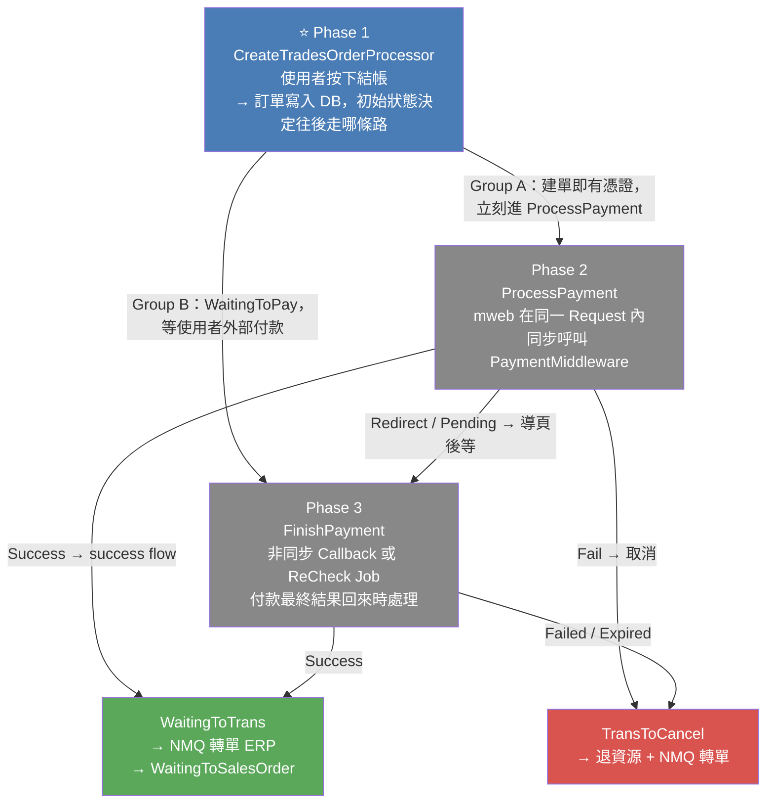
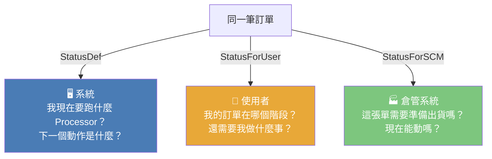
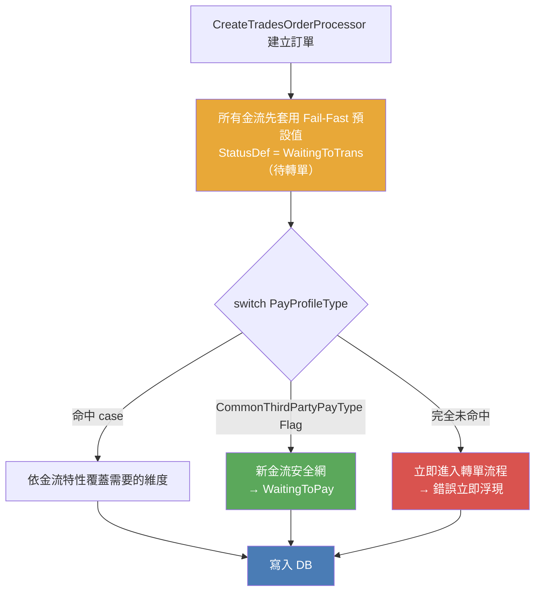
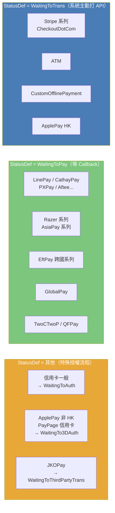
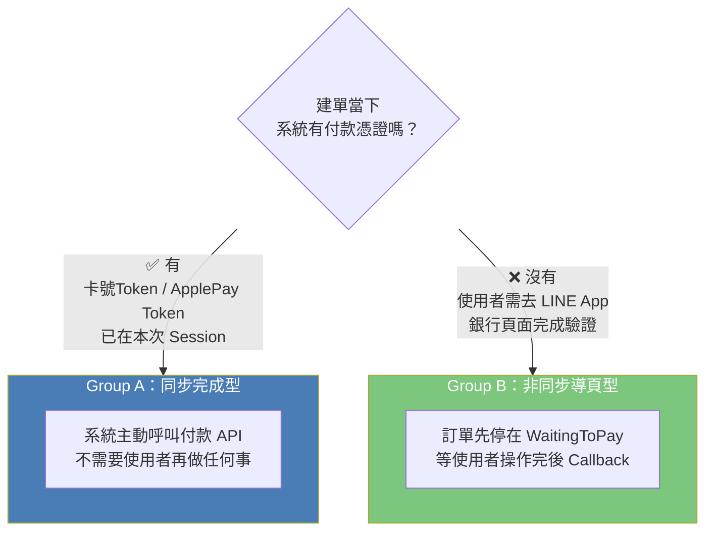
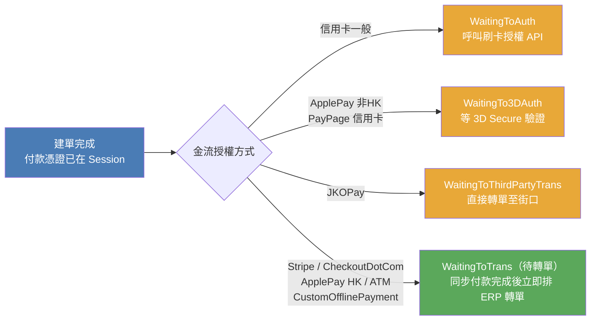
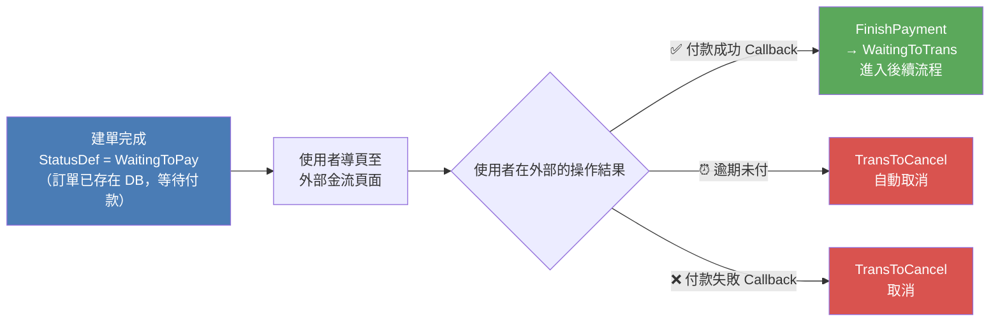




<!-- tab 大局觀-->

付款流程分為三個階段，本文聚焦 **Phase 1：CreateTradesOrderProcessor**



## Phase 1 在整個流程中扮演什麼角色？

> Phase 1 是**整個付款狀態機的起點** — 它不只是「把訂單存進去」，而是在建單的同一個動作裡，根據金流類型決定訂單接下來走哪條路

| 階段 | 入口 | 觸發者 | 時機 |
|:---:|:---|:---:|:---|
| **⭐ Phase 1** | `CreateTradesOrderProcessor.cs` | 使用者按下結帳 | 同步，在同一 Request Pipeline 內 |
| Phase 2 | `TradesOrderPaymentService.ProcessPayment()` | mweb 前台 | 緊接在建單 Pipeline 之後 |
| Phase 3 | `TradesOrderPaymentService.FinishPayment()` | PayChannelReturn 或 ReCheck Job | 使用者在外部完成操作後 |

Phase 1 決定的初始狀態，**直接決定 Phase 2 還是 Phase 3 是真正付款確認的入口**：
- 初始 `WaitingToTrans` / `WaitingToAuth` / `WaitingTo3DAuth` → Phase 2 是主要付款入口
- 初始 `WaitingToPay` → Phase 2 只是「登記等待」，Phase 3 才是付款確認入口


<!-- endtab -->


<!-- tab 本質-->

建立訂單當下，系統會依照金流類型，為 `OrderSlaveFlow` 設定一個「起始狀態」，寫入 DB 後由付款結果進一步驅動流轉

> 起始狀態是**告訴系統接下來由誰負責推進這筆訂單** — 是系統主動呼叫付款 API，還是等使用者去外部付款後 Callback 回來？


<!-- endtab -->


<!-- tab 為什麼需要三個狀態維度？-->


最直覺的設計是一個欄位記錄訂單狀態，但實際上系統、使用者、倉管三方對「同一筆訂單」需要看到完全不同的資訊：



三個維度**各自獨立演進**：一張剛建立的 ATM 訂單，對系統而言是 `WaitingToTrans`（準備觸發付款流程），對使用者顯示的卻是 `WaitingToPay`（請去 ATM 轉帳）。如果只有一個狀態，要嘛系統看到的內部術語暴露給使用者，要嘛使用者的顯示邏輯污染了驅動後端 Processor 的核心狀態。

| 維度 | 欄位 | 對象 | 回答的核心問題 |
|:---:|:---:|:---:|:---|
| **StatusDef** | `OrderSlaveFlow_StatusDef` | 系統核心 | 後端 Processor 下一步要做什麼？ |
| **StatusForUser** | `OrderSlaveFlow_StatusForUserDef` | 前台使用者 | 使用者訂單頁要顯示什麼狀態？ |
| **StatusForSCM** | `OrderSlaveFlow_StatusForSCMDef` | 倉庫 SCM | 倉管系統現在能對這張單進行什麼操作？ |


<!-- endtab -->

<!-- tab 為什麼預設值是 WaitingToTrans？-->


`WaitingToTrans` = **待轉單** 是**把 WebStore 的 TradesOrder 轉寫進 ERP 成為 SalesOrder** — 這是前台電商系統與後台倉儲系統的交接點。

`CreateTradesOrderProcessor` 在進入 switch 之前，先把所有訂單的 StatusDef 設為 `WaitingToTrans`。這個選擇暗藏了一個設計決策：

> **讓錯誤暴露，而非靜默等待**

如果預設值是 `WaitingToPay`（等 Callback），當一個新金流被加進系統但忘了在 switch 中配置，訂單就會靜靜地停在那裡等一個永遠不會來的 Callback — 問題可能數小時後才被發現。而 `WaitingToTrans` 意味著系統看到這個狀態就會試圖繼續推進，失敗就失敗，錯誤立刻浮現



注意 `CommonThirdPartyPayType Flag` 作為 switch 的最後一道 default 安全網，給「已知是第三方非同步金流但還沒加 case」的新金流提供保護，讓它們安全落入 WaitingToPay。

## 常見起始狀態一覽

| 起始狀態 | 語意 | 代表金流 |
|:---:|:---|:---|
| `WaitingToTrans` | **待轉單** — 付款已確認（或即將同步確認），等 NMQ 將訂單寫入 ERP | Stripe、ATM、CustomOfflinePayment |
| `WaitingToPay` | 等使用者在外部完成付款後 Callback | LinePay、Razer 系列、AsiaPay 系列 |
| `WaitingToAuth` | 等信用卡授權回傳 | 一般信用卡（CreditCardOnce / Installment） |
| `WaitingTo3DAuth` | 等 3D Secure 驗證完成 | ApplePay（非 HK）、PayPage 信用卡 |
| `WaitingToThirdPartyTrans` | 建單後立即轉單至第三方 | JKOPay（街口） |


<!-- endtab -->


<!-- tab 初始狀態對照-->

各金流在 `CreateTradesOrderProcessor` 建立訂單時的 `OrderSlaveFlow` 起始狀態，是訂單寫入 DB 當下的起點

## 完整對照表

| 金流 / 群組 | StatusDef | StatusForUser | StatusForSCM | 備註 |
|:---|:---:|:---:|:---:|:---|
| **【預設值（未命中 switch）】** | `WaitingToTrans` | — | — | Stripe 系列、CreditCardOnce_Stripe、CreditCardOnce_CheckoutDotCom |
| **CreditCardOnce / Installment**（一般信用卡） | `WaitingToAuth` | — | — | 等待刷卡授權 |
| **CreditCardOnce / Installment**（PayPage 代客下單） | `WaitingTo3DAuth` | `WaitingToPay` | — | PayPage 流程特殊處理 |
| **ATM** | `WaitingToTrans` | `WaitingToPay` | — | StatusDef 不覆蓋，只改 ForUser |
| **JKOPay（街口）** | `WaitingToThirdPartyTrans` | `WaitingToPay` | — | 建單後直接轉單 |
| **ApplePay（非 HK）** | `WaitingTo3DAuth` | `WaitingToPay` | — | 失敗可由 Recheck NMQ Redo |
| **ApplePay（HK，Stripe）** | `WaitingToTrans` | — | — | HK 走跨國 Stripe 原流程 |
| **GlobalPay** | `WaitingToPay` | `WaitingToPay` | — | CanCancel = false（付款完成前停用取消） |
| **LinePay / CathayPay / PXPay / Aftee / icashPay / EasyWallet / PoyaPay / Atome / PXPayPlus / PlusPay / Wallet** | `WaitingToPay` | `WaitingToPay` | — | 第三方非同步，建單後等 Callback |
| **EWallet_PayMe / AliPayHK_EftPay / WechatPayHK_EftPay** | `WaitingToPay` | `WaitingToPay` | — | 跨國 EftPay 系列 |
| **Razer 系列 / SwiftPass / EftPay / AsiaPay 系列** | `WaitingToPay` | `WaitingToPay` | — | 跨國金流，非同步 Callback |
| **CreditCardOnce_Razer / CreditCardOnce_AsiaPay / CreditCardOnce_Cybersource / TwoCTwoP / QFPay** | `WaitingToPay`（一般）| `WaitingToPay` | — | 定期購自動建單時例外：保持預設 `WaitingToTrans` |
| **CustomOfflinePayment（其他轉帳）** | `WaitingToTrans` | `WaitingToPay` | **`WaitingToPay`** | 唯一同時設定 SCM 狀態的金流 |
| **CommonThirdPartyPayType Flag（default）** | `WaitingToPay` | `WaitingToPay` | — | 未在 switch 中列舉的新金流 |

## 狀態分布視覺化



<!-- endtab -->


<!-- tab 分組邏輯-->

所有金流依照建單後的付款時序，分為兩大群組。**這個分組的本質，不是金流商的技術規格差異，而是「付款憑證在建單當下是否已在系統手中」**

## 為什麼會有兩種截然不同的路徑？

建立訂單時，系統面對一個根本問題：**我現在有能力完成付款嗎？**



Group A 的金流（信用卡、ApplePay）在使用者送出結帳的當下，付款憑證就已交給系統了；Group B（LinePay、街口）的真正付款動作發生在外部 App，系統拿不到憑證，只能等對方告知結果


## Group A：同步付款型

建單後**在同一個 Request Pipeline 內**完成付款，不需等使用者跳頁操作：



| 金流 | 起始 StatusDef | 說明 |
|:---|:---:|:---|
| CreditCardOnce / CreditCardInstallment | `WaitingToAuth` | 授權成功後 → WaitingToTrans → 排 ERP 轉單 |
| JKOPay | `WaitingToThirdPartyTrans` | 街口轉單完成後 → WaitingToTrans → 排 ERP 轉單 |
| ApplePay（非 HK）、PayPage 信用卡 | `WaitingTo3DAuth` | 3DS 通過後 → WaitingToTrans → 排 ERP 轉單 |
| Stripe / CheckoutDotCom、ApplePay HK | `WaitingToTrans` | **直接以待轉單起始**，同步付款 + ERP 轉單一氣呵成 |
| ATM、CustomOfflinePayment | `WaitingToTrans` | 入帳通知到來 → 已在待轉單狀態，直接排 ERP 轉單 |

> Stripe 系列在建單當下就設為 `WaitingToTrans`，代表「付款將在本次 Pipeline 同步完成，完成後無需再改狀態，直接觸發 ERP 轉單」。`WaitingToTrans` 是這條路徑的**終點站**，不是中間站


## Group B：非同步導頁型

系統沒有付款憑證，訂單必須「停在那裡等」：

> 這裡有一個設計上的取捨：系統可以不建單，等使用者付款成功後才建。但這樣如果建單失敗，使用者已付錢了怎麼辦？**先建單再付款**，能確保無論付款結果如何，訂單記錄都已存在，後續補償邏輯有依據可操作。



涵蓋金流：LinePay / CathayPay / PXPay / Aftee / icashPay / EasyWallet / PoyaPay / Atome / PXPayPlus / PlusPay / Wallet / GlobalPay / EWallet_PayMe / AliPayHK_EftPay / WechatPayHK_EftPay / Razer 系列 / SwiftPass / EftPay 系列 / AsiaPay 系列 / TwoCTwoP / QFPay


## 兩組的核心差異

| | Group A（同步付款型） | Group B（非同步導頁型） |
|:---:|:---:|:---:|
| **建單當下有付款憑證？** | ✅ 有 | ❌ 沒有 |
| **起始 StatusDef** | `WaitingToAuth` / `WaitingTo3DAuth` / `WaitingToTrans` / `WaitingToThirdPartyTrans` | `WaitingToPay` |
| **何時進入 WaitingToTrans？** | 同步付款成功後（或直接以 WaitingToTrans 起始） | 外部金流 Callback 確認付款後 |
| **ERP 轉單觸發時機** | 同一 Request Pipeline 結束時 | FinishPayment Callback 處理完成時 |
| **若付款失敗** | 同步失敗 → 立即 TransToCancel | Callback 失敗或逾期 → TransToCancel |


<!-- endtab -->


<!-- tab 定期購自動建單：「同一張卡，不同的情境」-->


`CreditCardOnce_Razer`、`CreditCardOnce_AsiaPay`、`CreditCardOnce_Cybersource`、`TwoCTwoP`、`QFPay` 這五種金流，同一個 PayProfileType 存在**兩種完全不同的起始狀態**：

```csharp
case PayProfileTypeDefEnum.CreditCardOnce_Razer:
case PayProfileTypeDefEnum.TwoCTwoP:
case PayProfileTypeDefEnum.QFPay:
    if (context.IsRegularOrderAutoGen == false)
    {
        orderSlaveFlow.OrderSlaveFlow_StatusDef = WaitingToPay;
        orderSlaveFlow.OrderSlaveFlow_StatusForUserDef = WaitingToPay;
    }
    // IsRegularOrderAutoGen = true → 維持預設 WaitingToTrans
    break;
```

| 場景 | StatusDef | 為什麼？ |
|:---:|:---:|:---|
| 一般結帳 | `WaitingToPay` | 使用者需要被導到金流頁面完成授權 |
| 定期購自動建單 | `WaitingToTrans` | 系統已持有 Token，直接扣款，**沒有使用者可以導頁** |

> 定期購第一次結帳時，金流商回傳了一個可重複使用的 Token（類似授權書）。往後每期自動扣款，系統持有這個 Token 直接呼叫金流 API，整個流程中根本不存在「使用者在操作」這件事。

**這是同一個付款方式在兩種情境下的本質差異**：一個是使用者主動發起、需要導頁完成授權；另一個是系統代為執行、Token 已存在、不需要任何人工干預。用 `IsRegularOrderAutoGen` 區分，讓同一個 PayProfileType 在不同情境下走對的路。


<!-- endtab -->


<!-- tab CustomOfflinePayment：倉管為何需要在建單就知道？-->


所有金流建單時通常只設定 StatusDef 和 StatusForUser，而 CustomOfflinePayment（其他轉帳）是**唯一在建單當下就設定 StatusForSCM** 的金流：

```csharp
// StatusDef 維持預設 WaitingToTrans（不覆蓋）
orderSlaveFlow.OrderSlaveFlow_StatusForUserDef = WaitingToPay;
orderSlaveFlow.OrderSlaveFlow_StatusForSCMDef  = WaitingToPay;  // ← 其他金流不設 SCM
```

| | 一般數位金流 | CustomOfflinePayment |
|:---:|:---:|:---:|
| **StatusForSCM 何時設定？** | 付款成功後才設定 | 建單當下就設定 |
| **為什麼？** | 未付款的訂單倉管不需要知道 | 入帳可能在數天後，人工比對需要早期可見性 |

> 信用卡刷卡、LinePay 付款，通常秒級完成，倉管等付款確認後再看到訂單完全來得及。但銀行轉帳可能要 1–3 個工作天，這段期間倉管可能需要提前備貨、協調出貨時間、或主動聯絡客戶確認付款進度。**讓 SCM 在建單就看到這筆訂單，是為了業務操作流暢，而非技術上的必要**


<!-- endtab -->


