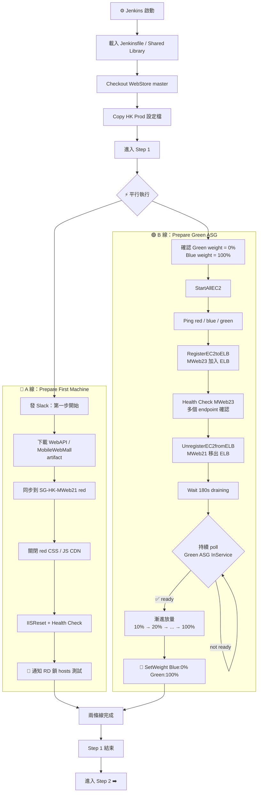
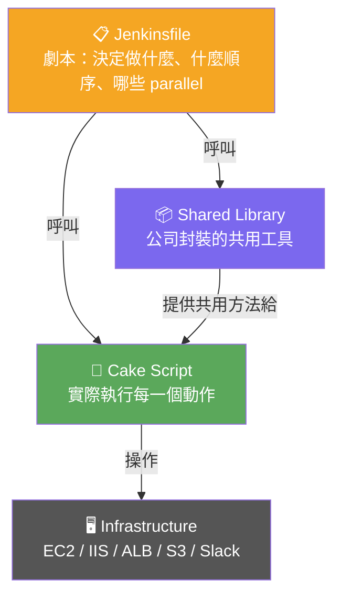
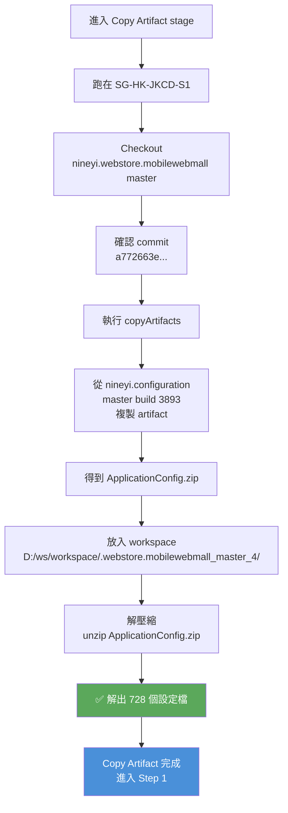
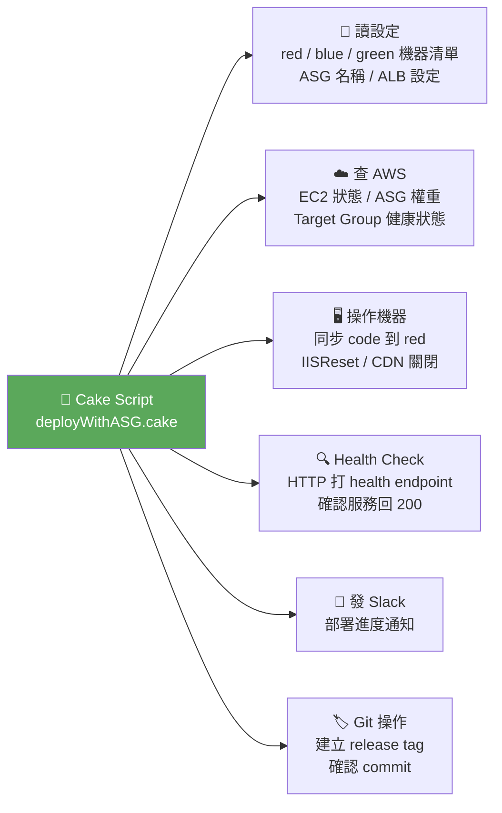
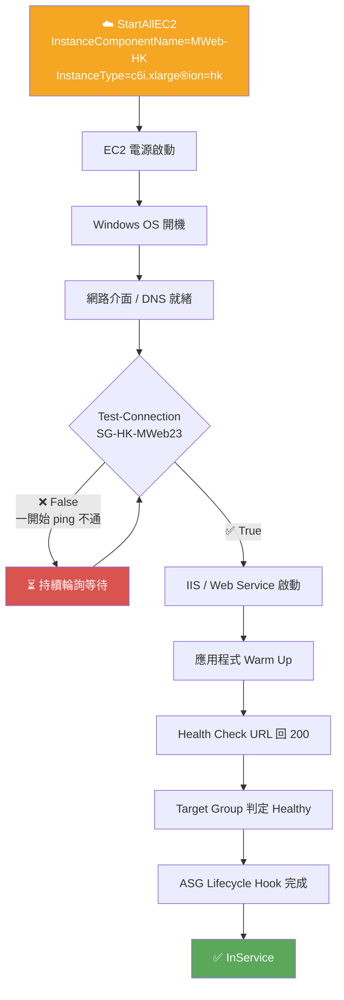




<!-- tab 流程圖-->

Step 1 的核心是 **平行跑兩條線**：A 線部署第一台測試機、B 線同步把 Green group 的機器準備起來，兩者同時進行互不等待，全部完成才進入 Step 2




| 線 | 目的 | 完成條件 |
|:---:|:---|:---|
| **A 線** | 把第一台 red 機器同步新版，讓 RD 可以鎖 hosts 測試 | Health Check 通過 + Slack 通知送出 |
| **B 線** | Green 加入 ELB、Red 移除 ELB、ASG 漸進放量至 Green:100% | SetWeight Blue:0% / Green:100% 完成 |

> Step 1 走完：**MWeb22（Blue）與 MWeb23（Green）同時在 ELB 內接流量**；MWeb21（Red）已離線，部署新版供 RD 驗收。hk-mweb-group1 ELB 只認 registered 狀態，Blue 從未被 Unregister，所以兩台都在線


<!-- endtab -->


<!-- tab 劇本、工具、程式碼、設定、憑證、執行環境-->

部署前需要備齊四件事：**知道跑什麼（劇本）、知道用什麼工具、知道部署哪個版本、知道憑證在哪**。這些全部在進入 Step 1 之前就定義好

## 工具分工架構



---

## 📋 Jenkinsfile — 劇本

Jenkinsfile 是流程的指揮官，決定「做什麼、什麼時候做、誰和誰可以一起跑」：

| 決策項目 | 說明 |
|:---|:---|
| Check Build Status | 要不要在部署前先確認上一個 build 是否成功 |
| Copy Artifact | 要不要從 Jenkins artifact 下載設定檔 |
| Step 1 結構 | 哪些 stage 要跑、順序為何 |
| Parallel 範圍 | A 線 / B 線 哪些工作可以同時跑 |
| deployWithASG.cake | 是否呼叫 Cake script 執行 ASG 相關操作 |
| Timeout | 每個 stage 最多等多久，避免卡死 |
| Credentials 包裝 | 把機密資料安全地傳給後續步驟 |

## 📦 Shared Library — 共用工具

因為多站台（HK / SG / TW...）部署邏輯高度重疊，公司封裝了 Jenkins Shared Library，避免每個 Jenkinsfile 重複實作相同邏輯：

- **Slack 通知** — 統一格式發佈署進度訊息
- **共用 deployment function** — 跨站台可直接呼叫的部署方法
- **共用 credentials 包裝** — 統一管理 token / key 的注入方式
- **共用錯誤處理** — stage 失敗時的統一通知與 abort 邏輯
- **共用 log 檢查** — 解析 IIS / Health Check 回應的共用邏輯

## 🔖 佈署哪一個版本

Checkout 到正確的 commit，確認這次部署用的是哪一版程式碼。

正式部署必須能回答以下三個問題，否則出問題時無從追查：

> 1. 我部署的是哪個 **branch**？
> 2. 是哪個 **commit**？
> 3. 這個 commit 是從哪個 **release** merge 進來的？

## ⚙️ 設定檔

正式環境的設定（DB 連線、API endpoint、Feature Flag...）不會 commit 進 repo，而是透過 **Copy Artifact** 從 `nineyi.configuration` 這個獨立 Jenkins job 取得，解壓後放入 workspace，Cake script 才能讀到正式環境資料。

## 🔑 Credentials

部署過程需要多組 credentials，全部在 Jenkinsfile 中統一包裝注入：

| Credential | 用途 |
|:---|:---|
| Slack Token | 發送部署通知 |
| Git Token | Checkout repo / 建立 Git Tag |
| Artifact Token | 從 Jenkins 下載 build artifact |
| Internal API Key | 呼叫 infra API（StartAllEC2、Health Check 等） |


<!-- endtab -->

<!-- tab Copy Artifact-->

正式環境的設定檔不放在應用程式 repo 裡，而是由獨立的 `nineyi.configuration` job 管理。Copy Artifact stage 的任務就是：**在部署前把正確版本的設定檔抓下來，放進 workspace，讓後續 Cake script 能讀到正式環境資料**

## 執行流程



## 本次執行資訊

| 項目 | 值 |
|:---|:---|
| **執行節點** | SG-HK-JKCD-S1 |
| **來源 Job** | nineyi.configuration » master |
| **Build 編號** | #3893 |
| **下載檔案** | ApplicationConfig.zip |
| **解出檔案數** | 728 個設定檔 |
| **放置路徑** | `D:\ws\workspace\.webstore.mobilewebmall_master_4\` |

## 為什麼設定檔要分開管理

| 原因 | 說明 |
|:---|:---|
| **安全性** | DB 密碼、API Key 不能 commit 進應用程式 repo |
| **環境隔離** | 同一份 code 可部署到 dev / staging / prod，各自讀不同設定 |
| **版本可追蹤** | 設定有獨立的 build 編號，出問題時可回查是哪版設定造成的 |
| **職責分離** | 設定變更由維運控管，不需要動應用程式 code |


<!-- endtab -->


<!-- tab Cake-->

Jenkinsfile 負責**編排**，Cake 負責**執行**。Jenkinsfile 告訴 Jenkins 什麼時候跑什麼，Cake 則是真正動手做事的腳本層，負責讀設定、操作機器、查 AWS、發通知。

## Cake 在 Step 1 做的事



## Cake 引用的工具與用途

| 套件 | 用途 |
|:---|:---|
| `AWSSDK.EC2` | 查 EC2 / ASG 狀態、觸發 StartAllEC2、確認 InService |
| `AWSSDK.S3` | 取得部署檔、設定檔或備份 |
| `Cake.Http` | 呼叫 infra API、admin API、Health Check endpoint |
| `Cake.Powershell` | 執行 PowerShell 指令（Test-Connection、IISReset 等） |
| `Cake.Slack` | 發送部署進度通知到指定 Slack channel |
| `Cake.Git` | 建立 Git Tag、讀取 commit / branch 資訊 |
| `StackExchange.Redis` | 處理 cache 清除或設定快取 |
| `Polly` | retry 機制、timeout 控制、失敗重試策略 |
| `NineYi.Cake.Lib` | 公司內部封裝的部署方法（共用邏輯） |

## Jenkinsfile vs Cake — 各自的邊界

| | Jenkinsfile | Cake |
|:---:|:---:|:---:|
| **角色** | 指揮官 | 執行者 |
| **決定** | 跑什麼、何時跑、parallel 範圍 | 怎麼跑、呼叫哪個 API、怎麼 retry |
| **可見度** | Jenkins UI pipeline 視圖 | Cake log 輸出 |
| **修改影響** | 流程結構改變 | 執行細節改變 |


<!-- endtab -->


<!-- tab 這段流程慢在哪-->

Step 1 最耗時的不是部署新版 code，而是 **B 線等 Green ASG InService、再執行漸進放量的整段流程**。

## 時間對比

| 任務 | 耗時 | 說明 |
|:---|:---:|:---|
| A 線（Sync first machine） | `00:00:43` | 下載 + 同步 + IISReset + Health Check |
| B 線（Prepare Green ASG） | `≈ 16 分鐘` | Register → Drain → poll InService → 漸進放量 |

> B 線比 A 線慢 **約 22 倍**。整個 Step 1 的瓶頸就是等 Green group 就緒，再一步步把流量切過去。

## B 線的完整時間軸（以 HK log 為例）

```
09:23:07  B 線啟動，確認 Green=0% / Blue=100%
09:23:18  RegisterEC2toELB（MWeb23 加入 ELB）
09:23:xx  Health Check MWeb23 endpoints 通過
09:24:55  UnregisterEC2fromELB（MWeb21 移出 ELB）
          Wait 180s connection draining
09:27:xx  開始 poll Green ASG InService（約每 20 秒一次）
09:34:25  Green group is all ready（InService ✅）
09:34:26  SetWeight Blue:90% / Green:10%
09:35:07  SetWeight Blue:80% / Green:20%
09:35:46  SetWeight Blue:70% / Green:30%
...       每步約 40 秒
09:39:xx  SetWeight Blue:0%  / Green:100% ← B 線完成
```


## 為什麼先確認 Green = 0%

B 線第一步是查 Green 的 ALB 權重：

```
Group  = Green
Weight = 0%
```

確認 Green 當下沒有正式流量，才能安全地把機器關掉再重開。  
若 Green 還有流量就強行開機輪替，使用者請求可能打到尚未就緒的機器。

## StartAllEC2 → InService 的完整鏈路

呼叫 API 開機只是起點，Windows EC2 要跑完整條鏈路才算真正 InService：



## Windows EC2 本來就慢

Linux container 啟動可能只要幾秒，Windows + IIS 機器每個階段都更耗時：

| 階段 | 慢的原因 |
|:---|:---|
| Windows 開機 | OS 本身初始化流程長 |
| IIS 啟動 | Application Pool 初始化、module 載入 |
| 應用程式 Warm Up | .NET 第一次 JIT 編譯、connection pool 建立 |
| Health Check 通過 | 要等應用程式真的能回應，不只是 port 開著 |
| ASG 狀態更新 | AWS 需要連續多次 healthy 才更新狀態 |

## 診斷指標

若某次 B 線特別慢，可以依序確認這六個節點：

| # | 確認項目 | 對應現象 |
|:---:|:---|:---|
| 1 | EC2 從 StartAllEC2 到 `running` 花多久 | AWS Console 看 instance state |
| 2 | Windows 開機到可以 ping 花多久 | log 裡 Test-Connection 第幾次變 True |
| 3 | IIS / Web Service 啟動花多久 | Event Log / IIS log 時間戳 |
| 4 | Health Check URL 何時開始回 200 | Cake log 裡 health check 回應時間 |
| 5 | Target Group 何時變 healthy | AWS Target Group 健康狀態時間軸 |
| 6 | ASG lifecycle hook 是否有等待腳本 | ASG activity log |


<!-- endtab -->



