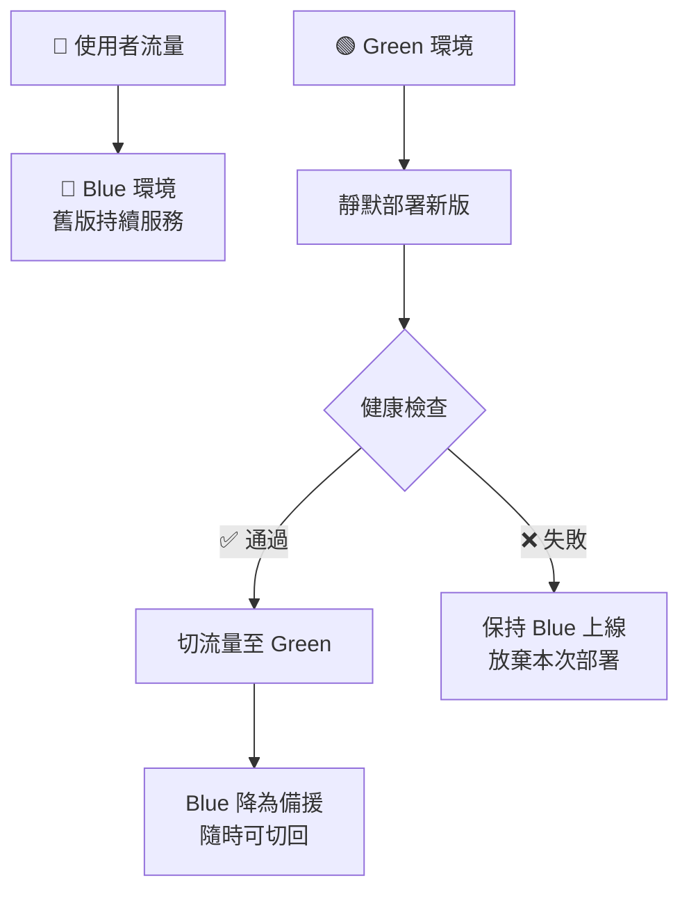
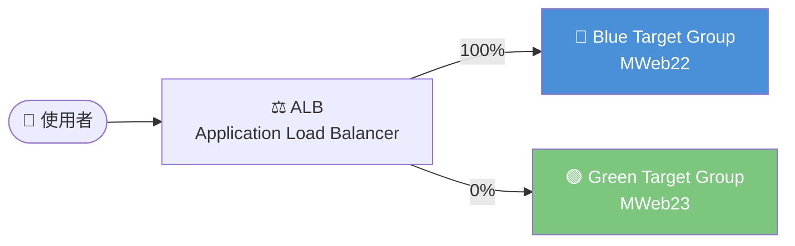
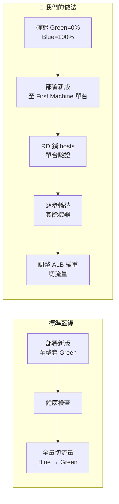
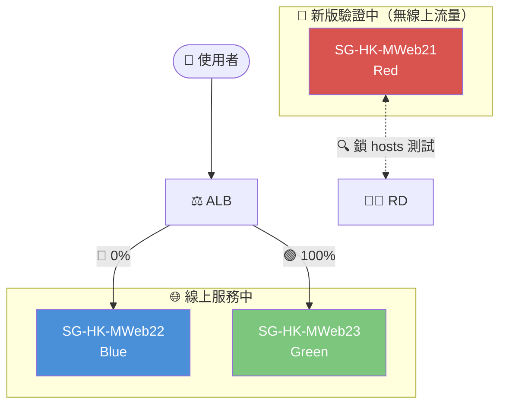
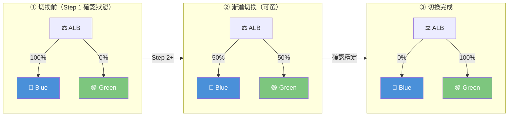
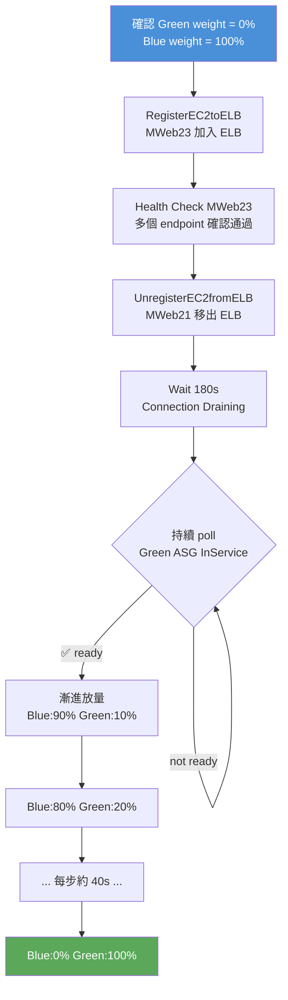
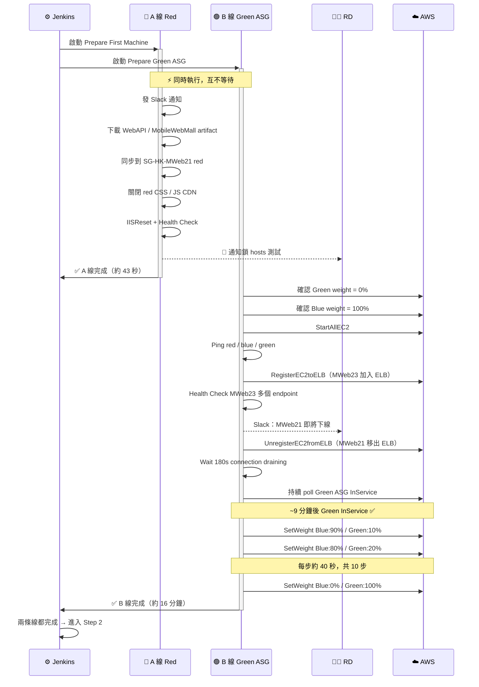
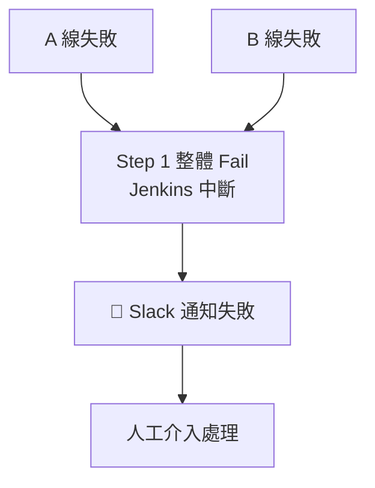
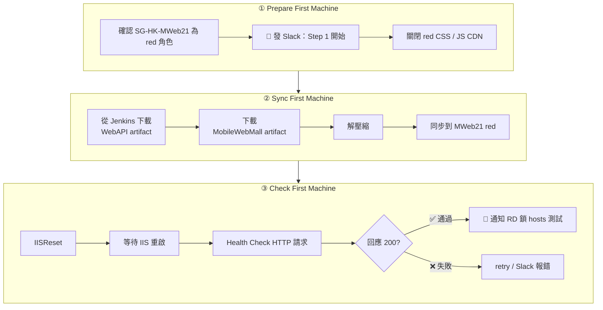
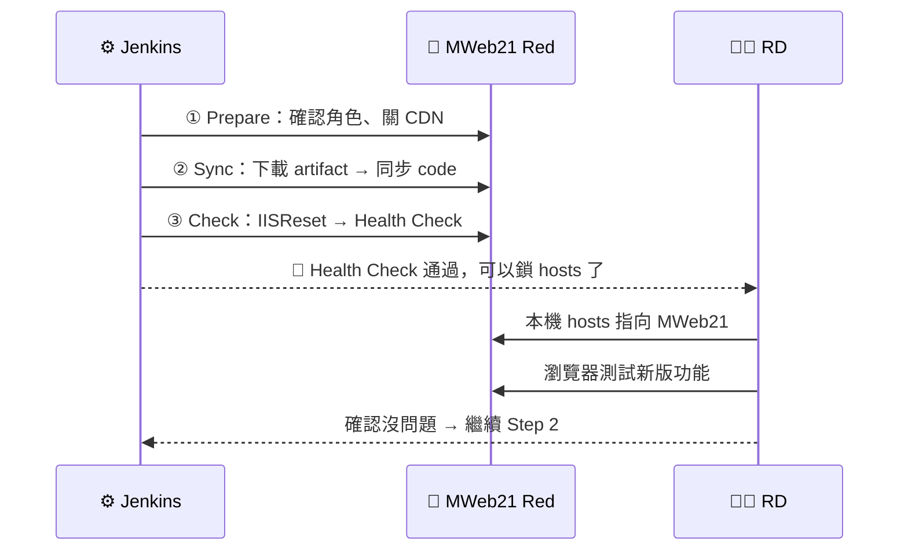




<!-- tab 意義-->

準備兩套幾乎一樣的正式環境，一套持續服務使用者，另一套靜默部署新版，確認無誤後再把流量切過去


> 不在使用者正在踩的地板上施工，而是先把隔壁房間裝潢好、確認能住，再把人帶過去


## 部署流程




## 藍綠 vs 金絲雀

兩者常被混淆，但著重點不同：

| | 藍綠佈署 | 金絲雀佈署 |
|:---:|:---:|:---:|
| **重點** | 架構（兩套環境） | 放量策略 |
| **流量方式** | 一次全切或漸進 | 先少量真實流量驗證，再逐步擴大 |
| **適合情境** | 需要快速回滾保底 | 需要低風險漸進驗收 |


藍綠佈署搭配 `weighted target group`，同樣可以做到漸進放量，兼顧兩種策略的優點


## ALB Weighted Target Group

AWS ALB 的流量分配機制：**同一個入口依照比例，把請求分配到不同 Target Group**。




切換時調整權重比例，不改 DNS、不動機器，流量即時生效：

```
切換前：Blue 100% / Green 0%
漸進式：Blue 50%  / Green 50%   ← 觀察穩定後
切換後：Blue 0%   / Green 100%
```


## 我們的實作與標準藍綠的差異

我們的版本是 **三色機器輪替 + First Machine 驗證 + ALB/ASG 控制** 的藍綠變體：



| | 標準藍綠 | 我們的做法 |
|:---:|:---:|:---:|
| **部署目標** | 整套 Green 環境 | First Machine 單台先行 |
| **驗證方式** | 環境層級健康檢查 | RD 鎖 hosts 對單台測試 |
| **風險控制粒度** | 新舊環境切換 | 每步固定角色、單台驗證、逐步推進 |
| **人為判斷負擔** | 需判斷這次新版在哪個顏色 | 角色固定，不需判斷 |

RD 每次不再需要思考：*新版在哪個顏色？這台有流量嗎？我要鎖哪個 IP？*
角色固定、流程固定 — 這是以**長期維運**角度設計的佈署策略。


<!-- endtab -->


<!-- tab 角色-->

Step 1 中三台機器各司其職：**Red 離開線上接受新版測試、Blue 繼續扛流量、Green 悄悄開機等待就緒**。風險被控制在單台，線上服務不受影響。

## Step 1 機器狀態全覽




## 🔴 SG-HK-MWeb21 — Red（新版測試機）

- **B 線操作**：Green 就緒後，B 線呼叫 `UnregisterEC2fromELB` 將 Red 從 ELB 移除，等待 180s connection draining
- **A 線操作**：下載新版 code → 同步到 Red → 關閉 CDN → IISReset → Health Check → 通知 RD
- **流量狀態**：Step 1 期間移出 ELB，無線上流量
- **為何先選這台**：角色固定為「每輪第一台」，RD 每次都知道鎖這台，不需要判斷

> Red 下線是由 **B 線** 執行（RegisterEC2 Green → UnregisterEC2 Red），不是 A 線。A 線只負責部署新版。


## 🔵 SG-HK-MWeb22 — Blue（線上主力）

- **Step 1 任務**：無操作，全程留在 ELB
- **流量狀態**：✅ **Step 1 全程在線接流量**，B 線結束時 ASG weight 降至 0%，但 ELB 仍 registered
- **角色意義**：Step 1 期間持續兜底；Step 1 結束後與 Green 同時在 ELB 內接流量


## 🟢 SG-HK-MWeb23 — Green（新主力上線）

- **B 線操作**：StartAllEC2 → Ping 通 → `RegisterEC2toELB`（加入 ELB）→ Health Check 通過 → 等 ASG InService → **漸進放量 10% → 20% → … → 100%**
- **流量狀態**：Step 1 結束時 ASG weight = **100%**，已成為主要導流機器
- **角色意義**：B 線核心任務，Green 就緒是 Step 1 完成的關鍵條件


## Step 1 結束後三機狀態

| 機器 | 顏色 | ELB 狀態 | Step 1 關鍵操作 |
|:---:|:---:|:---:|:---|
| SG-HK-MWeb21 | 🔴 Red | ❌ 已移除 | B線 Unregister → A線部署新版 → RD 測試 |
| SG-HK-MWeb22 | 🔵 Blue | ✅ 仍在 | 無操作，全程在線接流量 |
| SG-HK-MWeb23 | 🟢 Green | ✅ 已加入 | B線 Register → Health Check → 漸進放量 |

<!-- endtab -->


<!-- tab 切流量-->

切流量不是改 DNS、也不是把機器手動上下線，而是**調整 ALB Target Group 的 Weight 權重**，同一個入口、即時生效、可以漸進也可以一次全切


## DNS 切換 vs ALB 權重切換

| | DNS 切換 | ALB 權重切換 |
|:---:|:---:|:---:|
| **生效速度** | 受 TTL 影響，可能延遲數分鐘 | 即時 |
| **漸進控制** | 不支援 | ✅ 支援任意比例 |
| **回滾速度** | 慢 | ✅ 改數字即回滾 |
| **機器操作** | 無需動機器 | 無需動機器 |

## 三種流量狀態



## Step 1 的流量切換實際做了什麼

Step 1 **不只是查**，B 線會完整執行流量切換的全部動作：



## 漸進放量細節

Green InService 後，B 線不是直接一次全切，而是每隔約 40 秒調一步：

```
Blue:90% / Green:10%  → 09:34:26
Blue:80% / Green:20%  → 09:35:07
Blue:70% / Green:30%  → 09:35:46
...（每步約 40 秒）
Blue:0%  / Green:100% → 09:39:00
```

> 這正是藍綠佈署搭配漸進放量的實際體現 — 讓真實流量先小比例打到 Green，確認穩定後再全切，降低一次全切帶來的風險。

<!-- endtab -->


<!-- tab 平行跑兩條線-->

Step 1 的兩條線**完全獨立、互不等待**，Jenkins 同時啟動兩者，等兩條都完成才進入 Step 2。這樣設計的核心原因是：**A 線部署 code 約 43 秒，B 線等 Green InService 約 16 分鐘 — 若循序執行就要等 17 分鐘，平行只需等最慢的那條。**


## 時序圖



## 平行的設計意義

| | 循序執行 | 平行執行 |
|:---:|:---:|:---:|
| **A 線時間** | 約 43 秒 | 約 43 秒（同時進行） |
| **B 線時間** | 約 16 分鐘 | 約 16 分鐘（同時進行） |
| **總等待時間** | ≈ 17 分鐘 | ≈ 16 分鐘 |
| **兩線有依賴？** | — | ❌ 完全獨立 |

## Step 1 結束後三機狀態

Step 1 走完，**MWeb22（Blue）與 MWeb23（Green）同時在 ELB 內接流量**；MWeb21（Red）已離線，部署新版供 RD 驗收：

| 機器 | 顏色 | ELB 狀態 | 流量 | Step 1 關鍵操作 |
|:---:|:---:|:---:|:---:|:---|
| SG-HK-MWeb21 | 🔴 Red | ❌ 已移除 | 無 | B線 Unregister → A線部署新版 → RD 測試 |
| SG-HK-MWeb22 | 🔵 Blue | ✅ 仍在 | ✅ **在線** | 無操作，全程接流量 |
| SG-HK-MWeb23 | 🟢 Green | ✅ 已加入 | ✅ **在線** | B線 Register → Health Check → 漸進放量 |

> `SetWeight` 是 ASG/ALB 層的路由設定，**hk-mweb-group1 ELB 只認 registered 狀態**。Blue 從未被 Unregister，所以兩台都在線上接流量。

## 兩條線的失敗行為



> 任一條線失敗，Step 1 即中止，不會進入 Step 2。這確保「第一台沒驗過」或「Green 機器沒就緒」時，流程不會繼續推進。

<!-- endtab -->


<!-- tab machine steps 說明-->

A 線「Prepare First Machine」實際上由三個循序 step 組成，共同完成「把第一台機器部署好、讓 RD 可以驗收」這件事


## 三個 Step 的分工

| Step | 核心任務 | 完成標誌 |
|:---:|:---|:---|
| **Prepare** | 確認角色、通知開始、關 CDN | Slack 發出、red CDN 已關 |
| **Sync** | 下載新版、同步 code 到機器 | 檔案同步完成 |
| **Check** | 重啟服務、健康確認、通知 RD | Health Check 回 200、RD 收到通知 |

## 執行流程



## Jenkins 與 RD 的交接點



> Jenkins 跑完這三個 step，球就交到 RD 手上。RD 驗收完畢後，才會繼續推進後續部署


<!-- endtab -->



