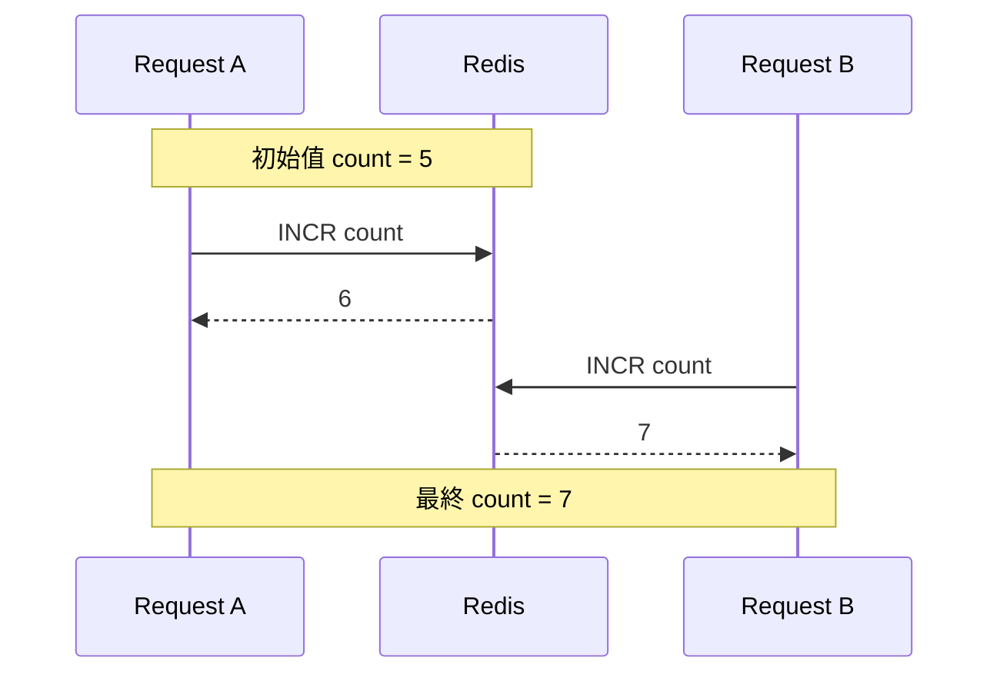




<!-- tab 不就是 +1-1 嗎-->

INCR = Increment，也就是增加，別看增加只是數學計算的 +1, +2 的事情，他牽扯的是 "流程" 問題，雖然 Redis 是單執行緒，但因為流程上或程式面，我們通常是把每一個看似簡單的事情，都會拆成一個個 UNIT
```bash
1. GET count
2. 程式 +1
3. SET count newValue
```


這三步是一個流程，但對 Redis 來說是三條分開的命令，只要是分開的命令，中間就可能插進別人的命令，它雖然一次只做一條，但順序可能變成

```bash
- A: GET count → 5
- B: GET count → 5
- A: SET count 6
- B: SET count 6
```

結果就出事了，明明有兩次加一，最後卻只變成 6，不是 7，所以問題根本在「每個 UNIT 的順序是什麼」


```mermaid
sequenceDiagram
    participant A as A
    participant R as Red
    is
    participant B as B

    Note over A,R: count = 5

    A->>R: GET count
    R-->>A: 5
    B->>R: GET count
    R-->>B: 5
    A->>R: SET count 6
    R-->>A: OK
    B->>R: SET count 6
    R-->>B: OK

    Note over A,B: 最終 count = 6
```


<!-- endtab -->


<!-- tab Basic-->


REDIS 的 INCR 操作就是，不用先把值讀出來自己加 1 再寫回去，Redis 幫你一次做完，這樣在多人同時操作時也不容易加錯


1. 先找到你指定的 key，例如 `page_views`、`order_id`、`login_count`
2. 讀取這個 key 目前的值，Redis 會看這個值是不是「可以當成整數」來處理，把這個值加 1，例如原本是 5，執行後就會變成 6
3. 把新值存回去，這個動作是 Redis 在內部直接完成的，不需要你自己拆成多個步驟
4. 回傳加完之後的新值，所以只知道有加成功，還能直接拿到結果繼續用


- 如果這個 key 原本不存在，Redis 會把它當成 0，然後加 1，結果變成 1
- 如果這個值不是整數內容，像是 hello，那執行 INCR 會報錯


例如

```bash
SET count 10
INCR count


## (integer) 11
```

如果 key 不存在
```bash
INCR visit_count

## (integer) 1
```





這就是 INCR


<!-- endtab -->


<!-- tab 情境-->


## 網頁瀏覽次數


每次有人打開頁面，就執行，這樣就能快速累加首頁被看了幾次

```bash
INCR page:view:home
```


## API 呼叫次數統計


你想知道某個 API 今天被打了多少次

```bash
INCR api:login:2026-04-19
```

這樣每天都能累積自己的計數


## 發號碼或流水號

你要產生一個遞增編號

```bash
INCR order:id
```

假設回傳 1001，那這次訂單就可以用 1001 當編號。這類場景很適合 INCR，因為大家都在同時加值時，Redis 會幫你處理好


## 庫存


```bash
SET product:1001:stock 10
DECR product:1001:stock
```

執行完之後，庫存就會變成 9

假設不用 DECR，而是自己拆成

```bash
1. GET stock
2. 程式裡判斷還有沒有庫存
3. 程式裡減 1
4. SET stock newValue

```
多人一起搶購時，就可能變成

```bash
- A 讀到 stock = 1
- B 也讀到 stock = 1
- A 寫回 0
- B 也寫回 0
```

表面上看起來最後是 0，但其實兩個人都成功買到了，等於超賣了


<!-- endtab -->


<!-- tab summary-->


<!-- endtab -->


