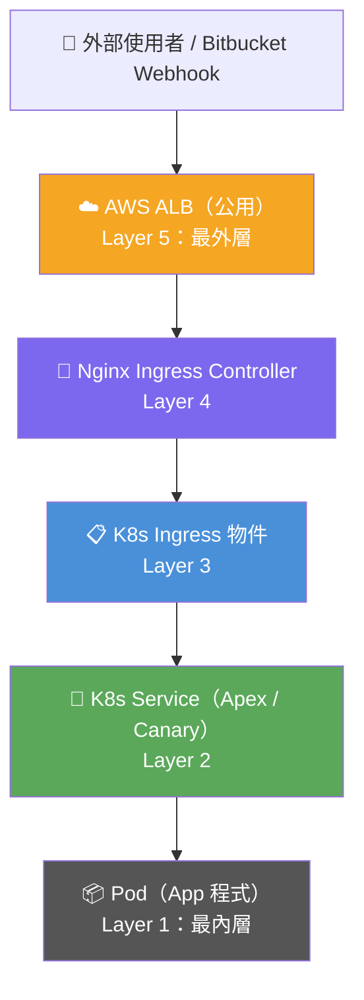
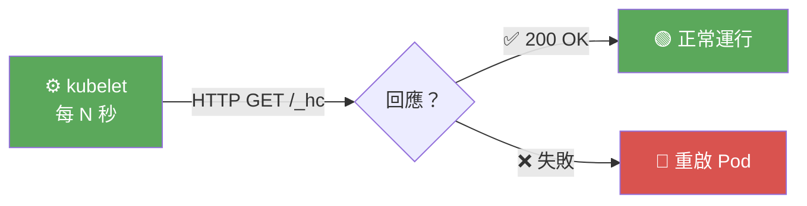
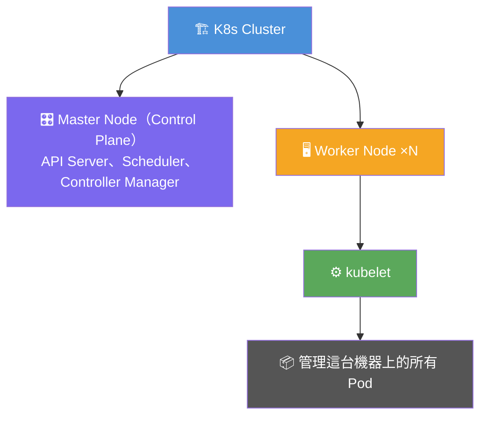
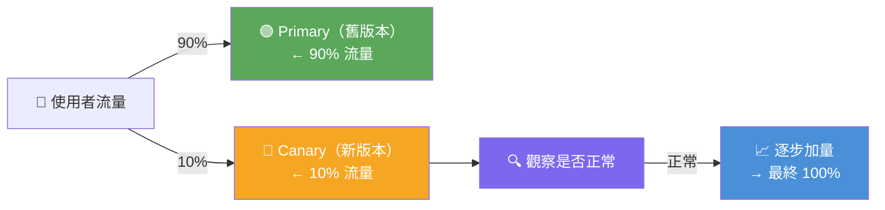
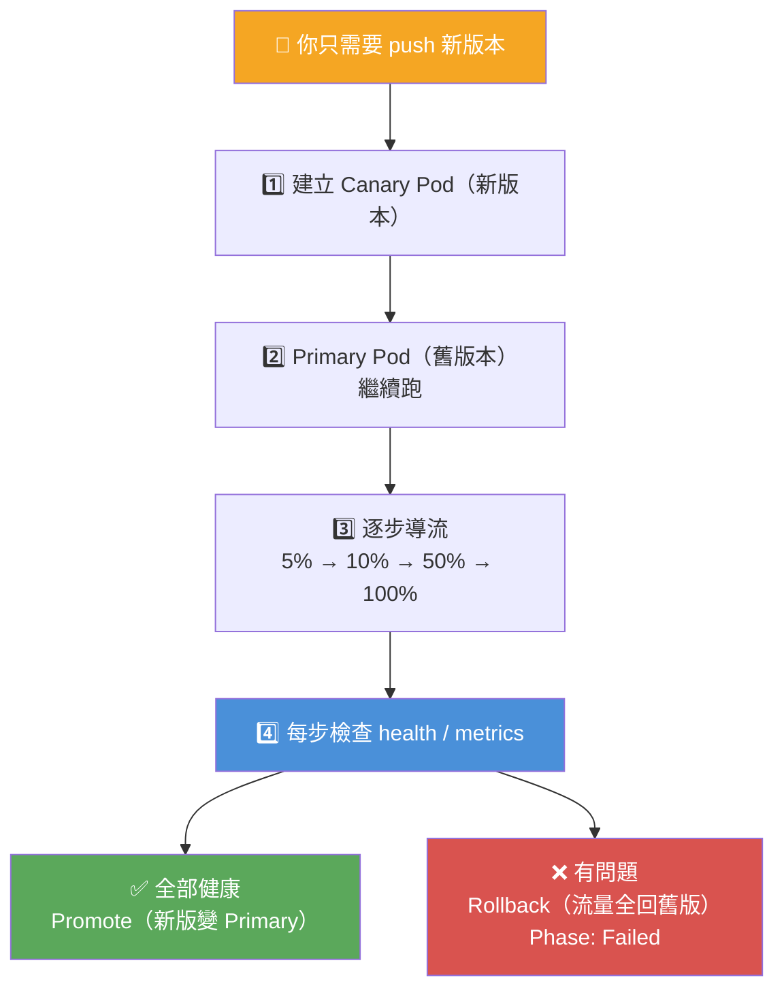
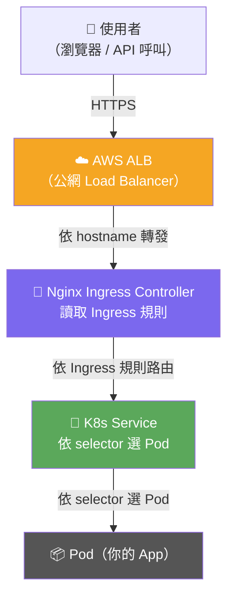
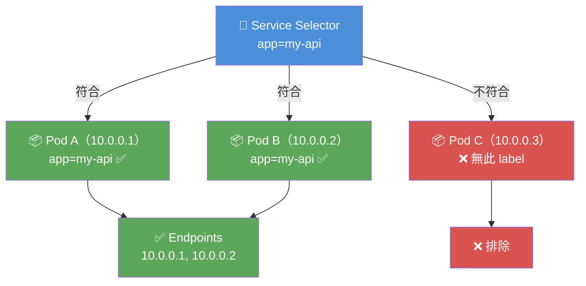
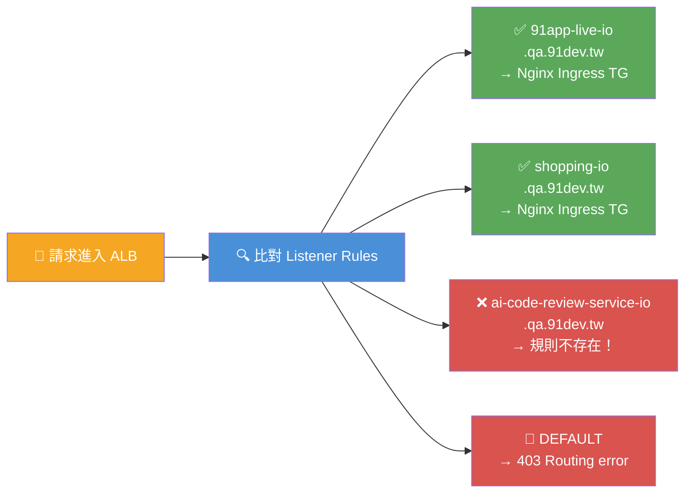




<!-- tab 背景-->

服務部署到 K8s 後，Pod 內部健康檢查（`/_hc`）回傳 200，但從外部網路呼叫 API 時，全部回傳：

```bash
HTTP/2 403
Routing error
```

本次記錄如何一層一層排查，最終找到真正的根本原因


<!-- endtab -->


<!-- tab 架構全貌-->

外部請求從前到後經過以下每一層



排查方向：**從最內層（Pod）往外一層一層確認，直到找到第一個異常層**


<!-- endtab -->


<!-- tab Layer 1：Pod 層-->


## Pod YAML

提供 Pod YAML，確認以下關鍵 status

```yaml
status:
  phase: Running
  conditions:
    - type: Ready
      status: 'True'        # Pod 已準備好接收流量
  containerStatuses:
    - restartCount: 0       # 沒有重啟，代表沒有 crash loop
      ready: true
      state:
        running:
          startedAt: '2026-05-11T03:52:43Z'
```

環境變數設定

```yaml
env:
  - name: ASPNETCORE_URLS
    value: http://+:5566    # ← 程式監聽的 port 與 K8s probe 一致
```


✅ **Pod 正常**。程式有在跑、Port 設定正確、無重啟 → 問題不在程式本身，往外查


## K8s Probe

Kubernetes 有三種 Probe（健康探針），由 kubelet 定期對 Pod 發 HTTP 請求來判斷容器狀態：


| Probe 類型 | 用途 | 失敗後行為 |
|:---|:---|:---|
| **Startup Probe** | 程式啟動完成了嗎？ | 在成功前，其他 probe 不會啟動；失敗超過閾值 → 重啟 Pod |
| **Liveness Probe** | 程式還活著嗎？ | 失敗 → 重啟 Pod |
| **Readiness Probe** | 程式準備好接流量嗎？ | 失敗 → 從 Service 移除，不送流量 |


```yaml
env:
- name: ASPNETCORE_URLS
    value: http://+:5566    # ← 程式監聽的 port 與 K8s probe 一致
```

K8s manifest 裡的 probe 設定大概長這樣

```yaml
livenessProbe:
httpGet:
    path: /_hc
    port: 5566
```

Probe 的運作流程



Port 不一致的後果就是 Startup probe failed: Get "http://10.x.x.x:5566/_hc/startup": connection refused

其中，原因就是 App 實際監聽 8080，但 Probe 打 5566 → 永遠連不到 → Pod 不斷重啟，所以 `ASPNETCORE_URLS=http://+:5566` 的作用就是強制 App 監聽 5566，與 K8s probe 的 target port 對齊


## kubelet


kubelet 是每台 K8s Node（實體/虛擬機）上都會跑的一個 agent 程式



| 職責 | 說明 |
|:---|:---|
| **啟動 Pod** | 接收 API Server 的指令，叫 container runtime（Docker/containerd）把容器跑起來 |
| **執行 Probe** | 每隔幾秒對 Pod 發健康檢查請求 |
| **回報狀態** | 把 Pod 狀態（Running/Failed/Restarting）回報給 API Server |
| **重啟 Pod** | Probe 失敗超過閾值時，直接重啟容器 |


<!-- endtab -->


<!-- tab Flagger Canary 層-->


我們 Pipeline 使用 **Flagger** 進行金絲雀部署（Canary Deployment）。Flagger 會：

1. 建立一個 **Primary Deployment**（穩定版本）
2. 建立一個 **Canary Deployment**（新版本）
3. 逐步把流量從 Primary 切到 Canary
4. 如果 Canary 健康 → Promote（升版完成）
5. 如果 Canary 不健康 → Rollback 並標記 `Phase: Failed`

若 Flagger 處於 `Phase: Failed` 狀態，它修改的 Ingress routing 可能沒有被完整還原，導致路由異常


## Canary 物件的 `status`

```yaml
status:
  phase: Succeeded                                  # ← 成功
  conditions:
    - reason: Succeeded
      message: Canary analysis completed successfully, promotion finished.
  lastAppliedSpec: bc57db7d4
  lastPromotedSpec: bc57db7d4                       # ← 兩個一致 = 已成功 Promote
  failedChecks: 0
```

## 結論

✅ **Flagger Canary 正常，最新部署已成功 Promote**。  → 不是 Canary Failed 造成的問題，往外查


## Canary 部署

Canary deployment（金絲雀部署） 是一種漸進式發布策略：



名字來自「礦工帶金絲雀下礦坑偵測毒氣」——先用小流量測試新版本，有問題就馬上 rollback


## Flagger


Flagger 是一個 K8s 的 Controller（控制器），它自動化 Canary 部署的整個流程




對應文件裡的實際狀態

```yaml
status:
  phase: Succeeded          # 部署成功
  lastAppliedSpec: bc57db7d4
  lastPromotedSpec: bc57db7d4  # 兩個相同 = 新版已完全取代舊版
  failedChecks: 0
```


| Flagger 建立的東西 | 用途 |
|:---|:---|
| **Primary Deployment** | 跑穩定版本的 Pod |
| **Canary Deployment** | 跑新版本的 Pod（部署中） |
| **Primary Ingress** | 承接 100% 正常流量 |
| **Canary Ingress** | 部署期間分流用（結束後 weight=0） |


Flagger 就是讓我們「不用停機、不用手動切流量」就能安全升版的自動化工具


<!-- endtab -->


<!-- tab Layer 3：Ingress 層-->


## 背景

Flagger 會管理**兩個** Ingress：

| 名稱 | 說明 | Nginx 標記 |
|---|---|---|
| `nine1-ai-code-review-api` | **Primary Ingress**，承接 100% 正常流量 | 無 canary 標記 |
| `nine1-ai-code-review-api-canary` | **Canary Ingress**，用於逐步導流 | `canary: true`, `canary-weight: 0` |

Canary Ingress 的 `canary-weight: 0` 代表目前 0% 流量導入 Canary，完全正常


## 確認方式

檢查兩個 Ingress 是否都存在，後端 Service 和 Port 設定是否正確：

```yaml
# Primary Ingress（應存在）
spec:
  rules:
    - host: ai-code-review-service-io.qa.91dev.tw
      http:
        paths:
          - backend:
              service:
                name: nine1-ai-code-review-api      # ← Apex Service
                port:
                  number: 5566                      # ← Port 正確
```

## 結論

✅ **兩個 Ingress 都存在，設定正確** → 不是 Primary Ingress 遺失造成的問題，往外查


##  Ingress

Ingress 是 K8s 裡的**「反向代理規則設定檔」**，它定義「外部流量進來之後，要怎麼分發到哪個 Service」


流量路徑全圖



Ingress 就在 Nginx 那一層 — 它是 Nginx 要讀的「路由設定」


##  Ingress 長什麼樣


```yaml
spec:
  rules:
    - host: ai-code-review-service-io.qa.91dev.tw
      http:
        paths:
          - backend:
              service:
                name: nine1-ai-code-review-api   # 送去這個 Service
                port:
                  number: 5566
```

凡是打來 ai-code-review-service-io.qa.91dev.tw 的請求，轉給 nine1-ai-code-review-api 這個 Service 的 5566 port」

| 元件 | 類比 | 職責 |
|:---|:---|:---|
| **AWS ALB** | 大樓門衛 | 「這棟樓有你嗎？」沒有 → 403 |
| **Ingress** | 樓層指引牌 | 「這個域名去 3F，那個域名去 7F」 |
| **K8s Service** | 樓層接待 | 找到這層裡健康的 Pod |
| **Pod** | 真正的辦公室 | 處理請求 |

Ingress YAML 自己不會動，它只是存在 K8s API Server 裡的


<!-- endtab -->


<!-- tab Layer 2 : Service / Endpoints 層-->


K8s Service 透過 **selector（Label Selector）** 決定要把流量送給哪些 Pod。如果 selector 和 Pod label 不匹配，`Endpoints` 就會是空的（`<none>`），流量進得來但沒地方送，造成 502/503。

Flagger 在部署時會把 Pod 加上 `instance=nine1-ai-code-review-api-primary` 的 label，Apex Service 的 selector 也需要對應到這個 label。

## 確認方式

在 Rancher UI

- **Service Discovery** → **Services** → `qa-ai-code-review`
- 點進 `nine1-ai-code-review-api`，確認有 Pod IP

或執行

```bash
kubectl get endpoints nine1-ai-code-review-api -n qa-ai-code-review
```

正常

```bash
NAME                       ENDPOINTS              AGE
nine1-ai-code-review-api   10.50.239.209:5566     5m
```

異常（代表 Service 選不到 Pod）：
```bash
NAME                       ENDPOINTS   AGE
nine1-ai-code-review-api   <none>      5m
```

## 結論

✅ **Service 有正確選到 Pod**（10.50.239.209:5566）→ 不是 Endpoints 空的問題，往外查


##  Pod Label

Label 就是貼在 Pod 上的標籤（key-value），我們在 Deployment YAML 裡定義

```yaml
spec:
  template:
    metadata:
      labels:
        app: my-api          # ← 自己定義的 label
        version: v1
```

K8s 建立 Pod 時，就會把這些 label 貼上去，Flagger 部署時還會額外自動加上

```yaml
instance: nine1-ai-code-review-api-primary   # ← Flagger 自動加的
```


## Selector


Selector 是 Service 上定義的**「我要找哪些 Pod」的條件**


```yaml
spec:
  selector:
    app: my-api              # ← 找有這個 label 的 Pod
```


K8s 會自動把符合 selector 的 Pod IP 收集成 Endpoints：




不匹配時的問題

```bash
Service selector: instance=nine1-ai-code-review-api-primary
Pod label:        instance=nine1-ai-code-review-api          ← 少了 -primary
```

→ 沒有 Pod 符合 → Endpoints = <none> → 流量進來沒地方送 → 502/503


你需要確保的唯一一件事

values-tw-*.yaml 的 fullnameOverride = RELEASE_NAME，兩個對得上。

```yaml
# values-tw-qa.yaml
fullnameOverride: nine1-ai-code-review-api   # ← 這個值決定了一切

# .gitlab-ci.yml
RELEASE_NAME: nine1-ai-code-review-api       # ← 必須跟上面一致
```


<!-- endtab -->


<!-- tab Layer 4：Nginx + AWS ALB 層-->


## 測試 `curl` 的 Response Header

```bash
curl -i https://ai-code-review-service-io.qa.91dev.tw/_hc
```

```bash
HTTP/2 403
server: awselb/2.0        ← ！！！這不是 Nginx，是 AWS ELB！
content-type: text/plain
Routing error
```

**`server: awselb/2.0`** 代表這個 403 是 **AWS ALB 本身回傳的**，請求根本沒有進入 K8s Cluster


## 確認 DNS 指向

```bash
nslookup ai-code-review-service-io.qa.91dev.tw

ai-code-review-service-io.qa.91dev.tw
  → public-ingress.eks.91dev.tw
  → public-eks-ingress-alb-60960985.ap-northeast-1.elb.amazonaws.com
```

域名走的是**共用公用 ALB**（`public-eks-ingress-alb`），這個 ALB 前面承接所有對外服務的流量，再依 hostname 分發到 Nginx Ingress


## 根本原因

這個 ALB 使用 **Listener Rules（監聽規則）** 來決定哪個 hostname 的流量要轉發給哪個 Target Group（Nginx Ingress）

但 **新服務**的 hostname 在 ALB Listener Rules 裡**沒有對應的規則**！  




## 結論

❌ **問題在 AWS ALB Listener Rules 未設定此 hostname 的轉發規則。**


## Hostname

打 API 時網址裡的網域名稱：https://ai-code-review-service-io.qa.91dev.tw/_hc 這整段就是 hostname，ALB 收到請求時，會看 HTTP Header 裡的 Host 欄位：Host: ai-code-review-service-io.qa.91dev.tw 用這個值來決定「這個請求要丟給誰處理」


## Target Group

Target Group 是 AWS ALB 的概念，意思是**「一群要接收流量的目標機器」**，在我們的架構裡，Target Group 指向的就是 Nginx Ingress Controller 的 Pod

```bash
Target Group（Nginx Ingress TG）
├── Nginx Pod IP: 10.0.1.5:80
├── Nginx Pod IP: 10.0.1.6:80
└── Nginx Pod IP: 10.0.1.7:80
```


<!-- endtab -->


<!-- tab table-->


| 步驟 | 確認項目 | 工具 | 正常標準 |
|---|---|---|---|
| 1 | Pod 狀態 | Pod YAML / Rancher | `phase: Running`, `Ready: True`, `restartCount: 0` |
| 2 | Canary 狀態 | Canary YAML | `phase: Succeeded`, lastApplied = lastPromoted |
| 3 | Ingress 存在 | Ingress YAML / Rancher | Primary + Canary 兩個都在，port 正確 |
| 4 | Service Endpoints | `kubectl get endpoints` | 有 Pod IP，不是 `<none>` |
| 5 | 實際呼叫測試 | `curl -i` | 看 `server:` header 判斷是誰回傳的錯誤 |
| 6 | DNS 確認 | `nslookup` | 確認域名解析路徑 |


<!-- endtab -->


