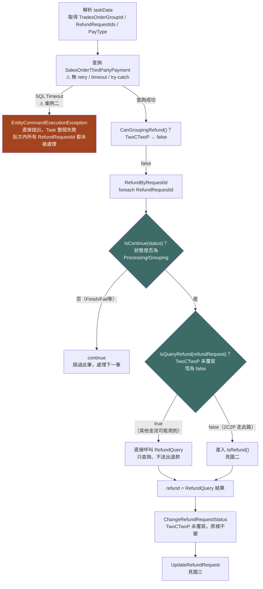
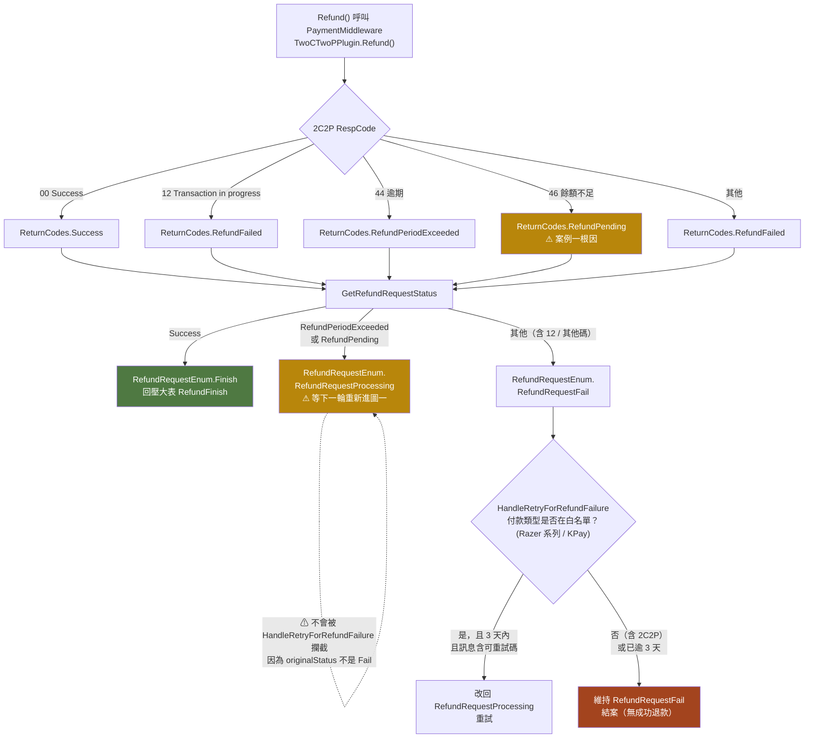
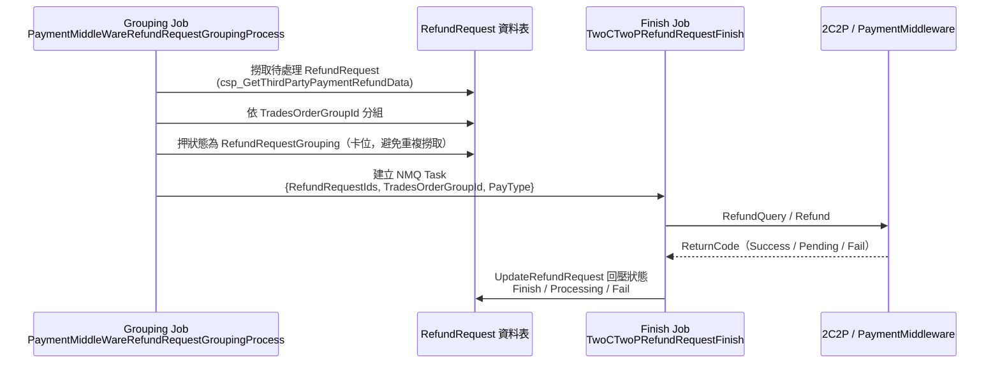



<!-- tab 問題總覽-->

<style>
.medchart-wrap { display: flex; flex-direction: column; gap: 28px; margin: 24px 0; }
.medchart {
  background: #fbfaf6;
  border: 1px solid #c9c3ae;
  border-radius: 4px;
  position: relative;
  font-family: 'Courier New', 'Consolas', 'PingFang TC', monospace;
  box-shadow: 0 1px 3px rgba(0,0,0,0.08);
  padding-bottom: 4px;
}
.medchart::before {
  content: ''; position: absolute; left: 0; top: 0; bottom: 0; width: 6px;
  background: repeating-linear-gradient(180deg, #b9c9c6 0 10px, transparent 10px 20px);
}
.medchart-top {
  display: flex; align-items: center; gap: 10px;
  padding: 14px 20px 10px 26px; border-bottom: 2px solid #2f4f4f;
}
.medchart-cross {
  width: 26px; height: 26px; flex-shrink: 0; position: relative;
}
.medchart-cross::before, .medchart-cross::after {
  content: ''; position: absolute; background: #3d6b66;
}
.medchart-cross::before { left: 45%; top: 0; width: 12%; height: 100%; }
.medchart-cross::after  { top: 45%; left: 0; height: 12%; width: 100%; }
.medchart-title { font-weight: 700; font-size: 1.02rem; color: #2f4f4f; letter-spacing: 1px; }
.medchart-title small { display:block; font-weight:400; font-size:0.72rem; color:#8a9a97; letter-spacing:2px; margin-top:2px; }

.medchart-idbar {
  display: flex; flex-wrap: wrap; gap: 0; margin: 10px 20px 10px 26px;
  border: 1px solid #c9c3ae;
}
.medchart-idbox { flex: 1; min-width: 140px; border-right: 1px dashed #c9c3ae; padding: 6px 12px; }
.medchart-idbox:last-child { border-right: none; }
.medchart-idbox .k { font-size: 0.68rem; color: #8a8272; letter-spacing: 1px; }
.medchart-idbox .v { font-size: 0.88rem; color: #2f2f2f; font-weight: 700; }

.medchart-field { margin: 0 20px 0 26px; padding: 10px 0; border-bottom: 1px dashed #d8d3c2; }
.medchart-field:last-of-type { border-bottom: none; }
.medchart-field .k {
  display: inline-block; font-size: 0.72rem; color: #6b6250; letter-spacing: 2px;
  border: 1px solid #c9c3ae; border-radius: 2px; padding: 1px 8px; margin-bottom: 6px; background: #f2efe4;
}
.medchart-field .v { font-size: 0.88rem; color: #2b2b2b; line-height: 1.9; }
.medchart-field .v code { background: #eef0eb; padding: 1px 6px; border-radius: 3px; font-size: 0.85em; color: #a3441e; }
.medchart-field ol, .medchart-field ul { margin: 4px 0 0; padding-left: 20px; }

.medchart-stamp {
  display: inline-block; margin: 14px 20px 18px 26px; padding: 6px 16px;
  border: 3px double #a3441e; color: #a3441e; font-weight: 700; font-size: 0.85rem;
  letter-spacing: 2px; transform: rotate(-3deg); border-radius: 4px; background: rgba(163,68,30,0.04);
}

/* ---- 完整鏈路解析：延續病歷表配色，改用診斷流程卡片的視覺語彙 ---- */
.flow-banner {
  display: flex; align-items: center; gap: 12px;
  background: #f2efe4; border-left: 4px solid #3d6b66;
  padding: 10px 18px; margin: 30px 0 16px; border-radius: 2px;
}
.flow-banner .flow-num {
  font-family: 'Courier New', 'Consolas', monospace; font-weight: 700; font-size: 0.82rem;
  color: #a3441e; border: 1px solid #a3441e; border-radius: 50%;
  width: 26px; height: 26px; flex-shrink: 0;
  display: flex; align-items: center; justify-content: center; background: #fbfaf6;
}
.flow-banner .flow-text { line-height: 1.5; }
.flow-banner .flow-title { font-weight: 700; color: #2f4f4f; letter-spacing: 1px; font-size: 0.98rem; }
.flow-banner .flow-desc { font-size: 0.78rem; color: #8a8272; letter-spacing: 0.5px; margin-top: 1px; }

.flow-note {
  background: #fbfaf6; border: 1px dashed #c9c3ae; border-left: 4px solid #b8860b;
  padding: 10px 18px; margin: 14px 0 20px; border-radius: 2px;
  font-size: 0.92rem; color: #4a4636; line-height: 1.8;
}
.flow-note code { background: #eef0eb; padding: 1px 6px; border-radius: 3px; color: #a3441e; }
.flow-note.danger {
  background: #fbf1ee; border-color: #e0b8ab; border-left-color: #a3441e; color: #7a2e1f;
}
.flow-note.danger code { background: #f3ded7; color: #8c2f1a; }

.stage-grid { display: flex; gap: 20px; margin: 20px 0 24px; flex-wrap: wrap; }
.stage-card {
  flex: 1; min-width: 280px; background: #fbfaf6; border: 1px solid #c9c3ae; border-radius: 4px;
  box-shadow: 0 1px 3px rgba(0,0,0,0.06); overflow: hidden;
}
.stage-card .stage-head {
  display: flex; align-items: center; gap: 10px; padding: 10px 16px;
  background: #2f4f4f; color: #fbfaf6;
}
.stage-card .stage-head .stage-tag {
  font-family: 'Courier New', Consolas, monospace; font-size: 0.7rem; letter-spacing: 1px;
  border: 1px solid rgba(255,255,255,0.6); border-radius: 2px; padding: 1px 6px; opacity: 0.9;
}
.stage-card .stage-head .stage-name { font-weight: 700; font-size: 0.95rem; letter-spacing: 1px; }
.stage-card .stage-head .stage-loc { font-size: 0.7rem; opacity: 0.75; margin-left: auto; font-family: 'Courier New', Consolas, monospace; }
.stage-card ol { margin: 0; padding: 14px 20px 16px 34px; list-style: none; counter-reset: stage-step; }
.stage-card ol li {
  counter-increment: stage-step; position: relative; padding: 6px 0 6px 6px;
  border-bottom: 1px dashed #d8d3c2; font-size: 0.88rem; color: #2b2b2b; line-height: 1.7;
}
.stage-card ol li:last-child { border-bottom: none; }
.stage-card ol li::before {
  content: counter(stage-step); position: absolute; left: -26px; top: 6px;
  width: 18px; height: 18px; border-radius: 50%; background: #3d6b66; color: #fff;
  font-size: 0.68rem; font-weight: 700; display: flex; align-items: center; justify-content: center;
}
.stage-card ol li code, .stage-card .stage-bullets code { background: #eef0eb; padding: 1px 6px; border-radius: 3px; color: #a3441e; font-size: 0.85em; }
.stage-card .stage-bullets { margin: 0; padding: 0 20px 16px; font-size: 0.88rem; color: #2b2b2b; line-height: 1.8; }

.case-timeline { position: relative; margin: 20px 0 30px; padding-left: 36px; }
.case-timeline::before {
  content: ''; position: absolute; left: 9px; top: 4px; bottom: 4px; width: 2px;
  background: repeating-linear-gradient(180deg, #b9c9c6 0 8px, transparent 8px 16px);
}
.tl-event { position: relative; margin-bottom: 18px; }
.tl-event:last-child { margin-bottom: 0; }
.tl-event::before {
  content: ''; position: absolute; left: -31px; top: 3px; width: 12px; height: 12px;
  border-radius: 50%; background: #3d6b66; border: 2px solid #fbfaf6; box-shadow: 0 0 0 1.5px #3d6b66;
}
.tl-event.warn::before   { background: #b8860b; box-shadow: 0 0 0 1.5px #b8860b; }
.tl-event.danger::before { background: #a3441e; box-shadow: 0 0 0 1.5px #a3441e; }
.tl-event.done::before   { background: #4f7942; box-shadow: 0 0 0 1.5px #4f7942; }
.tl-event .tl-card {
  background: #fbfaf6; border: 1px solid #d8d3c2; border-radius: 4px; padding: 8px 16px;
}
.tl-event.warn .tl-card   { border-left: 3px solid #b8860b; }
.tl-event.danger .tl-card { border-left: 3px solid #a3441e; }
.tl-event.done .tl-card   { border-left: 3px solid #4f7942; }
.tl-head { display: flex; align-items: baseline; gap: 8px; flex-wrap: wrap; }
.tl-head .tl-step {
  font-family: 'Courier New', Consolas, monospace; font-size: 0.68rem; color: #8a8272;
  border: 1px solid #c9c3ae; border-radius: 2px; padding: 0 6px; background: #f2efe4; flex-shrink: 0;
}
.tl-head .tl-title { font-weight: 700; color: #2f4f4f; font-size: 0.92rem; }
.tl-desc { font-size: 0.86rem; color: #2b2b2b; margin-top: 4px; line-height: 1.7; }
.tl-desc code { background: #eef0eb; padding: 1px 6px; border-radius: 3px; color: #a3441e; font-size: 0.85em; }

.plan-card {
  background: #fbfaf6; border: 1px solid #c9c3ae; border-radius: 4px;
  margin: 22px 0; box-shadow: 0 1px 3px rgba(0,0,0,0.06); overflow: hidden;
}
.plan-card .plan-head {
  display: flex; align-items: center; gap: 12px; padding: 12px 18px;
  background: #2f4f4f; color: #fbfaf6;
}
.plan-card .plan-num {
  font-family: 'Courier New', Consolas, monospace; font-weight: 700; font-size: 0.85rem;
  border: 1px solid rgba(255,255,255,0.6); border-radius: 50%; width: 26px; height: 26px;
  display: flex; align-items: center; justify-content: center; flex-shrink: 0;
}
.plan-card .plan-title { font-weight: 700; font-size: 0.98rem; letter-spacing: 1px; }
.plan-card .plan-target { font-size: 0.74rem; opacity: 0.8; margin-left: auto; font-family: 'Courier New', Consolas, monospace; text-align: right; }
.plan-card .plan-priority {
  font-size: 0.68rem; letter-spacing: 1px; padding: 2px 8px; border-radius: 10px; flex-shrink: 0;
}
.plan-priority.high { background: #a3441e; color: #fff; }
.plan-priority.mid  { background: #b8860b; color: #fff; }
.plan-priority.low  { background: #6b8e6b; color: #fff; }
.plan-card .plan-body { padding: 16px 20px 18px; }
.plan-card .plan-body > p:first-child { margin-top: 0; }
.plan-card .plan-body pre { margin: 12px 0 0; }
.plan-card .plan-body code { color: #a3441e; }

.flow-table-wrap { margin: 12px 0 24px; border: 1px solid #c9c3ae; border-radius: 2px; overflow: hidden; }
.flow-table-wrap table { width: 100%; border-collapse: collapse; font-size: 0.86rem; margin: 0 !important; }
.flow-table-wrap th { background: #2f4f4f; color: #fbfaf6; padding: 9px 12px; text-align: left; font-weight: 600; letter-spacing: 0.5px; }
.flow-table-wrap td { padding: 9px 12px; border-top: 1px solid #e3ddc9; vertical-align: top; color: #2b2b2b; }
.flow-table-wrap tr:nth-child(even) td { background: #f7f5ec; }
.flow-table-wrap td code, .flow-table-wrap th code { background: #eef0eb; padding: 1px 6px; border-radius: 3px; color: #a3441e; font-size: 0.85em; }
</style>

2C2P 的退款流程遇到兩種會「卡住」的狀況：一種是**商家錢包餘額不夠**，系統只會無限空轉、不會停下來也不會通知任何人；另一種是**資料庫查詢逾時**，導致整批退款請求直接失敗中止，需要人力介入才能恢復。下面用「病歷表」的方式，把兩筆真實訂單的發病經過整理出來。

<div class="medchart-wrap">

<div class="medchart">
  <div class="medchart-top">
    <div class="medchart-cross"></div>
    <div class="medchart-title">退款流程病歷紀錄 01<small>REFUND INCIDENT CHART</small></div>
  </div>
  <div class="medchart-idbar">
    <div class="medchart-idbox"><div class="k">訂單編號 TG CODE</div><div class="v">TG240229L00048</div></div>
    <div class="medchart-idbox"><div class="k">退款單號 REFUND ID</div><div class="v">124650</div></div>
    <div class="medchart-idbox"><div class="k">病灶 SYMPTOM</div><div class="v">餘額不足 (Code 46)</div></div>
  </div>

  <div class="medchart-field">
    <div class="k">主訴 CHIEF COMPLAINT</div>
    <div class="v">呼叫 Refund 時，2C2P 回應 <code>46,Insufficient funds to perform refund.</code></div>
  </div>

  <div class="medchart-field">
    <div class="k">生命徵象 VITAL SIGN</div>
    <div class="v">狀態停留於 <code>RefundRequestProcessing</code>　·　重試次數：無上限　·　自癒能力：無</div>
  </div>

  <div class="medchart-field">
    <div class="k">病程記錄 COURSE OF ILLNESS</div>
    <div class="v">
      <ol>
        <li>RefundQuery 回應 <code>00,Success</code> 且 <code>status=S</code>（已 Settled），判定「可退款」</li>
        <li>呼叫 Refund，2C2P 回應 <code>46 餘額不足</code></li>
        <li>狀態寫回 <code>RefundRequestProcessing</code>，永遠不會進入重試上限判斷</li>
        <li>每一輪排程都重新呼叫一次 RefundQuery + Refund，持續打向 2C2P，直到商戶餘額被人工補足</li>
        <li>下一輪 RefundQuery 顯示已退款成功，工程師手動 redo 後狀態才轉 Finish 並回壓大表</li>
      </ol>
    </div>
  </div>

  <div class="medchart-stamp">診斷 DX：46 追加主動通知商戶餘額不足的機制</div>
</div>

<div class="medchart">
  <div class="medchart-top">
    <div class="medchart-cross"></div>
    <div class="medchart-title">退款流程病歷紀錄 02<small>REFUND INCIDENT CHART</small></div>
  </div>
  <div class="medchart-idbar">
    <div class="medchart-idbox"><div class="k">訂單編號 TG CODE</div><div class="v">TG240510P00022 / TG240205L00095</div></div>
    <div class="medchart-idbox"><div class="k">退款單號 REFUND ID</div><div class="v">129378 / 122952</div></div>
    <div class="medchart-idbox"><div class="k">病灶 SYMPTOM</div><div class="v">DB 查詢逾時</div></div>
  </div>

  <div class="medchart-field">
    <div class="k">主訴 CHIEF COMPLAINT</div>
    <div class="v"><code>SalesOrderThirdPartyPaymentRepository.Get()</code> 查詢逾時（Execution Timeout Expired）</div>
  </div>

  <div class="medchart-field">
    <div class="k">生命徵象 VITAL SIGN</div>
    <div class="v">StatusUpdatedDateTime 停留於 <code>2024-xx</code>　·　停滯時長：近 2 年　·　告警機制：無</div>
  </div>

  <div class="medchart-field">
    <div class="k">病程記錄 COURSE OF ILLNESS</div>
    <div class="v">
      <ol>
        <li>例外在 <code>DoRefundRequestFinish</code> 一開始就被拋出，連 RefundQuery 都還沒執行，整個 Task 中止</li>
        <li>兩筆退款單狀態就此停滯，因無告警機制，無人發現</li>
        <li>事後人工查詢才發現兩筆訂單其實各自「早有明確結果」：</li>
      </ol>
      <ul>
        <li><code>129378</code>：2C2P 狀態為 <code>V</code>（已作廢，respDesc="No refund records"）</li>
        <li><code>122952</code>：2C2P <code>refundList</code> 中早已存在對應 <code>tradesOrderSlaveCode</code> 的退款紀錄（已退款完成）</li>
      </ul>
    </div>
  </div>

  <div class="medchart-stamp">診斷 DX：查詢無 Retry 保護，且未核對 Status/RefundList</div>
</div>

</div>

<!-- endtab -->


<!-- tab 完整鏈路解析-->

這一段把 `PaymentMiddleWareRefundRequestService` 整條退款鏈路拆成三張圖：**入口與分派**（圖一）→ **2C2P 專屬的退款前置檢查**（圖二）→ **2C2P 回應碼如何分派到最終狀態**（圖三），每張圖都對應到不同的判斷分支

<div class="flow-banner">
  <div class="flow-num">1</div>
  <div class="flow-text">
    <div class="flow-title">入口與分派</div>
    <div class="flow-desc">DoRefundRequestFinish → RefundByRequestId · SQL Timeout 分支 / IsQueryRefund 分支</div>
  </div>
</div>



<div class="flow-table-wrap">

| 節點 | 位置 | 說明 |
|:---|:---|:---|
| 查詢 SalesOrderThirdPartyPayment | `DoRefundRequestFinish`（Line 197-198） | 單次 EF 查詢、**沒有 retry / timeout 保護機制、沒有 try-catch**。SQL Server 忙碌時（案例二）直接丟出例外，整個 Task 失敗，此時**連任何一筆 RefundRequest 都還沒被讀取或處理**。 |
| IsContinue | `IsContinue`（Line 527-530） | 只要目前狀態非 `RefundRequestProcessing` / `RefundRequestGrouping` 就跳過；反過來說，只要狀態還是 Processing，**每一輪排程都會無條件重新進入處理**。 |
| IsQueryRefund | `RefundByRequestId`（Line 354） | 2C2P 沒有覆寫此方法，沿用 `AbstractPayChannelService` 預設值 `false`，因此永遠會走到 `IsRefund()` 分支，而不是「只查詢不動作」的分支。 |

</div>

<div class="flow-banner">
  <div class="flow-num">2</div>
  <div class="flow-text">
    <div class="flow-title">IsRefund() 內部判斷</div>
    <div class="flow-desc">TwoCTwoPPayChannelService · 決定要不要真正呼叫 Refund()</div>
  </div>
</div>

`IsRefund()` 每次被呼叫都會**先重新打一次 RefundQuery**，再依回應內容決定要不要真正呼叫 `Refund()`：

```mermaid
flowchart TD
    A["IsRefund 被呼叫"] --> B["先呼叫 RefundQuery\n（每次都重打，即使已是第 N 次 redo）"]
    B --> C{"RefundQueryResult\nReturnCode == Success？"}

    C -->|"否\n（查詢動作本身失敗）"| C1["refund.ReturnCode = RefundFailed\nIsRefund 回傳 false\n⚠ 不呼叫 Refund()"]

    C -->|"是"| D{"ExtendInfo.status\n== \"S\"（已 Settled）？"}

    D -->|"否\n可能是尚未結算 / V 作廢\n⚠ 未核對 refundList"| D1["refund.ReturnCode = RefundPending\nIsRefund 回傳 false\n⚠ 不呼叫 Refund()"]

    D -->|"是"| D2["IsRefund 回傳 true\n→ 外層真正呼叫 Refund()\n見圖三"]

    style C1 fill:#a3441e,color:#fff
    style D1 fill:#b8860b,color:#fff
    style D2 fill:#4f7942,color:#fff
```

<div class="flow-note">
💡 圖二有三條出路，只有「狀態為已結算（status=="S"）」這一條會真正呼叫 <code>Refund()</code> 送出退款請求；另外「RefundQuery 查詢本身就失敗」與「狀態不是已結算」這兩條路徑，<code>refund</code> 都只是本地端自己組出來的「假回應」，2C2P 完全沒有收到任何退款動作。
</div>

**呼叫 `Refund()` 時實際帶給 PaymentMiddleware 的 Payload**（`Refund()` Line 540-575）：

<div class="flow-table-wrap">

| 欄位 | 值 |
|:---|:---|
| `TransactionId` | `payment.SalesOrderThirdPartyPayment_TransactionId`（原始付款交易編號） |
| `Amount` | `refundRequest.RefundRequest_Amount` |
| `Currency` | `payment.SalesOrderThirdPartyPayment_CurrencyTypeDef` |
| `ExtendInfo.tradesOrderSlaveCode` | `refundRequest.RefundRequest_TradesOrderSlaveCode`（`TwoCTwoPPayChannelService.GetRefundExtendInfo`） |

</div>

<div class="flow-banner">
  <div class="flow-num">3</div>
  <div class="flow-text">
    <div class="flow-title">圖三：回應碼分派到最終狀態</div>
    <div class="flow-desc">TwoCTwoPPlugin.Refund() → GetRefundRequestStatus → HandleRetryForRefundFailure</div>
  </div>
</div>




<div class="flow-table-wrap">

| 分派點 | 位置 | 說明 |
|:---|:---|:---|
| RespCode → ReturnCodes | `TwoCTwoPPlugin.Refund()`（Line 313-320） | 2C2P 的 46（餘額不足）被映射為 `RefundPending`，**與 44（逾期）走同一條路徑**，但語意完全不同：44 是「真的不能退了」，46 卻是「可能等等就能退」。 |
| GetRefundRequestStatus | Line 504-518 | `Success → Finish`；`RefundPeriodExceeded / RefundPending → RefundRequestProcessing`；其餘 `→ RefundRequestFail`。**RefundPending 走的是 Processing 分支，不會進到 Fail 分支。** |
| HandleRetryForRefundFailure | Line 950-997 | 此重試上限機制（3 天內 + 白名單錯誤碼）**只在 originalStatus 已經是 Fail 時才會被檢查**，且白名單**只涵蓋 Razer 系列與 KPay**。由於 2C2P 的 46 在上一步已經走 Processing 分支，**永遠不會進入這個判斷式**——這是結構性的、而非單純「忘記把 2C2P 加進白名單」。 |
| 狀態回到 Processing 之後 | — | 狀態回到 Processing 後，下一輪排程會重新從圖一的 `IsContinue` 開始，再次進入圖二重打 RefundQuery，滿足 status=="S" 甚至會再打一次真正的 Refund——這就是案例一「無限重試」的完整迴圈。 |

</div>

### TwoCTwoPPayChannelService.cs — IsRefund() 的退款前置檢查

```csharp
// TwoCTwoPPayChannelService.cs IsRefund() Line 104-134
public override bool IsRefund(salesOrderThirdPartyPayment, paytype, refundRequest, refund, RefundQueryFunc)
{
    // 每次呼叫都會重新打一次 RefundQuery，即使已是第 N 次 redo
    var refundQueryResult = RefundQueryFunc(paytype, salesOrderThirdPartyPayment, refundRequest);

    if (refundQueryResult.ReturnCode != Success)
    {
        refund.ReturnCode = RefundFailed;
        return false;
    }

    // 只檢查 status == "S"（Settled），完全沒有核對 refundList 是否已存在對應退款紀錄
    var orderIsSettled = refundQueryResult.ExtendInfo?["status"] == "S";
    if (orderIsSettled) { return true; }  // → 外層才會真正呼叫 Refund()

    refund.ReturnCode = RefundPending;  // status != "S"（可能是 V 作廢，或尚未結算），一律視為 Pending
    return false;
}
```

<div class="flow-note danger">
⚠ 這個方法把「訂單狀態不是 S」的所有情境（尚未結算 / 已作廢 V / 甚至已存在 refundList 退款紀錄）**全部一視同仁歸類為 <code>RefundPending</code>**，沒有進一步分辨「值得等待重試」與「其實已有明確結果、不該再重試」。
</div>

### TwoCTwoPPlugin.cs — Refund() 與 RefundQuery() 的回應碼轉換

```csharp
// TwoCTwoPPlugin.cs Refund() Line 313-320
var returnCode = apiResponse.RespCode switch
{
    "00" => ReturnCodes.Success,
    "12" => ReturnCodes.RefundFailed,
    "44" => ReturnCodes.RefundPeriodExceeded,
    "46" => ReturnCodes.RefundPending,   // 餘額不足 → Pending，往上層一路變成 Processing，永遠不進 Fail 分支
    _   => ReturnCodes.RefundFailed,
};
```

```csharp
// TwoCTwoPPlugin.cs RefundQuery() Line 406-410
var returnCode = apiResponse.RespCode switch
{
    "00" => ReturnCodes.Success,   // 只代表「查詢動作本身成功」，不代表訂單已退款
    _   => ReturnCodes.UnhandledException,
};
// apiResponse.Status ("S"=已結算 / "V"=作廢) 與 apiResponse.RefundList（明細清單）
// 都已完整解析進 ExtendInfo，但只有 status 被 TwoCTwoPPayChannelService.IsRefund 拿來做「是否可退款」的閘門判斷，
// RefundList 明細完全沒有被拿來核對「是否已經退過款」。
```

<!-- endtab -->


<!-- tab Grouping 與 Finish 兩階段-->

## Grouping 與 Finish 兩階段是怎麼銜接的

退款流程實際上分成兩個獨立排程階段：



<div class="stage-grid">

<div class="stage-card">
  <div class="stage-head">
    <span class="stage-tag">STAGE 1</span>
    <span class="stage-name">Grouping 階段</span>
    <span class="stage-loc">CreateRefundRequestFinish · L138-171</span>
  </div>
  <ol>
    <li>透過 SP <code>csp_GetThirdPartyPaymentRefundData</code> 撈取<strong>尚未分群</strong>（待處理狀態）的 <code>RefundRequest</code></li>
    <li>依 <code>TradesOrderGroupId</code> 分組</li>
    <li><strong>先把該批 RefundRequestIds 狀態押成 <code>RefundRequestGrouping</code></strong>——目的是卡位，避免下一輪 Grouping 排程重複撈到同一批</li>
    <li>建立對應 NMQ Task（如 <code>TwoCTwoPRefundRequestFinish</code>），把 taskData 送出</li>
  </ol>
</div>

<div class="stage-card">
  <div class="stage-head">
    <span class="stage-tag">STAGE 2</span>
    <span class="stage-name">Finish 階段</span>
    <span class="stage-loc">DoRefundRequestFinish · L186-217</span>
  </div>
  <ol>
    <li>非同步執行，真正呼叫 <code>RefundQuery</code> / <code>Refund</code> 打 2C2P API</li>
    <li>依回應透過 <code>UpdateRefundRequest → GetRefundRequestStatus</code> 把狀態從 <code>Grouping</code> <strong>回壓改為</strong> <code>Finish</code>（成功）／<code>RefundRequestProcessing</code>（Pending，如 46）／<code>RefundRequestFail</code></li>
  </ol>
</div>

</div>

<div class="flow-note danger">
⚠ 若 Finish Job 中途失敗或結果是 Pending，狀態不會回到「待處理」，而是停在 <code>Grouping</code> 或 <code>Processing</code>。因為 <code>IsContinue</code> 只會跳過「非 Processing/Grouping」的狀態，所以下一輪 **Grouping 排程不會重新撈到它**（已經是 Grouping/Processing，不符合 SP 篩選的「待處理」條件），但下一輪 **Finish Job 若被重新觸發**（正常排程週期或人工 redo NMQ 訊息）會再次進來處理——這正是案例一「無限重試」實際發生的路徑：卡在 Processing 的單子要靠 Finish Job 本身被重複排程 / redo 才會反覆嘗試，而不是靠 Grouping Job。
</div>

<!-- endtab -->

<!-- tab 案例時間軸-->

## 案例一時間軸：TG240229L00048（餘額不足）

<div class="case-timeline">

<div class="tl-event">
  <div class="tl-card">
    <div class="tl-head"><span class="tl-step">STEP 6</span><span class="tl-title">IsRefund 內 RefundQuery</span></div>
    <div class="tl-desc">回應 <code>00,Success</code>，<code>status=S</code>，判定可退款 <strong>True</strong></div>
  </div>
</div>

<div class="tl-event warn">
  <div class="tl-card">
    <div class="tl-head"><span class="tl-step">STEP 7</span><span class="tl-title">呼叫 Refund</span></div>
    <div class="tl-desc">2C2P 回應 <code>46,Insufficient funds</code>，映射為 <code>RefundPending</code></div>
  </div>
</div>

<div class="tl-event warn">
  <div class="tl-card">
    <div class="tl-head"><span class="tl-step">STEP 9</span><span class="tl-title">狀態回壓</span></div>
    <div class="tl-desc"><code>GetRefundRequestStatus</code> 將 <code>RefundPending</code> 對應為 <code>RefundRequestProcessing</code></div>
  </div>
</div>

<div class="tl-event danger">
  <div class="tl-card">
    <div class="tl-head"><span class="tl-step">STEP 10</span><span class="tl-title">重試上限不生效</span></div>
    <div class="tl-desc"><code>originalStatus</code> 是 <code>Processing</code> 而非 <code>Fail</code>，無次數/天數上限</div>
  </div>
</div>

<div class="tl-event danger">
  <div class="tl-card">
    <div class="tl-head"><span class="tl-title">下一輪排程</span></div>
    <div class="tl-desc"><code>IsContinue</code> 判斷為 <code>true</code>，不跳過，重打一次 RefundQuery + Refund，如此反覆</div>
  </div>
</div>

<div class="tl-event done">
  <div class="tl-card">
    <div class="tl-head"><span class="tl-title">商戶餘額補足</span></div>
    <div class="tl-desc">Refund 成功，狀態轉 <code>Finish</code>，工程師手動 redo 加速回壓大表</div>
  </div>
</div>

</div>

## 案例二鏈路對照：TG240510P00022 / TG240205L00095（DB Timeout）

<div class="case-timeline">

<div class="tl-event">
  <div class="tl-card">
    <div class="tl-head"><span class="tl-step">STEP 1-2</span><span class="tl-title">NMQ Job 觸發</span></div>
    <div class="tl-desc">解析 taskData，查詢 <code>SalesOrderThirdPartyPayment</code></div>
  </div>
</div>

<div class="tl-event danger">
  <div class="tl-card">
    <div class="tl-head"><span class="tl-title">SQL Timeout</span></div>
    <div class="tl-desc"><code>EntityCommandExecutionException</code> 未被攔截，Task 直接失敗</div>
  </div>
</div>

<div class="tl-event danger">
  <div class="tl-card">
    <div class="tl-head"><span class="tl-title">卡住</span></div>
    <div class="tl-desc">退款單停留在 <code>Processing</code>/<code>Grouping</code>，<strong>近 2 年未更新</strong>，無監控告警</div>
  </div>
</div>

<div class="tl-event">
  <div class="tl-card">
    <div class="tl-head"><span class="tl-title">人工查詢 129378</span></div>
    <div class="tl-desc"><code>status=V</code> 作廢，<code>respDesc=No refund records</code>，本來就無需退款</div>
  </div>
</div>

<div class="tl-event">
  <div class="tl-card">
    <div class="tl-head"><span class="tl-title">人工查詢 122952</span></div>
    <div class="tl-desc"><code>status=S</code> 且 <code>refundList</code> 已有對應退款紀錄，早已退款完成只是未同步</div>
  </div>
</div>

<div class="tl-event done">
  <div class="tl-card">
    <div class="tl-head"><span class="tl-title">結論</span></div>
    <div class="tl-desc">即使 DB 不 Timeout，現有邏輯仍無法自動辨識這兩種情境</div>
  </div>
</div>

</div>

<!-- endtab -->

<!-- tab 改善設計方案-->


<div class="plan-card">
  <div class="plan-head">
    <div class="plan-num">1</div>
    <div class="plan-title">IsRefund 加入 RefundList / Status=V 二次核對</div>
    <span class="plan-priority high">優先度：高</span>
  </div>
  <div class="plan-body">

在呼叫 RefundQuery 後，除了 `status == "S"` 才判斷可退款外，應新增三種情境的判斷：

<div class="flow-table-wrap">

| 情境 | 判斷依據 | 建議處理 |
|:---|:---|:---|
| 已作廢（Void） | `status == "V"` | 視為「原交易未成立，無需退款」，直接標記完成並記錄原因，不再進入 Pending 迴圈 |
| 已退款但未同步 | `refundList` 中已存在對應 `tradesOrderSlaveCode` 且金額相符的紀錄 | 直接依 `refundList` 明細回寫 `RefundRequest_TransactionId` 並轉 Finish，不需要再呼叫一次 Refund |
| 真正 Pending（如餘額不足） | `status == "S"` 但 Refund 呼叫回應 46 等可重試錯誤碼，且 `refundList` 查無對應紀錄 | 依策略一的重試上限機制處理，超過上限即轉人工並告警 |

</div>

```csharp
// 概念示意：TwoCTwoPPayChannelService.IsRefund 擴充
var refundQueryResult = RefundQueryFunc(paytype, salesOrderThirdPartyPayment, refundRequest);
var status = refundQueryResult.ExtendInfo?["status"]?.ToString();
var refundList = refundQueryResult.ExtendInfo?["refundList"] as List<RefundEntry>;

if (status == "V")
{
    refund.ReturnCode = ReturnCodes.Success;  // 已作廢，視為無需退款，直接結案
    refund.ReturnMessage = "訂單已作廢，無需退款";
    return false;  // 不再呼叫 Refund
}

var alreadyRefunded = refundList?.Any(r =>
    r.TradesOrderSlaveCode == refundRequest.RefundRequest_TradesOrderSlaveCode) == true;
if (alreadyRefunded)
{
    refund.ReturnCode = ReturnCodes.Success;  // 已存在退款紀錄，同步狀態即可
    return false;
}
```

<div class="flow-note danger">
⚠ 若沒有這一步，案例二的兩筆訂單（129378 作廢、122952 已退款未同步）即使排除掉 DB Timeout，下一次重跑仍然會誤判為需要重新退款，白白浪費一次真實的 Refund 呼叫。
</div>

  </div>
</div>

<div class="plan-card">
  <div class="plan-head">
    <div class="plan-num">2</div>
    <div class="plan-title">DB 查詢加上 Retry + 例外隔離</div>
    <span class="plan-priority mid">優先度：中</span>
  </div>
  <div class="plan-body">

針對 `DoRefundRequestFinish` 內的 `SalesOrderThirdPartyPaymentRepository.Get`、`RefundRequestRepository.Get` 導入 Polly 重試（例如 3 次、指數退避 1s/2s/4s），並在 `RefundByRequestId` 的 `foreach` 內針對單筆處理加上 try-catch，捕捉例外後記錄、告警並 `continue`，避免一筆異常拖累整批。

```csharp
// 概念示意
var retryPolicy = Policy
    .Handle<SqlException>().Or<EntityCommandExecutionException>()
    .WaitAndRetry(3, retryAttempt => TimeSpan.FromSeconds(Math.Pow(2, retryAttempt)),
        onRetry: (ex, ts, count, ctx) => _logger.Info($"查詢重試第 {count} 次：{ex.Message}"));

var salesOrderThirdPartyPayment = retryPolicy.Execute(
    () => _salesOrderThirdPartyPaymentRepository.Get(entity.TradesOrderGroupId));

// RefundByRequestId foreach 內
try { /* 單筆退款處理邏輯 */ }
catch (Exception ex)
{
    _logger.Error(ex, $"RefundRequestId={refundRequestId} 處理失敗，跳過此筆繼續下一筆");
    NotifyOps($"退款單處理異常：{refundRequestId}");
    continue;
}
```

<div class="flow-note">
💡 案例二的根本問題是「一筆 SQL Timeout 拖垮整批」；即使加了 Retry，仍要搭配 foreach 內的 try-catch，才能確保**單筆異常不會讓同一批次裡其他健康的 RefundRequest 也一起卡住**。
</div>

  </div>
</div>

<div class="plan-card">
  <div class="plan-head">
    <div class="plan-num">3</div>
    <div class="plan-title">主動監控與自動化商戶通知</div>
    <span class="plan-priority mid">優先度：中</span>
  </div>
  <div class="plan-body">

這一項同時涵蓋「系統面監控」與「餘額不足時的通知設計」，核心原則是**讓卡住的退款單被主動發現，並讓需要處理的人（尤其是商戶本人）直接收到通知，而不是靠工程師手動轉達**：

- 建立每日排程掃描 `RefundRequest_StatusDef IN ('RefundRequestProcessing','RefundRequestGrouping')` 且 `RefundRequest_StatusUpdatedDateTime` 超過 N 天的異常清單，推播 Slack/Teams 並附上 Correlation ID、TGCode 方便直接查 Loki
- 在 Grafana / Loki 建立 Dashboard，依 PayType 統計 `RefundRequestProcessing` 停留時間分布，及早發現異常堆積，而非等客訴或人工巡檢
- DB 查詢連續失敗（策略三 retry 全部用盡）時，額外觸發一次性告警，避免第二次「靜默卡住兩年」
- **餘額不足達重試上限時**：不是丟一則 Slack 訊息給工程師了事，而是直接觸發商戶通知管線——商戶後台主動彈出「因帳戶餘額不足，OO 筆退款卡住，請儘速儲值」，或自動寄送 Email/簡訊給商戶帳務聯絡人，客服窗口收到的則是「已通知商戶」的追蹤摘要，而非「請去通知商戶」的待辦


  </div>
</div>

<!-- endtab -->


