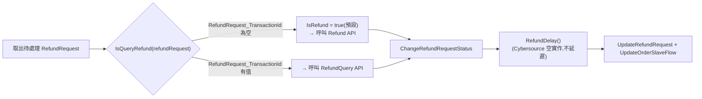
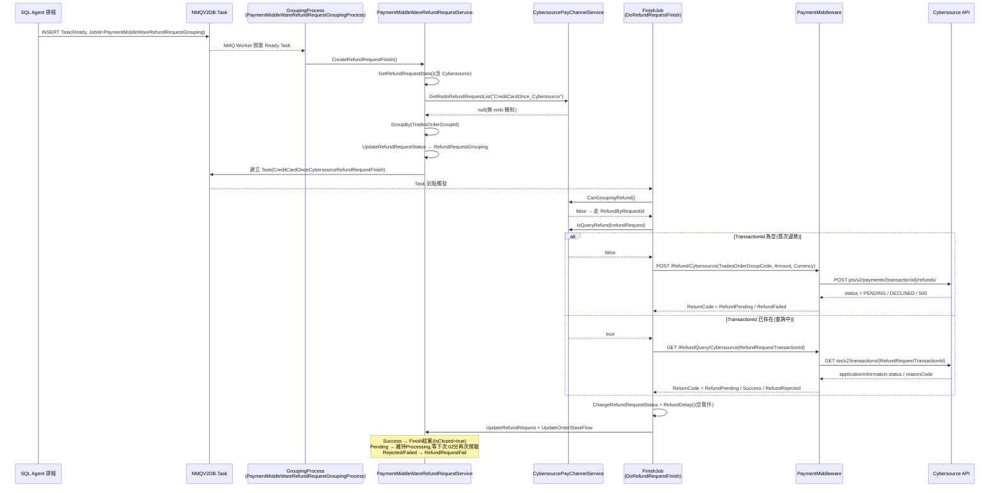

```mermaid
flowchart TD
    A["⏰ SQL Server 排程<br/>NMQV2_GeneratePaymentMiddleWareRefundRequestGrouping<br/>每小時 :02 分觸發"] -->|"cfn_GetJobWhetherToPerform('readwrite',1) IN ('ALL')"| B{"NMQV2DB.dbo.Job<br/>是否存在<br/>PaymentMiddleWareRefundRequestGrouping ?"}
    B -- 不存在 --> Z1["結束,不做事"]
    B -- 存在 --> C["INSERT INTO NMQV2DB.dbo.Task<br/>Task_Status = Ready<br/>Task_JobId = @jobId"]
    C --> D["NMQ Worker 撈取 Ready Task 執行<br/>PaymentMiddleWareRefundRequestGroupingProcess.DoJob()"]
    D --> E["PaymentMiddleWareRefundRequestService.CreateRefundRequestFinish()"]

    E --> F["GetRefundRequestData()<br/>撈 28 種付款方式中狀態=RefundRequestProcessing 的退款單<br/>+ 各 PayChannel Redo 重試清單"]
    F --> G["GroupBy(TradesOrderGroupId)<br/>依 TGCode 分群"]
    G --> H["UpdateRefundRequestStatus → RefundRequestGrouping<br/>(鎖定,防止重複撈取)"]
    H --> I["依付款方式建立對應 NMQ Task<br/>Cybersource → CreditCardOnceCybersourceRefundRequestFinish"]
    I --> J["RefundTaskBookingTime()<br/>Cybersource:回傳 null → 不限速"]

    J --> K["⏱ NMQ Task 到點觸發<br/>DoRefundRequestFinish(taskData)"]
    K --> L{"CanGroupingRefund() ?<br/>Cybersource = false"}
    L -- "true(僅 Razer)" --> M["RefundByGroupingAmount<br/>合併同 TransactionId 金額後退款"]
    L -- "false(Cybersource 走此路)" --> N["RefundByRequestId<br/>逐筆退款 / 查詢"]

    N --> O{"IsQueryRefund(refundRequest)<br/>= RefundRequest_TransactionId 是否有值?"}
    O -- "無值 → 新退款" --> P["呼叫 PaymentMiddleware<br/>POST /Refund/Cybersource"]
    O -- "有值 → 查詢既有退款" --> Q["呼叫 PaymentMiddleware<br/>GET 對應 /RefundQuery/Cybersource"]

    P --> R["PaymentMiddleware 組裝 HTTP Signature<br/>POST pts/v2/payments/{transactionId}/refunds/"]
    Q --> S["PaymentMiddleware 組裝 HTTP Signature<br/>GET tss/v2/transactions/{RefundRequestTransactionId}"]

    R --> T["Cybersource 回應 status"]
    S --> U["Cybersource 回應 applicationInformation.status/reasonCode"]

    T --> V["解析並轉換 ReturnCode<br/>PENDING→RefundPending / 500,DECLINED→RefundFailed"]
    U --> W["解析並轉換 ReturnCode<br/>PENDING→RefundPending / TRANSMITTED→Success / reasonCode=100→RefundPending / 其他→RefundRejected"]

    V --> X["ChangeRefundRequestStatus + RefundDelay()(空實作)"]
    W --> X
    X --> Y["UpdateRefundRequest 更新退款單狀態<br/>+ UpdateOrderSlaveFlow 更新訂單大表<br/>(運費退款不更新大表)"]
    Y --> AA{"ReturnCode = Success(00) ?"}
    AA -- 是 --> AB["Finish 結案<br/>IsClosed=true,寫入 ConfirmDate"]
    AA -- "RefundPending / RefundRejected 未結案" --> AC["維持 RefundRequestProcessing<br/>等待下次 :02 分排程再次撈取(RefundQuery)"]
```



<!-- tab 整體流程-->

<style>
.cyb-banner {
  display: flex; align-items: center; gap: 12px;
  background: #eef2fb; border-left: 4px solid #1b2a4a;
  padding: 10px 18px; margin: 30px 0 16px; border-radius: 2px;
}
.cyb-banner .cyb-num {
  font-family: 'Courier New', Consolas, monospace; font-weight: 700; font-size: 0.82rem;
  color: #fff; background: #1b2a4a; border-radius: 50%;
  width: 26px; height: 26px; flex-shrink: 0;
  display: flex; align-items: center; justify-content: center;
}
.cyb-banner .cyb-text { line-height: 1.5; }
.cyb-banner .cyb-title { font-weight: 700; color: #1b2a4a; letter-spacing: 1px; font-size: 0.98rem; }
.cyb-banner .cyb-desc { font-size: 0.78rem; color: #6b7690; letter-spacing: 0.5px; margin-top: 1px; }

.cyb-note {
  background: #f5f7fb; border: 1px dashed #c7d0e6; border-left: 4px solid #3b6fe0;
  padding: 10px 18px; margin: 14px 0 20px; border-radius: 2px;
  font-size: 0.92rem; color: #223055; line-height: 1.8;
}
.cyb-note code { background: #e3e9f7; padding: 1px 6px; border-radius: 3px; color: #1b2a4a; }
.cyb-note.warn   { background: #fdf6e8; border-color: #f0dba9; border-left-color: #e8a33d; color: #6b4c12; }
.cyb-note.warn code   { background: #f7e9c8; color: #6b4c12; }
.cyb-note.danger { background: #fbeeed; border-color: #e6bcb6; border-left-color: #b3433a; color: #7a271f; }
.cyb-note.danger code { background: #f5d9d5; color: #7a271f; }
.cyb-note.done   { background: #eafaf3; border-color: #b9e6cf; border-left-color: #2f9e6e; color: #185c3c; }
.cyb-note.done code   { background: #d3f2e3; color: #185c3c; }

.cyb-table-wrap { margin: 12px 0 24px; border: 1px solid #c7d0e6; border-radius: 4px; overflow: hidden; }
.cyb-table-wrap table { width: 100%; border-collapse: collapse; font-size: 0.86rem; margin: 0 !important; }
.cyb-table-wrap th { background: #1b2a4a; color: #fff; padding: 9px 12px; text-align: left; font-weight: 600; letter-spacing: 0.5px; }
.cyb-table-wrap td { padding: 9px 12px; border-top: 1px solid #e3e8f5; vertical-align: top; color: #223055; }
.cyb-table-wrap tr:nth-child(even) td { background: #f5f7fb; }
.cyb-table-wrap td code, .cyb-table-wrap th code { background: #e3e9f7; padding: 1px 6px; border-radius: 3px; color: #1b2a4a; font-size: 0.85em; }

.cyb-timeline { position: relative; margin: 20px 0 30px; padding-left: 36px; }
.cyb-timeline::before {
  content: ''; position: absolute; left: 9px; top: 4px; bottom: 4px; width: 2px;
  background: repeating-linear-gradient(180deg, #c7d0e6 0 8px, transparent 8px 16px);
}
.cyb-tl-event { position: relative; margin-bottom: 18px; }
.cyb-tl-event:last-child { margin-bottom: 0; }
.cyb-tl-event::before {
  content: ''; position: absolute; left: -31px; top: 3px; width: 12px; height: 12px;
  border-radius: 50%; background: #3b6fe0; border: 2px solid #fff; box-shadow: 0 0 0 1.5px #3b6fe0;
}
.cyb-tl-event.warn::before   { background: #e8a33d; box-shadow: 0 0 0 1.5px #e8a33d; }
.cyb-tl-event.danger::before { background: #b3433a; box-shadow: 0 0 0 1.5px #b3433a; }
.cyb-tl-event.done::before   { background: #2f9e6e; box-shadow: 0 0 0 1.5px #2f9e6e; }
.cyb-tl-event .cyb-tl-card { background: #f5f7fb; border: 1px solid #dde4f3; border-radius: 4px; padding: 8px 16px; }
.cyb-tl-event.warn .cyb-tl-card   { border-left: 3px solid #e8a33d; }
.cyb-tl-event.danger .cyb-tl-card { border-left: 3px solid #b3433a; }
.cyb-tl-event.done .cyb-tl-card   { border-left: 3px solid #2f9e6e; }
.cyb-tl-head { display: flex; align-items: baseline; gap: 8px; flex-wrap: wrap; }
.cyb-tl-head .cyb-tl-step {
  font-family: 'Courier New', Consolas, monospace; font-size: 0.68rem; color: #6b7690;
  border: 1px solid #c7d0e6; border-radius: 2px; padding: 0 6px; background: #eef2fb; flex-shrink: 0;
}
.cyb-tl-head .cyb-tl-title { font-weight: 700; color: #1b2a4a; font-size: 0.92rem; }
.cyb-tl-desc { font-size: 0.86rem; color: #223055; margin-top: 4px; line-height: 1.7; }
.cyb-tl-desc code { background: #e3e9f7; padding: 1px 6px; border-radius: 3px; color: #1b2a4a; font-size: 0.85em; }

.cyb-plan-card { background: #f5f7fb; border: 1px solid #c7d0e6; border-radius: 4px; margin: 22px 0; box-shadow: 0 1px 3px rgba(27,42,74,0.08); overflow: hidden; }
.cyb-plan-card .cyb-plan-head { display: flex; align-items: center; gap: 12px; padding: 12px 18px; background: #1b2a4a; color: #fff; }
.cyb-plan-card .cyb-plan-num {
  font-family: 'Courier New', Consolas, monospace; font-weight: 700; font-size: 0.85rem;
  border: 1px solid rgba(255,255,255,0.6); border-radius: 50%; width: 26px; height: 26px;
  display: flex; align-items: center; justify-content: center; flex-shrink: 0;
}
.cyb-plan-card .cyb-plan-title { font-weight: 700; font-size: 0.98rem; letter-spacing: 1px; }
.cyb-plan-card .cyb-plan-priority { font-size: 0.68rem; letter-spacing: 1px; padding: 2px 8px; border-radius: 10px; flex-shrink: 0; margin-left: auto; }
.cyb-plan-priority.high { background: #b3433a; color: #fff; }
.cyb-plan-priority.mid  { background: #e8a33d; color: #fff; }
.cyb-plan-priority.low  { background: #2f9e6e; color: #fff; }
.cyb-plan-card .cyb-plan-body { padding: 16px 20px 18px; }
.cyb-plan-card .cyb-plan-body > p:first-child { margin-top: 0; }
.cyb-plan-card .cyb-plan-body code { color: #1b2a4a; background: #e3e9f7; padding: 1px 6px; border-radius: 3px; }
</style>

退款這件事,不是使用者在後台按下「退款」按鈕,錢就馬上原路退回。以 <code>Cybersource</code> 這個金流為例,系統其實會先把退款請求排隊,等每小時固定一次的排程撿起來,經過「分群鎖定 → 建立任務 → 呼叫金流 API → 解析回應」好幾層之後,才會真正把退款單狀態改成完成


<div class="cyb-banner">
  <div class="cyb-num">1</div>
  <div class="cyb-text">
    <div class="cyb-title">整體流程總覽</div>
    <div class="cyb-desc">從 SQL 排程觸發,到退款單最終結案的完整路徑</div>
  </div>
</div>




<!-- endtab -->


<!-- tab GroupingProcess（分群 Job）-->


<div class="cyb-timeline">

<div class="cyb-tl-event">
  <div class="cyb-tl-card">
    <div class="cyb-tl-head"><span class="cyb-tl-step">STEP 1</span><span class="cyb-tl-title">撈取待處理退款單</span></div>
    <div class="cyb-tl-desc">對每個 payType(含 <code>CreditCardOnce_Cybersource</code>)呼叫 <code>GetRefundRequestData()</code>,撈出 <code>RefundRequestProcessing</code> 狀態的退款單,並額外呼叫 <code>payChannelService.GetRedoRefundRequestList(payType)</code> 撈重試清單——但 Cybersource 目前這裡固定回傳 <code>null</code>,代表尚未實作 Redo 重試機制。</div>
  </div>
</div>

<div class="cyb-tl-event">
  <div class="cyb-tl-card">
    <div class="cyb-tl-head"><span class="cyb-tl-step">STEP 2</span><span class="cyb-tl-title">依購物車分群</span></div>
    <div class="cyb-tl-desc"><code>GroupBy(TradesOrderGroupId)</code> 依 TGCode 分群,方便後續 Razer 合併退款;Cybersource 雖然不合併金額,仍共用同一套分群與 Task 建立流程。</div>
  </div>
</div>

<div class="cyb-tl-event">
  <div class="cyb-tl-card">
    <div class="cyb-tl-head"><span class="cyb-tl-step">STEP 3</span><span class="cyb-tl-title">鎖定退款單狀態</span></div>
    <div class="cyb-tl-desc"><code>UpdateRefundRequestStatus → RefundRequestGrouping</code>,避免下次 :02 分排程重複撈取到同一批退款單。</div>
  </div>
</div>

<div class="cyb-tl-event">
  <div class="cyb-tl-card">
    <div class="cyb-tl-head"><span class="cyb-tl-step">STEP 4</span><span class="cyb-tl-title">建立對應的 NMQ Task</span></div>
    <div class="cyb-tl-desc">Cybersource 對應的 JobName 是 <code>CreditCardOnceCybersourceRefundRequestFinish</code>。</div>
  </div>
</div>

<div class="cyb-tl-event done">
  <div class="cyb-tl-card">
    <div class="cyb-tl-head"><span class="cyb-tl-step">STEP 5</span><span class="cyb-tl-title">決定任務執行時機</span></div>
    <div class="cyb-tl-desc"><code>RefundTaskBookingTime()</code> 在 Cybersource 覆寫為回傳 <code>null</code>,代表不做限速排程,Task 建立後立即可以被執行。</div>
  </div>
</div>

</div>


<!-- endtab -->


<!-- tab Finish Job（逐筆退款）-->

<div class="cyb-banner">
  <div class="cyb-num"></div>
  <div class="cyb-text">
    <div class="cyb-title">Finish Job — DoRefundRequestFinish</div>
    <div class="cyb-desc">Cybersource 固定走 RefundByRequestId,逐筆退款 / 查詢</div>
  </div>
</div>

Cybersource 的 <code>CanGroupingRefund()</code>(繼承 <code>AbstractPayChannelService</code> 的預設值)固定回傳 <code>false</code>,因此一定走**逐筆退款**路線,不會像 Razer 一樣把同一張購物車(TGCode)底下的金額合併起來一次退。



<div class="cyb-note">
💡 這裡的分岔只看一件事:這筆退款單有沒有已經記錄過 <code>TransactionId</code>。<code>CybersourcePayChannelService.IsQueryRefund()</code> 判斷 <code>RefundRequest_TransactionId</code> 是否已有值——第一次退款時是空的,呼叫 Refund;Refund 回應受理中(PENDING)之後,TransactionId 已經寫回退款單,下一次排程就改呼叫 RefundQuery 查結果。<code>IsRefund</code> 這個開關 Cybersource 沒有覆寫,預設為 <code>true</code>。額外附帶的參數,<code>GetRefundExtendInfo</code> 帶入 <code>TradesOrderGroupCode</code>,<code>GetRefundQueryExtendInfo</code> 帶入 <code>RefundRequestTransactionId</code>,兩者都由 <code>CybersourcePayChannelService</code> 提供。
</div>


<!-- endtab -->


<!-- tab Cybersource PaymentMiddleware API-->

<div class="cyb-banner">
  <div class="cyb-num">3</div>
  <div class="cyb-text">
    <div class="cyb-title">認證方式 — HTTP Signature</div>
    <div class="cyb-desc">Refund 與 RefundQuery 共用同一套簽章機制</div>
  </div>
</div>

Header 來源是 <code>ShopSecret</code> 底下的 <code>Cybersource</code> group,共 6 組憑證(後 3 組供其他用途/預留,實際簽章只用前 3 組):

<div class="cyb-table-wrap">

| Header | 對應 ShopSecret 欄位 |
|:---|:---|
| `x-merchant-id` | `Cybersource_MerchantId` |
| `x-secret-key` | `Cybersource_SecretKey` |
| `x-merchant-key-id` | `Cybersource_MerchantKeyId` |
| `x-profile-id` | `Cybersource_ProfileId`(預留) |
| `x-profile-access-key` | `Cybersource_ProfileAccessKey`(預留) |
| `x-profile-secret` | `Cybersource_ProfileSecret`(預留) |

</div>

實際的簽章 Header 由 <code>HttpSignatureHelper.GenerateHttpSignatureHeaders()</code> 產生。

## Refund(新退款)

```
POST pts/v2/payments/{transactionId}/refunds/
Authorization: HTTP_SIGNATURE
Content-Type: application/json

{
  "clientReferenceInformation": { "code": "{TradesOrderGroupCode}" },
  "orderInformation": {
    "amountDetails": { "totalAmount": "{Amount}", "currency": "{Currency}" }
  }
}
```

<div class="cyb-table-wrap">

| 欄位 | 來源 |
|:---|:---|
| `transactionId`(URL) | 付款時 Cybersource 回傳的 transaction ID |
| `clientReferenceInformation.code` | `RefundRequestExtendInfo.TradesOrderGroupCode` |
| `orderInformation.amountDetails.totalAmount` | `request.Amount` |
| `orderInformation.amountDetails.currency` | `request.Currency` |

</div>

<div class="cyb-note">
💡 <b>特殊設計 — HTTP 錯誤不拋出:</b>即使 HTTP 回應非 2xx(例如 DECLINED 案例常見的 4xx/5xx),程式也不會直接拋例外中斷,而是改抓例外裡的 response body 繼續解析 <code>errorInformation</code>,確保不會因為 HTTP 狀態碼而遺失金流回傳的錯誤細節。

```csharp
try
{
    return await base.PostJsonAsync<CybersourceRefundResponseEntity>(url, body, authHeaders);
}
catch (FlurlHttpException ex)
{
    return await ex.GetResponseJsonAsync<CybersourceRefundResponseEntity>();
}
```
</div>

**Status → ReturnCode 對照:**

<div class="cyb-table-wrap">

| Status | ReturnCode | 說明 |
|:---|:---|:---|
| `PENDING` | `RefundPending` | 受理中,需後續呼叫 RefundQuery |
| `500` | `RefundFailed` | 系統錯誤,含 `errorInformation` |
| `DECLINED` | `RefundFailed` | 發卡行拒絕,含 `errorInformation` |
| 其他未知值 | `throw NotImplementedException` | Cybersource 若新增狀態需修改程式碼才能支援 |

</div>

## RefundQuery(查詢既有退款)

```
GET tss/v2/transactions/{RefundRequestTransactionId}
Authorization: HTTP_SIGNATURE
```

<div class="cyb-note warn">
⚠ 這裡 URL 帶入的是**退款動作**回傳的 transaction ID,不是原始付款的 transaction ID,兩者不要搞混。
</div>

**Status/ReasonCode → ReturnCode 對照:**

<div class="cyb-table-wrap">

| `applicationInformation.status` | reasonCode | ReturnCode | 說明 |
|:---|:---|:---|:---|
| `PENDING` | 任意 | `RefundPending` | Cybersource 僅受理,尚未真正送出 |
| `TRANSMITTED` | 任意 | `Success` | 已傳送至發卡行,視為退款完成 |
| 其他 | `100` | `RefundPending` | Fallback:reasonCode 成功但狀態非預期,仍視為處理中 |
| 其他 | 非 `100` | `RefundRejected` | 退款最終被拒絕 |

</div>

<div class="cyb-note done">
✅ <b>為什麼 <code>TRANSMITTED</code> 才算成功,而不是 <code>PENDING</code>?</b>Cybersource 的退款生命週期是:<code>PENDING</code>(受理)→ <code>TRANSMITTED</code>(送出至發卡行)→ 最終到帳。<code>PENDING</code> 只代表系統收到請求,還沒有真正動作,所以不能當作退款已完成的依據。
</div>


<!-- endtab -->


<!-- tab 退款狀態機（整體視角）-->

<div class="cyb-banner">
  <div class="cyb-num">4</div>
  <div class="cyb-text">
    <div class="cyb-title">退款狀態機 — 整體視角</div>
    <div class="cyb-desc">一筆退款單從建立到結案(或失敗)會經過的所有狀態</div>
  </div>
</div>

狀態機的節點彼此會互相繞回去(例如查詢中又退回處理中),用流程圖畫反而滿版都是交叉線、很難跟著看。這裡改用「狀態卡片」由上往下呈現,每張卡片只講兩件事:**現在是什麼狀態**、**接下來依什麼條件會走到哪裡**。

<div class="cyb-timeline">

<div class="cyb-tl-event">
  <div class="cyb-tl-card">
    <div class="cyb-tl-head"><span class="cyb-tl-title">① RefundRequestProcessing — 退款單的預設狀態</span></div>
    <div class="cyb-tl-desc">退款單建立時的起始狀態,同時也是任何「結果還沒確定」時會被打回來的狀態。SQL 排程每小時 :02 分會鎖定這批退款單,依 <code>TransactionId</code> 是否已存在,分別導向下面 ② 或 ③ 其中一條路徑。</div>
  </div>
</div>

<div class="cyb-tl-event">
  <div class="cyb-tl-card">
    <div class="cyb-tl-head"><span class="cyb-tl-title">② 呼叫 Refund API(TransactionId 為空,第一次退款)</span></div>
    <div class="cyb-tl-desc">回應 <code>PENDING</code> → 寫入 <code>TransactionId</code>,狀態退回「① RefundRequestProcessing」,下次改走③查詢路線。<br/>回應 <code>500</code> 或 <code>DECLINED</code> → 直接進入「④ RefundRequestFail」。</div>
  </div>
</div>

<div class="cyb-tl-event">
  <div class="cyb-tl-card">
    <div class="cyb-tl-head"><span class="cyb-tl-title">③ 呼叫 RefundQuery API(TransactionId 已存在,查詢中)</span></div>
    <div class="cyb-tl-desc"><code>PENDING</code>,或 reasonCode 為 <code>100</code>(fallback)→ 退回「① RefundRequestProcessing」,下次繼續查詢。<br/><code>TRANSMITTED</code> → 進入「⑤ Finish」結案。<br/>其他狀態且 reasonCode 非 <code>100</code> → 進入「④ RefundRequestFail」。</div>
  </div>
</div>

<div class="cyb-tl-event danger">
  <div class="cyb-tl-card">
    <div class="cyb-tl-head"><span class="cyb-tl-title">④ RefundRequestFail — 失敗狀態</span></div>
    <div class="cyb-tl-desc">符合重試條件(3 天內 + 可重試錯誤碼)→ 改回「① RefundRequestProcessing」重新嘗試。<br/>逾 3 天或不可重試錯誤碼 → 流程結束,需要人工介入。</div>
  </div>
</div>

<div class="cyb-tl-event done">
  <div class="cyb-tl-card">
    <div class="cyb-tl-head"><span class="cyb-tl-title">⑤ Finish — 結案</span></div>
    <div class="cyb-tl-desc"><code>IsClosed=true</code>,寫入 <code>ConfirmDate</code>,並呼叫 <code>UpdateOrderSlaveFlow</code> 更新訂單大表。</div>
  </div>
</div>

</div>

<div class="cyb-note danger">
⚠ Cybersource 目前 <code>GetRedoRefundRequestList()</code> 固定回傳 <code>null</code>(TODO 待補),代表 <b>Cybersource 沒有自動化的失敗重試機制</b>——這和 Razer、KPay 等有 <code>PR020</code>/<code>PR015</code>/<code>29523</code> 可重試錯誤碼的付款方式不同,一旦進入 <code>RefundRequestFail</code>,就需要人工介入處理。
</div>


<!-- endtab -->


<!-- tab 序列圖（End-to-End）-->

<div class="cyb-banner">
  <div class="cyb-num">5</div>
  <div class="cyb-text">
    <div class="cyb-title">完整鏈路 — Sequence Diagram</div>
    <div class="cyb-desc">從 SQL Agent 排程到 Cybersource API 回應的完整互動時序</div>
  </div>
</div>




<!-- endtab -->


<!-- tab 已知風險 / 異常情境-->

以下是這條退款路徑目前已知需要留意的地方,依嚴重程度排序:

<div class="cyb-plan-card">
  <div class="cyb-plan-head">
    <div class="cyb-plan-num">1</div>
    <div class="cyb-plan-title">未知 Status 會拋例外</div>
    <span class="cyb-plan-priority high">風險:高</span>
  </div>
  <div class="cyb-plan-body">
Refund 回應若出現非 <code>PENDING</code>/<code>500</code>/<code>DECLINED</code> 的新狀態,程式會直接拋出 <code>NotImplementedException</code> 中斷處理,需要持續留意 Cybersource 是否新增了狀態值。
  </div>
</div>

<div class="cyb-plan-card">
  <div class="cyb-plan-head">
    <div class="cyb-plan-num">3</div>
    <div class="cyb-plan-title">RefundQuery 長時間停留在 PENDING</div>
    <span class="cyb-plan-priority mid">風險:中</span>
  </div>
  <div class="cyb-plan-body">
Cybersource 查詢回應可能長達數小時停留在 <code>PENDING</code>。如果系統邏輯有 timeout 中斷,最後一次查詢結果可能被誤判為 <code>RefundPending</code>(對應碼 4003),需要靠下一次排程再次 Redo,才能拿到最終的 <code>TRANSMITTED</code>。
  </div>
</div>

<div class="cyb-plan-card">
  <div class="cyb-plan-head">
    <div class="cyb-plan-num">4</div>
    <div class="cyb-plan-title">運費退款不會更新大表</div>
    <span class="cyb-plan-priority low">設計備註</span>
  </div>
  <div class="cyb-plan-body">
當 <code>SourceDef == SalesOrderFee</code> 時,Finish 階段不會呼叫 <code>UpdateOrderSlaveFlow</code>,只更新退款單本身——這是刻意的設計,不算異常。
  </div>
</div>

<div class="cyb-plan-card">
  <div class="cyb-plan-head">
    <div class="cyb-plan-num">5</div>
    <div class="cyb-plan-title">多付款方式退款(IsMultiPayment)</div>
    <span class="cyb-plan-priority low">設計備註</span>
  </div>
  <div class="cyb-plan-body">
Cybersource 若涉及多付款方式退款,Finish 完成後不會直接更新大表,而是改建立 <code>SyncRefundRequestFinishJob</code>,等所有退款單都完成後再統一更新。
  </div>
</div>


<!-- endtab -->



