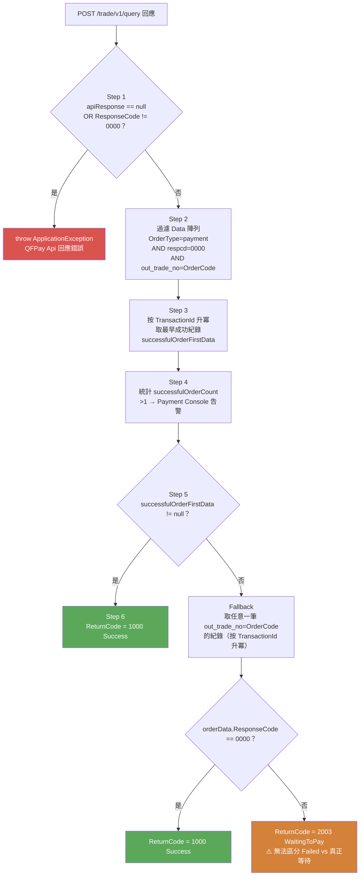
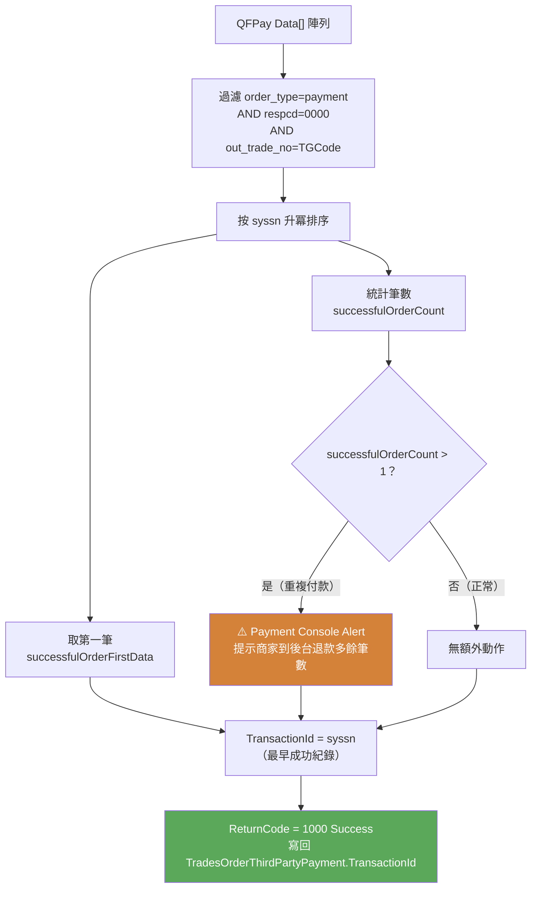




<!-- tab 流程概覽-->


QFPay 採用 **Hosted PayPage** 模式：Pay 只是純 URL 組裝（不呼叫 QFPay API），消費者導向 QFPay 托管頁完成付款後，系統才透過 **QueryPayment 主動查詢**確認付款結果。

因此 Query 是 QFPay 整個金流中**真正的網路呼叫**，也是決定訂單最終狀態的關鍵步驟。


Pay 完成後，QFPay 給你的是一個**包含該 TGCode 所有交易記錄的陣列**，可能同時有付款成功、付款失敗、重試紀錄混在一起。Query 要從這堆資料裡**正確判斷這筆訂單究竟有沒有成功**。


<!-- endtab -->


<!-- tab API 呼叫細節-->


## API 規格

```
POST /trade/v1/query
Content-Type: application/x-www-form-urlencoded
X-QF-APPCODE: {apiCode}
X-QF-SIGN:    {sha256_signature}
X-QF-SIGNTYPE: SHA256
```


## 實際 Request Body

以下是 mweb 呼叫 PMW QueryPayment 時的真實 Request Body：

```json
{
  "request_id": "918b4c7c-24e7-41cc-be5c-0e1912738552",
  "transaction_id": "",
  "country": "HK",
  "extend_info": {
    "orderCode": "TG260702L00052",
    "isUsingLiveTest": false
  }
}
```

**關鍵觀察：**

| 欄位 | 值 | 說明 |
|:---|:---|:---|
| `transaction_id` | `""` (空字串) | **QFPay Pay 模式永遠不回傳 TransactionId**，DB 存的就是空字串，Query 帶出的也是空字串 |
| `extend_info.orderCode` | `TG260702L00052` | **真正用來查詢的 key**，即 TGCode（out_trade_no）|
| `extend_info.isUsingLiveTest` | `false` | 環境切換旗標（Production 環境） |


## Request 欄位完整對照

| QFPay 欄位 | 說明 | 來源 | 備注 |
|:---|:---|:---|:---|
| `syssn` | QFPay 交易編號 | `request.TransactionId` | 與 `out_trade_no` 擇一；多個以逗號分隔 |
| `out_trade_no` | 訂單號（TG Code） | `ExtendInfo.OrderCode` | TGCode（付款）或 TSCode（退款查詢） |
| `pay_type` | 支付類型篩選 | `ExtendInfo.PayType` | 選填；多個以逗號分隔 |
| `respcd` | 篩選特定回應代碼 | `ExtendInfo.ResponseCode` | 選填 |
| `start_time` | 查詢開始時間 | `ExtendInfo.StartTime` | 提供 syssn/out_trade_no 時被 QFPay 忽略 |
| `end_time` | 查詢結束時間 | `ExtendInfo.EndTime` | 跨月查詢必填 |
| `txzone` | 時區 | `ExtendInfo.TimeZone` | 預設 +0800 |
| `page` | 頁碼 | `ExtendInfo.Page` | 最大 8，預設 1 |
| `page_size` | 每頁筆數 | `ExtendInfo.PageSize` | 最大 100，預設 10 |
| `mchid` | 商戶編號 | ⚠️ **固定為 null** | Dead field，從未傳值 |

> `start_time` / `end_time` 只要提供了 `syssn` 或 `out_trade_no`，QFPay 就會忽略時間區間。跨月查詢必須提供時間區間。


## Response ExtendInfo 欄位

| 欄位 | 來源 | 說明 |
|:---|:---|:---|
| `Page` | `apiResponse.page` | 目前頁碼 |
| `PageSize` | `apiResponse.page_size` | 每頁筆數 |
| `ResponseCode` | `apiResponse.respcd` | API level 回應碼（`0000` = 成功）|
| `ResponseDescription` | `apiResponse.resperr` | API level 描述訊息 |
| `Data[]` | `apiResponse.data` | **所有交易紀錄（含付款與退款混合）** |
| `SuccessCount` | 計算所得 | 同一 TG 成功付款筆數；**>1 需告警** |
| `RawData` | `apiResponse` | 完整原始回應物件 |


## 實際 Response Body

以下是 PMW QueryPayment 成功時的真實 Response Body（對應 `TG260702M00043` 付款成功案例）：

```json
{
  "request_id": "5bca8e39-a623-4c73-97a1-857690c27c55",
  "return_code": "0000",
  "return_message": "交易成功",
  "transaction_id": "20260702155300020090137007",
  "extend_info": {
    "page": 1,
    "resperr": "请求成功",
    "page_size": 10,
    "respcd": "0000",
    "data": [
      {
        "syssn": "20260702155300020090137007",
        "out_trade_no": "TG260702M00043",
        "chnlsn": "2026070199401001440244051586",
        "txcurrcd": "HKD",
        "pay_type": "801512",
        "order_type": "payment",
        "txdtm": "2026-07-02 11:35:13",
        "txamt": "61830",
        "paydtm": "2026-07-02 11:35:25",
        "respcd": "0000",
        "errmsg": "交易成功"
      }
    ],
    "successCount": 1
  }
}
```


<!-- endtab -->


<!-- tab TransactionId 的完整生命週期-->


| 階段 | `TransactionId` 的值 | 說明 |
|:---|:---:|:---|
| **Pay** | `""` (空字串) | Hosted Page 模式，付款前無 syssn |
| **DB 寫入（Pay 後）** | `""` | `TradesOrderThirdPartyPayment.TransactionId` 存空字串 |
| **Query Request** | `""` | 從 DB 讀出後帶入 `QueryPaymentRequestEntity.TransactionId` |
| **QFPay /trade/v1/query** | `syssn` 不傳（空值被過濾）| 只帶 `out_trade_no = TGCode` 查詢 |
| **QFPay Response** | `syssn = "20260702155300020090137007"` | 成功記錄中的 `syssn` 欄位 |
| **PMW 回傳** | `transaction_id = "20260702155300020090137007"` | `QFPayPaymentDataEntity.TransactionId = [JsonPropertyName("syssn")]` |
| **DB 更新（Query 成功後）** | `"20260702155300020090137007"` | `GetTradesOrderThirdPartyPaymentUpdateEntityOnReturnSuccess()` 將 `queryResult.TransactionId` 寫回 DB |


> 關鍵程式碼路徑（PMW → mweb）


```csharp
// PMW QFPayPaymentDataEntity.cs
[JsonPropertyName("syssn")]
public string TransactionId { get; set; }  // syssn 直接映射為 TransactionId

// PMW QFPayPlugin.cs - QueryPayment 回傳
TransactionId = orderData?.TransactionId,  // = syssn of 成功付款記錄

// mweb QFPayPayChannelService.cs - 存回 DB
// mweb QFPayPayChannelService.cs - 存回 DB
TransactionId = queryResult.TransactionId,  // = syssn → 寫入 TradesOrderThirdPartyPayment
```


<!-- endtab -->


<!-- tab 簽名機制（SHA256）-->


Query 的簽名與 Pay 相同算法，但位置不同

| 流程 | 簽名位置 | Payload 傳送方式 |
|:---|:---|:---|
| **Pay** | URL `?...&sign={hex}` | URL query string（GET 參數）|
| **Query / Refund / Cancel** | Header: `X-QF-SIGN: {hex}` | POST form-urlencoded body |

```csharp
// 簽名核心：payload raw string + apiKey → SHA256 → lowercase hex
private static string GenerateSha256Signature(string data, string apiKey)
{
    using var sha256 = SHA256.Create();
    byte[] hash = sha256.ComputeHash(Encoding.UTF8.GetBytes($"{data}{apiKey}"));
    return Convert.ToHexString(hash).ToLower();
}
```

> ⚠️ **反射效能問題**：每次簽名都呼叫 `GetType().GetProperties()` 取屬性，高並發下有效能損耗，且無快取


<!-- endtab -->


<!-- tab 查詢邏輯-->


## 為什麼 Query 需要多步驟判定？

QFPay 對同一個 `out_trade_no` 可能回傳**多筆記錄混合陣列**（付款成功、付款失敗、重試紀錄等）。程式必須優先找到成功紀錄，而不能因為陣列中有失敗紀錄就誤判為失敗。


## 完整判定流程（6 步驟）




## 程式碼對應

```csharp
// Step 1：API level 驗證
if (apiResponse == null || apiResponse.ResponseCode != "0000")
    throw new ApplicationException("QFPay Api 回應錯誤");

// Step 2：找出所有成功付款紀錄
var successfulOrderData = apiResponse.Data?.Where(d =>
    d.OrderType == "payment"           // 排除退款紀錄
    && d.ResponseCode == "0000"        // 只取成功
    && d.TradeOrderCode == OrderCode); // 比對 TGCode

// Step 3：取最早一筆成功紀錄
var successfulOrderFirstData = successfulOrderData
    ?.OrderBy(d => d.TransactionId)
    ?.FirstOrDefault();

// Step 4：統計成功筆數（>1 告警）
var successfulOrderCount = successfulOrderData?.Count();

// Step 5：無成功紀錄 → Fallback 取任意一筆
var orderData = successfulOrderFirstData ?? apiResponse.Data
    ?.OrderBy(d => d.TransactionId)
    ?.FirstOrDefault(d => d.TradeOrderCode == OrderCode);

// Step 6：ReturnCode 判斷
var returnCode = orderData?.ResponseCode == "0000"
    ? ReturnCodes.Success        // 1000
    : ReturnCodes.WaitingToPay;  // 2003（⚠️ 無法區分 Failed）
```


## ReturnCode 對照

| 情境 | ReturnCode | 說明 |
|:---|:---:|:---|
| 找到 payment + respcd=0000 | `1000` Success | 付款成功，訂單可繼續 |
| 找到紀錄但非 0000 | `2003` WaitingToPay | **⚠️ 可能是已失敗但被誤判為等待** |
| 查無任何紀錄 | `2003` WaitingToPay | 真正尚未付款 |
| API 回 null 或非 0000 | throw `ApplicationException` | QFPay API 異常 |


## 設計問題

> 程式碼**優先正向表列成功**（先找 `payment+0000`），才考慮 Fallback 取其他紀錄，避免因存在失敗記錄就誤判為失敗。這是刻意設計，但代價是**無法辨識「真正失敗」的訂單**，ReCheck Job 會對已失敗的訂單持續重試直到逾時。


<!-- endtab -->


<!-- tab 判定成功訂單機制-->


QFPay 的查詢結果可能包含**同一 TGCode 的多筆成功付款紀錄**（例如網路重試導致重複扣款），系統取最早成功紀錄為唯一訂單


```csharp
// 過濾所有成功的付款紀錄
var successfulOrderData = apiResponse.Data.Where(data =>
    data.OrderType == "payment" &&
    data.ResponseCode == "0000" &&
    data.TradeOrderCode == extendInfo.OrderCode);

// 按 TransactionId（syssn）字典序升冪 → 取第一筆（最早）
var successfulOrderFirstData = successfulOrderData
    ?.OrderBy(data => data.TransactionId)
    ?.FirstOrDefault();
```

> `syssn` 由 QFPay 系統依時序產生，字典序升冪 = 時間序升冪，因此「最小值 = 最早交易」


<!-- endtab -->


<!-- tab SuccessCount 統計與告警機制-->


```csharp
// 統計所有成功筆數
var successfulOrderCount = successfulOrderData?.Count();

// 回傳時帶入 ExtendInfo
SuccessCount = successfulOrderCount ?? 0
```

| `successfulOrderCount` | 系統行為 | 後續處理 |
|:---:|:---|:---|
| `0` | 無成功紀錄 → Fallback 取任意一筆 → WaitingToPay | ReCheck Job 繼續輪詢 |
| `1` | ✅ 正常：取唯一成功紀錄 → ReturnCode = 1000 Success | 訂單正常完成 |
| `> 1` | ⚠️ 重複付款告警：仍取**最早**那筆 → ReturnCode = 1000 Success | **Payment Console 發出 Alert，需人工到後台退款** |




## 設計說明

- **為何取最早？** 最早那筆是消費者「真正的」付款行為，後續重複成功紀錄通常是重試或系統異常造成，退款也應退這些多餘的。
- **為何不自動退款？** 系統無法在查詢時直接呼叫退款（職責分離），只能發 Alert 由人工確認後手動退款，避免誤退。
- **已知缺陷：** 僅發 Alert 而無自動退款，若商家未即時處理，消費者會被重複扣款。


<!-- endtab -->


<!-- tab 情境 Q1：正常查詢成功-->


```
request.TransactionId = "syssn_xxx"
ExtendInfo.OrderCode  = "TG123456"

→ POST /trade/v1/query
→ Data[] 中找到:
    { order_type: "payment", respcd: "0000", out_trade_no: "TG123456" }

→ successfulOrderFirstData = 該筆
→ ReturnCode = 1000 (Success)
→ TransactionId = orderData.TransactionId
```


<!-- endtab -->


<!-- tab 情境 Q2：付款中（真正 WaitingToPay）-->


```
→ POST /trade/v1/query
→ apiResponse.ResponseCode = "0000" ✅
→ Data[] 中無任何 respcd=0000 的 payment 紀錄
   （消費者尚未付款，QFPay 無訂單紀錄 或 訂單仍在處理中）

→ successfulOrderFirstData = null
→ Fallback: orderData = null（或有進行中紀錄但非 0000）
→ ReturnCode = 2003 (WaitingToPay)
→ ReCheck Job 下次繼續查
```


<!-- endtab -->


<!-- tab 情境 Q3：付款失敗（被誤判為 WaitingToPay）⚠️-->


```
→ POST /trade/v1/query
→ Data[] 中有紀錄，respcd = "1181"（已過期）或其他失敗碼
→ successfulOrderFirstData = null（無成功紀錄）
→ Fallback: 取到 respcd="1181" 的紀錄
→ orderData.ResponseCode != "0000"
→ ReturnCode = 2003 (WaitingToPay) ← ⚠️ 誤判！

實際情況：消費者已放棄，QFPay 已標記失敗
系統行為：ReCheck Job 持續重試，直到訂單逾時取消
```


<!-- endtab -->


<!-- tab 情境 Q4：重複付款告警-->


```
→ POST /trade/v1/query
→ Data[] 中找到 2 筆 respcd=0000 的 payment 紀錄
→ successfulOrderCount = 2  ← ⚠️ 觸發告警
→ 取 TransactionId 字典序最小（最早）那筆
→ ReturnCode = 1000 (Success)
→ ExtendInfo.SuccessCount = 2
→ Payment Console Alert

處理：需人工介入，對多餘付款筆數協助退款
系統無自動退款機制
```


<!-- endtab -->


<!-- tab 情境 Q5：URL 組裝錯誤導致無訂單紀錄-->


```
txdtm 格式錯誤（hh Bug → 下午時段時間誤記）
OR sign 簽名計算有誤

→ 消費者看到 QFPay QFSign_Error 頁面
→ QFPay 不產生訂單紀錄（未達付款步驟）
→ Query 查無任何 Data
→ ReturnCode = 2003 (WaitingToPay)
→ ReCheck Job 持續重試，最終逾時取消
```


<!-- endtab -->


<!-- tab 缺陷分析-->


## 🟠 HIGH：Query 無法區分 WaitingToPay 與付款失敗

```csharp
// ❌ 現狀：所有非成功一律回傳 WaitingToPay
var returnCode = orderData?.ResponseCode == "0000"
    ? ReturnCodes.Success
    : ReturnCodes.WaitingToPay;   // 無法辨識 Failed

// ✅ 建議：細分 QFPay 失敗碼
var returnCode = orderData?.ResponseCode switch
{
    "0000"  => ReturnCodes.Success,
    null    => ReturnCodes.WaitingToPay, // 查無紀錄 = 真正等待中
    "1181"  => ReturnCodes.Failed,       // 已過期
    "1264"  => ReturnCodes.Failed,       // 已關閉
    _       => ReturnCodes.WaitingToPay  // 其他 = 還在處理中
};
```

**影響**：ReCheck Job 對已失敗訂單持續輪詢，浪費資源且延遲取消。消費者需等到逾時才能重新下單。


## 🟠 HIGH：SuccessCount > 1 僅告警，無自動處理

```
偵測到 SuccessCount = 2
→ ExtendInfo.SuccessCount = 2
→ Payment Console Alert（人工介入）
→ 系統不自動退款、不阻擋流程

後果：消費者被重複扣款，等人工協助
```

**建議**：偵測到 `SuccessCount > 1` 時，自動觸發對多餘付款筆數（第 2 筆起）呼叫 Refund；或加入防呆 Flag 阻止後續訂單流程繼續直到人工確認。


## 🔵 LOW：throw ApplicationException 不區分錯誤類型

```csharp
// ❌ 所有 QFPay API 異常統一拋出相同錯誤，無降級處理
if (apiResponse == null || apiResponse.ResponseCode != "0000")
    throw new ApplicationException("QFPay Api 回應錯誤");
```


網路逾時、簽名錯誤、商戶設定錯誤等完全不同的問題，都拋出同樣的例外，上層無法根據錯誤類型做不同的降級處理（如：網路錯誤可重試，簽名錯誤不應重試）。


**建議**：根據 `apiResponse.ResponseCode` 的具體值分類，使用不同的 Exception Type 或 ReturnCode 區分可重試 vs 不可重試的錯誤。


<!-- endtab -->



