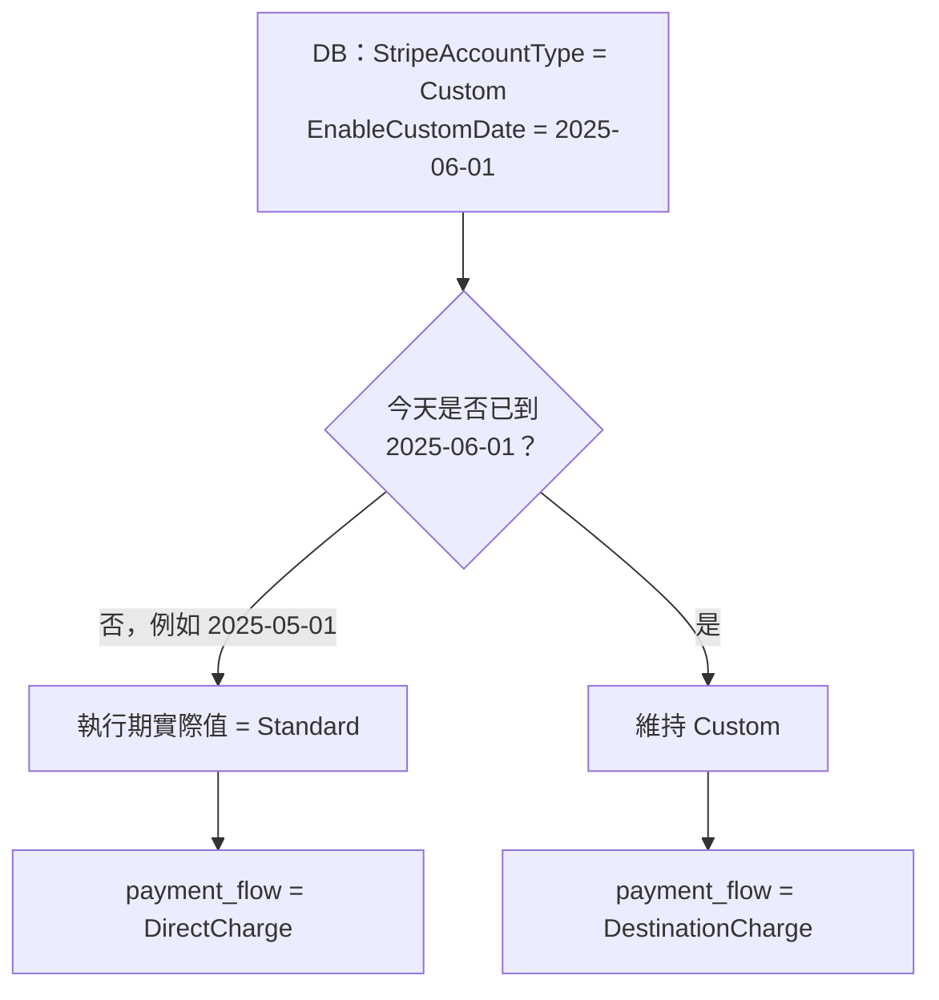
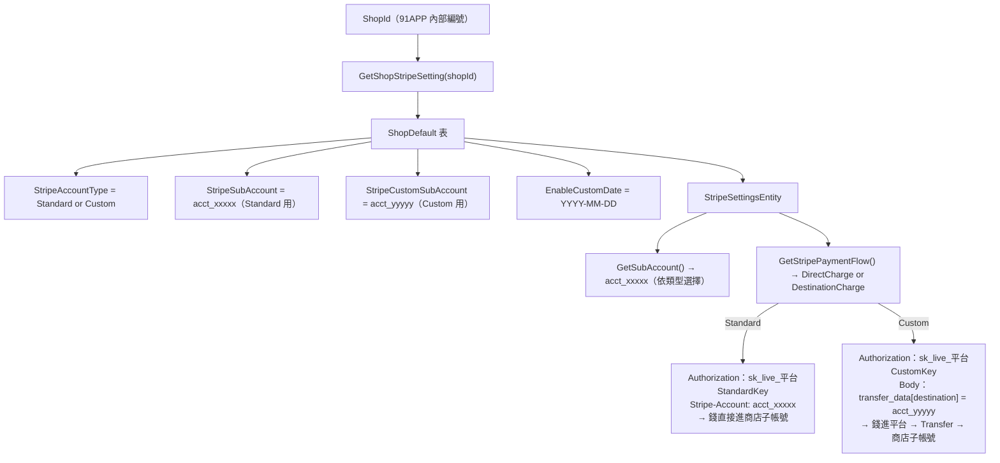
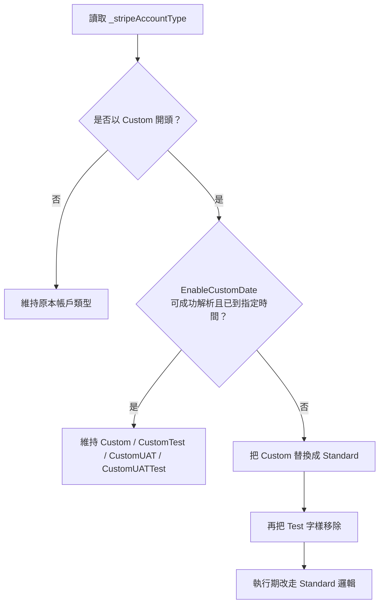
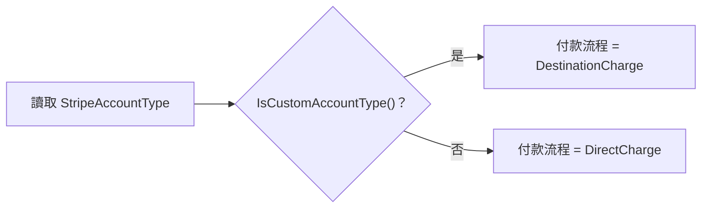
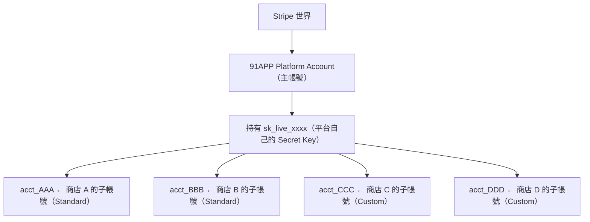
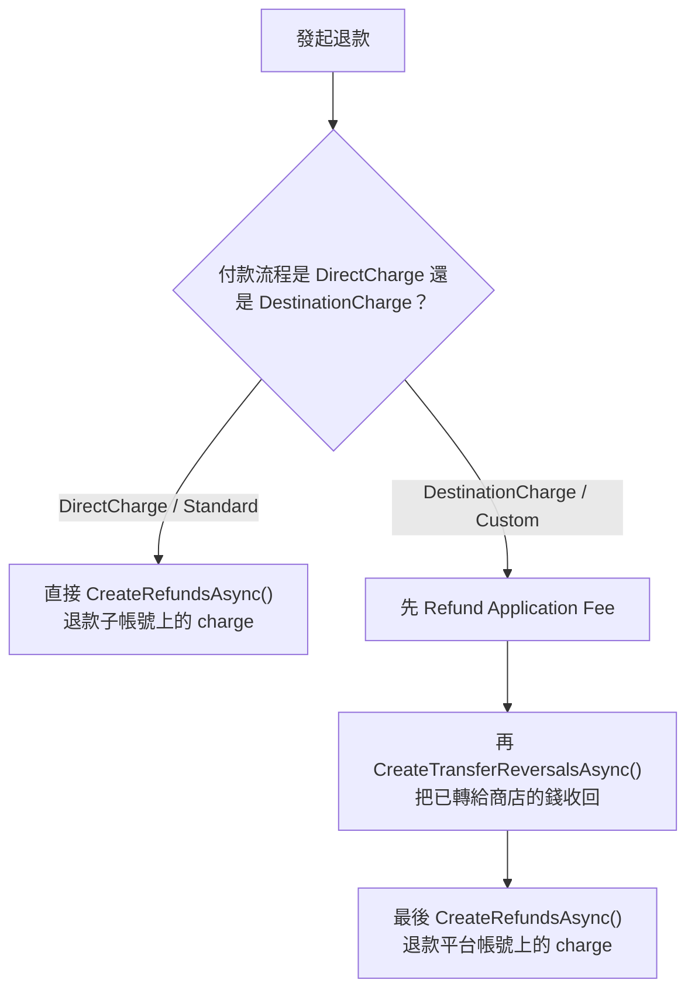
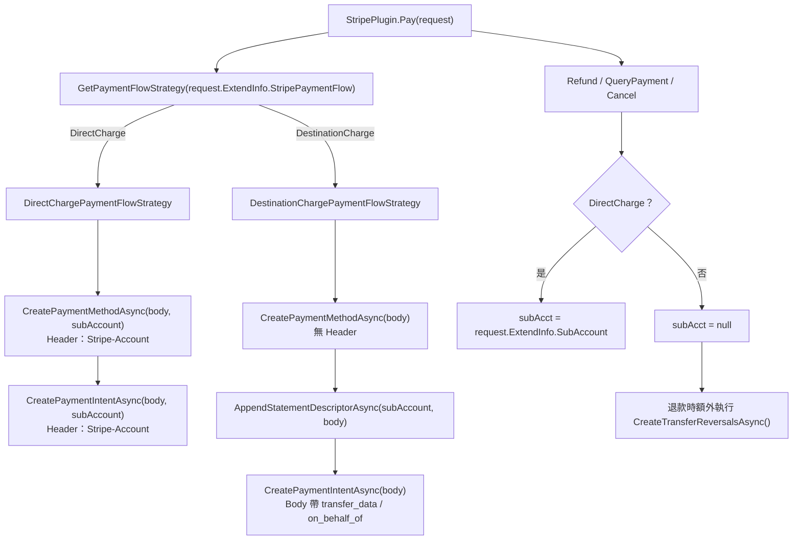
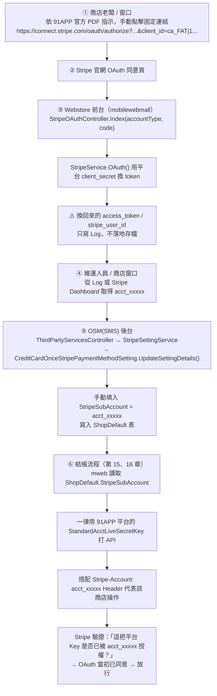



<!-- 文件-->

<style>
.pat-hero{
background:linear-gradient(135deg,#4a3fb0,#635bff 72%);
color:#fff;
padding:34px 32px 28px;
border-radius:18px;
margin:0 0 24px;
box-shadow:0 10px 28px rgba(74,63,176,.18);
}
.pat-hero .pat-eyebrow{
font-size:.78rem;
letter-spacing:3px;
text-transform:uppercase;
opacity:.84;
display:flex;
align-items:center;
gap:8px;
}
.pat-hero .pat-mark{
display:inline-flex;
align-items:center;
justify-content:center;
width:22px;
height:22px;
border-radius:7px;
background:#fff;
color:#635bff;
font-weight:800;
font-size:.72rem;
font-family:Consolas,monospace;
}
.pat-hero h1{margin:10px 0 8px;color:#fff;font-size:1.6rem;}
.pat-hero p{margin:0;line-height:1.86;font-size:.93rem;max-width:860px;opacity:.96;}
.pat-badges{display:flex;gap:10px;flex-wrap:wrap;margin-top:18px;}
.pat-badge{
display:inline-flex;
align-items:center;
gap:7px;
padding:6px 12px;
border-radius:999px;
background:rgba(255,255,255,.16);
border:1px solid rgba(255,255,255,.18);
font-size:.79rem;
font-weight:700;
}
.pat-kicker{
display:flex;
gap:10px;
flex-wrap:wrap;
margin:14px 0 18px;
}
.pat-kicker span{
display:inline-flex;
align-items:center;
gap:6px;
padding:6px 12px;
border-radius:999px;
border:1px solid #e3e0f5;
background:#fff;
color:#2f2c45;
font-size:.8rem;
font-weight:700;
}
.pat-note{
border-radius:12px;
padding:14px 18px;
margin:16px 0 20px;
font-size:.91rem;
line-height:1.82;
border-left:4px solid #2563a8;
background:#e8f1fb;
color:#1c4064;
}
.pat-note code,.pat-table-wrap code,.pat-compare-card code,.pat-qa-card code,.pat-key-box code,.pat-stage-card code,.pat-callout code,.pat-mini-card code{
background:#eeecff;
color:#4a3fb0;
padding:1px 6px;
border-radius:5px;
font-size:.86em;
}
.pat-note.warn{border-left-color:#c9821c;background:#fdf3dd;color:#6a4a0a;}
.pat-note.danger{border-left-color:#b93d2f;background:#fdecea;color:#7b281d;}
.pat-note.ok{border-left-color:#1f8a52;background:#e7f7ee;color:#185d3b;}
.pat-note .pat-n-title{display:block;font-weight:800;margin-bottom:4px;}
.pat-section-head{
display:flex;
align-items:center;
gap:12px;
margin:32px 0 14px;
}
.pat-section-head .pat-chip{
width:34px;
height:34px;
border-radius:12px;
background:linear-gradient(135deg,#a78bfa,#635bff);
color:#fff;
display:flex;
align-items:center;
justify-content:center;
font-weight:800;
box-shadow:0 4px 12px rgba(99,91,255,.18);
}
.pat-section-head h2{
margin:0;
border:none;
padding:0;
font-size:1.18rem;
}
.pat-table-wrap{
display:inline-block;
max-width:100%;
overflow-x:auto;
margin:12px 0 22px;
border:1px solid #e3e0f5;
border-radius:12px;
box-shadow:0 2px 8px rgba(73,62,156,.05);
}
.pat-table-wrap table{
width:auto;
border-collapse:collapse;
margin:0 !important;
font-size:.88rem;
background:#fff;
}
.pat-table-wrap thead th{
background:#4a3fb0;
color:#fff;
text-align:left;
padding:10px 14px;
font-weight:700;
vertical-align:top;
}
.pat-table-wrap tbody td{
padding:10px 14px;
border-top:1px solid #e8e5f6;
vertical-align:top;
color:#2b2a3a;
}
.pat-table-wrap tbody tr:nth-child(even) td{background:#faf9ff;}
.pat-sub{
display:block;
font-size:.77rem;
color:#5f5b78;
margin-top:2px;
}
.pat-compare-grid{
display:flex;
gap:16px;
flex-wrap:wrap;
margin:14px 0 22px;
}
.pat-compare-card{
flex:1;
min-width:260px;
background:#fff;
border:1px solid #e3e0f5;
border-radius:14px;
overflow:hidden;
box-shadow:0 3px 10px rgba(73,62,156,.06);
}
.pat-compare-card .pat-compare-head{
padding:12px 16px;
font-weight:800;
display:flex;
align-items:center;
gap:10px;
color:#fff;
}
.pat-compare-card.custom .pat-compare-head{background:linear-gradient(135deg,#4a3fb0,#635bff);}
.pat-compare-card.standard .pat-compare-head{background:linear-gradient(135deg,#2563a8,#4f8fd8);}
.pat-compare-card .pat-dot{
width:10px;
height:10px;
border-radius:50%;
display:inline-block;
background:#fff;
opacity:.9;
}
.pat-compare-card .pat-compare-body{
padding:14px 16px 16px;
font-size:.88rem;
line-height:1.8;
color:#2b2a3a;
}
.pat-compare-card .pat-compare-body p{margin:0 0 8px;}
.pat-checklist{
margin:10px 0 20px;
padding-left:0;
list-style:none;
}
.pat-checklist li{
position:relative;
padding-left:28px;
margin:8px 0;
line-height:1.8;
}
.pat-checklist li::before{
content:"✓";
position:absolute;
left:0;
top:1px;
width:18px;
height:18px;
border-radius:50%;
background:#e7f7ee;
color:#1f8a52;
font-size:.78rem;
font-weight:800;
display:flex;
align-items:center;
justify-content:center;
}
.pat-callout{
display:flex;
gap:10px;
align-items:flex-start;
padding:14px 18px;
margin:16px 0 20px;
border-radius:12px;
border:1px solid #e5dcba;
background:#fff9ec;
color:#6b4e0a;
line-height:1.82;
}
.pat-callout .pat-icon{flex-shrink:0;font-size:1rem;line-height:1.6;}
.pat-callout.info{border-color:#d7e7fb;background:#eef6ff;color:#1d4d73;}
.pat-callout.warn{border-color:#efd39c;background:#fff6df;color:#6b4a09;}
.pat-callout.danger{border-color:#efc0b9;background:#fdf0ed;color:#7b281d;}
.pat-callout.security{border-color:#f1c7cf;background:#fff1f4;color:#8f2034;}
.pat-flow-pills{
display:flex;
gap:10px;
flex-wrap:wrap;
margin:12px 0 20px;
}
.pat-flow-pills span{
display:inline-flex;
align-items:center;
gap:7px;
padding:6px 12px;
border-radius:999px;
font-size:.8rem;
font-weight:700;
}
.pat-flow-pills .custom{background:#eeecff;color:#4a3fb0;}
.pat-flow-pills .standard{background:#e8f1fb;color:#2563a8;}
.pat-flow-pills .danger{background:#fdecea;color:#b93d2f;}
.pat-flow-pills .ok{background:#e7f7ee;color:#1f8a52;}
.pat-key-grid{
display:flex;
gap:16px;
flex-wrap:wrap;
margin:14px 0 22px;
}
.pat-key-box{
flex:1;
min-width:260px;
padding:16px 18px;
border-radius:14px;
background:#fff;
border:1px solid #e3e0f5;
box-shadow:0 3px 10px rgba(73,62,156,.05);
}
.pat-key-box h4{margin:0 0 8px;font-size:1rem;}
.pat-key-box code{display:inline-block;margin-top:6px;}
.pat-mini-grid{
display:flex;
gap:16px;
flex-wrap:wrap;
margin:14px 0 22px;
}
.pat-mini-card{
flex:1;
min-width:220px;
padding:14px 16px;
border:1px solid #e3e0f5;
border-radius:12px;
background:#fff;
font-size:.87rem;
line-height:1.78;
box-shadow:0 2px 8px rgba(73,62,156,.05);
}
.pat-mini-card h4{margin:0 0 8px;font-size:.95rem;}
.pat-term{
background:#221f36;
border-radius:14px;
padding:18px 22px 22px;
margin:16px 0 24px;
box-shadow:0 8px 24px rgba(40,32,90,.2);
overflow-x:auto;
}
.pat-term .pat-term-bar{
display:flex;
align-items:center;
gap:6px;
margin-bottom:12px;
}
.pat-term .pat-term-dot{
width:10px;
height:10px;
border-radius:50%;
display:inline-block;
}
.pat-term .pat-term-dot.r{background:#ff5f56;}
.pat-term .pat-term-dot.y{background:#ffbd2e;}
.pat-term .pat-term-dot.g{background:#27c93f;}
.pat-term .pat-term-title{
margin-left:8px;
font-size:.74rem;
color:#a7a2cf;
letter-spacing:.5px;
}
.pat-term pre.pat-term-pre{
margin:0 !important;
background:transparent !important;
padding:0 !important;
border:none !important;
box-shadow:none !important;
font-family:Consolas,monospace !important;
font-size:.84rem !important;
line-height:1.84 !important;
white-space:pre !important;
overflow-x:auto !important;
color:#f3f1ff !important;
text-shadow:none !important;
}
.pat-term .k1{color:#c7b8ff !important;font-weight:700;}
.pat-term .k2{color:#7fd1ff !important;font-weight:700;}
.pat-term .k3{color:#ffd479 !important;font-weight:700;}
.pat-term .k4{color:#87efac !important;font-weight:700;}
.pat-stage-grid{
display:flex;
gap:16px;
flex-wrap:wrap;
margin:14px 0 22px;
}
.pat-stage-card{
flex:1;
min-width:260px;
background:#fff;
border:1px solid #e3e0f5;
border-radius:14px;
overflow:hidden;
box-shadow:0 3px 10px rgba(73,62,156,.06);
}
.pat-stage-card .pat-stage-head{
padding:11px 16px;
background:#4a3fb0;
color:#fff;
font-weight:800;
font-size:.92rem;
}
.pat-stage-card.standard .pat-stage-head{background:#2563a8;}
.pat-stage-card.warn .pat-stage-head{background:#c9821c;}
.pat-stage-card .pat-stage-body{
padding:14px 16px 16px;
font-size:.88rem;
line-height:1.8;
color:#2b2a3a;
}
.pat-stage-card .pat-stage-body ol,.pat-stage-card .pat-stage-body ul{margin:8px 0 0;padding-left:20px;}
.pat-stage-card .pat-stage-body li{margin:5px 0;}
.pat-diff-before{background:#f3f6fb;}
.pat-diff-after{background:#eef9f0;}
.pat-question-table td:first-child{white-space:nowrap;}
</style>


<div class="pat-section-head">
<div class="pat-chip">1</div>
<h2>技術文件與資源</h2>
</div>


<div class="pat-table-wrap">
<table>
<thead><tr><th>文件類型</th><th>連結</th><th>用途</th></tr></thead>
<tbody>
<tr><td><strong>需求規劃簡報</strong></td><td><a href="https://docs.google.com/presentation/d/1rf8MKdV2Vh6ofZq6repFjUd-2DUYjhpv9I2ppT0rSYI/edit?slide=id.p#slide=id.p" target="_blank" rel="noopener">Stripe Custom Account-需求規劃 ↗</a></td><td>Custom Account 的完整需求規劃與技術設計</td></tr>
<tr><td><strong>Stripe 配置 Notion</strong></td><td><a href="https://www.notion.so/STRIPE-24e558dd52a9800fb4cfefcc627101d9" target="_blank" rel="noopener">STRIPE-24e558dd52a9800fb4cfefcc627101d9 ↗</a></td><td>完整的測試商店配置表</td></tr>
<tr><td><strong>帳戶配置總表</strong></td><td><a href="https://docs.google.com/spreadsheets/d/1Wc3SB8I2qlHJ5xw2JzrOuXZVUpKAAHs7OsbJAUVeG0A/edit?gid=0#gid=0" target="_blank" rel="noopener">Google Sheets ↗</a></td><td>完整的帳戶類型與金鑰對應表</td></tr>
</tbody>
</table>
</div>


<!-- endtab -->


<!-- 總覽、帳戶類型與金鑰 -->


<div class="pat-section-head">
<div class="pat-chip">2</div>
<h2>帳戶類型與金鑰</h2>
</div>

## 帳戶類型說明

<div class="pat-compare-grid">
<div class="pat-compare-card custom">
<div class="pat-compare-head"><span class="pat-dot"></span>Custom</div>
<div class="pat-compare-body">
<p><strong>費率設定：</strong>由平台設定統一費率</p>
<p><strong>適用對象：</strong>小型商店</p>
<p><strong>範例：</strong>在 OSM 按按鈕即可開設帳戶</p>
</div>
</div>
<div class="pat-compare-card standard">
<div class="pat-compare-head"><span class="pat-dot"></span>Standard</div>
<div class="pat-compare-body">
<p><strong>費率設定：</strong>商店自行與 Stripe 談判</p>
<p><strong>適用對象：</strong>大型商店</p>
<p><strong>範例：</strong>SASA 等大型零售商</p>
</div>
</div>
</div>

## 帳戶類型清單

<div class="pat-compare-grid">
<div class="pat-compare-card custom">
<div class="pat-compare-head"><span class="pat-dot"></span>Custom 系列</div>
<div class="pat-compare-body">
<p><code>Custom</code> — Custom 正式環境</p>
<p><code>CustomTest</code> — Custom 測試環境</p>
<p><code>CustomUAT</code> — Custom UAT 環境</p>
<p><code>CustomUATTest</code> — Custom UAT 測試環境</p>
</div>
</div>
<div class="pat-compare-card standard">
<div class="pat-compare-head"><span class="pat-dot"></span>Standard 系列</div>
<div class="pat-compare-body">
<p><code>Standard</code> — Standard 正式環境</p>
<p><code>StandardUAT</code> — Standard UAT 環境</p>
</div>
</div>
</div>

## 商店帳戶類型查詢


```sql
-- 查詢商店的 Stripe 帳戶類型
SELECT *
FROM ShopDefault (NOLOCK)
WHERE ShopDefault_ValidFlag = 1
  AND ShopDefault_ShopId = @shopId
  AND ShopDefault_Key = 'StripeAccountType'


USE WebStoreDB
-- 查詢商店的 Stripe 帳戶類型
SELECT *
FROM ShopDefault (NOLOCK)
WHERE ShopDefault_ValidFlag = 1
  AND ShopDefault_ShopId = 99
  AND ShopDefault_GroupTypeDef = 'Stripe'
```

## DB 設定對應（ShopDefault 表）

<div class="pat-table-wrap">
<table>
<thead><tr><th>DB Key</th><th>說明</th><th>哪種帳號使用</th></tr></thead>
<tbody>
<tr><td><code>StripeAccountType</code></td><td><code>Standard</code> 或 <code>Custom</code></td><td>決定走哪條流程</td></tr>
<tr><td><code>StripeSubAccount</code></td><td>Standard 子帳號 <code>acct_xxx</code></td><td>Standard</td></tr>
<tr><td><code>StripeCustomSubAccount</code></td><td>Custom 子帳號 <code>acct_xxx</code>（正式）</td><td>Custom</td></tr>
<tr><td><code>StripeCustomTestSubAccount</code></td><td>Custom 子帳號 <code>acct_xxx</code>（測試）</td><td>Custom</td></tr>
<tr><td><code>EnableCustomDate</code></td><td>Custom 帳號啟用日期，未到則降級為 Standard 流程</td><td>Custom</td></tr>
</tbody>
</table>
</div>


## EnableCustomDate 降級機制

商店 DB 設定 `StripeAccountType = Custom`，但若 `EnableCustomDate` 尚未到達，系統執行期<strong>自動降級為 Standard</strong>：



<div class="pat-callout info">
<span class="pat-icon">💡</span>
<span><strong>用途：</strong>讓商店可以提前在 DB 設定好 Custom 帳號資訊，到指定日期才自動切換，不需要當天手動改 DB。</span>
</div>

## 完整關係圖



## 程式碼

#### 取得商店 Stripe 設定

```csharp
public StripeSettingsEntity GetShopStripeSetting(long shopId, bool cleanCache = false)
{
    // 從資料庫取得 Stripe 相關設定
    IEnumerable<ShopDefaultEntity> shopDefault =
        this.ShopDefaultRepository.GetShopDefaultListByGroupTypeDef(shopId, new List<string> { "Stripe" });

    return new StripeSettingsEntity
    {
        StripeAccountType = shopDefault.SingleOrDefault(x => x.Key == "StripeAccountType").NewValue,
        StripeAccountSettingType = shopDefault.SingleOrDefault(x => x.Key == "StripeAccountSettingType").NewValue,
        StripeSubAccount = shopDefault.SingleOrDefault(x => x.Key == "StripeSubAccount").NewValue,
        StripeCustomSubAccount = shopDefault.SingleOrDefault(x => x.Key == "StripeCustomSubAccount").NewValue,
        StripeCustomTestSubAccount = shopDefault.SingleOrDefault(x => x.Key == "StripeCustomTestSubAccount").NewValue,
        EnableCustomDate = shopDefault.SingleOrDefault(x => x.Key == "EnableCustomDate").NewValue,
    };
}
```


#### 動態帳戶類型切換

```csharp
private string GetRuntimeAccountType()
{
    // 確保 Account Type 不會因為時間差而有所變動
    if (string.IsNullOrEmpty(this._runtimeStripeAccountType))
    {
        this._runtimeStripeAccountType = this._stripeAccountType;

        // Account Type 由 Custom 改為 Standard 的條件
        // 1. EnableCustomDate 未指定時間
        // 2. EnableCustomDate 未達指定時間
        if (this._runtimeStripeAccountType.StartsWith(StripeAccountTypeConstants.Custom, StringComparison.OrdinalIgnoreCase)
            && (DateTime.TryParse(this.EnableCustomDate, out DateTime enableCustomDate) == false
                || enableCustomDate > DateTime.Now))
        {
            // 將 Custom 替換為 Standard
            this._runtimeStripeAccountType = this._runtimeStripeAccountType.Replace(
                StripeAccountTypeConstants.Custom, StripeAccountTypeConstants.Standard);
            this._runtimeStripeAccountType = this._runtimeStripeAccountType.Replace(
                StripeAccountTypeConstants.Test, string.Empty);
        }
    }

    return this._runtimeStripeAccountType;
}
```



<div class="pat-note warn">
資料庫可以先把商店設成 <code>Custom</code>，但如果 <code>EnableCustomDate</code> 還沒到，程式在執行當下會自動降級成 <code>Standard</code>。這樣可以先布好設定，等日期到了再切換，不用等到當天手動改值。
</div>

#### 帳戶類型判斷方法

```csharp
// 判斷是否為 Custom 類型帳戶
public bool IsCustomAccountType() =>
    this.StripeAccountType.StartsWith(StripeAccountTypeConstants.Custom, StringComparison.OrdinalIgnoreCase);
```

#### 付款流程決定

```csharp
public string GetStripePaymentFlow()
{
    // Custom 帳戶使用 DestinationCharge，Standard 使用 DirectCharge
    return this.IsCustomAccountType() ? "DestinationCharge" : "DirectCharge";
}
```



#### 子帳戶選擇

```csharp
public string GetSubAccount()
{
    if (this.IsCustomAccountType())
    {
        // Custom 帳戶：根據測試模式選擇對應子帳戶
        return this.IsTestMode() ? this.StripeCustomTestSubAccount : this.StripeCustomSubAccount;
    }
    else
    {
        // Standard 帳戶：使用標準子帳戶
        return this.StripeSubAccount;
    }
}
```

<!-- endtab -->

<!-- tab 金鑰-->


## Secret Key 設定位置

<div class="pat-callout info">
<span class="pat-icon">📁</span>
<span><strong>設定檔路徑：</strong><code>MachineConfig/Frontend/AppSettings.QA300.config</code></span>
</div>

**檔案結構：**

<div class="pat-table-wrap">
<table>
<thead><tr><th>設定項目</th><th>說明</th><th>範例</th></tr></thead>
<tbody>
<tr><td><code>CustomAcctLiveSecretKey</code></td><td>Custom 帳戶正式環境金鑰</td><td><code>sk_live_...</code></td></tr>
<tr><td><code>CustomAcctTestSecretKey</code></td><td>Custom 帳戶測試環境金鑰</td><td><code>sk_test_...</code></td></tr>
<tr><td><code>StandardAcctLiveSecretKey</code></td><td>Standard 帳戶正式環境金鑰</td><td><code>sk_live_...</code></td></tr>
</tbody>
</table>
</div>


## 根據帳戶類型取得 API 金鑰

```csharp
private string GetStripeApiKey(long shopId, string accountType)
{
    return accountType switch
    {
        // Custom 系列
        StripeAccountTypeConstants.Custom =>
            this._stripeConfigurations.CustomAcctLiveSecretKey,
        StripeAccountTypeConstants.CustomTest =>
            this._stripeConfigurations.CustomAcctTestSecretKey,
        StripeAccountTypeConstants.CustomUAT =>
            this._stripeConfigurations.CustomUATAcctLiveSecretKey,
        StripeAccountTypeConstants.CustomUATTest =>
            this._stripeConfigurations.CustomUATAcctTestSecretKey,

        // Standard 系列
        StripeAccountTypeConstants.Standard =>
            this._stripeConfigurations.StandardAcctLiveSecretKey,
        StripeAccountTypeConstants.StandardUAT =>
            this._stripeConfigurations.StandardUATAcctLiveSecretKey,

        // 預設使用 Standard Live Key
        _ => this._stripeConfigurations.StandardAcctLiveSecretKey
    };
}
```

#### API 金鑰對應表

<div class="pat-table-wrap">
<table>
<thead><tr><th>帳戶類型</th><th>對應 API 金鑰</th></tr></thead>
<tbody>
<tr><td>Custom</td><td><code>CustomAcctLiveSecretKey</code></td></tr>
<tr><td>CustomTest</td><td><code>CustomAcctTestSecretKey</code></td></tr>
<tr><td>CustomUAT</td><td><code>CustomUATAcctLiveSecretKey</code></td></tr>
<tr><td>CustomUATTest</td><td><code>CustomUATAcctTestSecretKey</code></td></tr>
<tr><td>Standard</td><td><code>StandardAcctLiveSecretKey</code></td></tr>
<tr><td>StandardUAT</td><td><code>StandardUATAcctLiveSecretKey</code></td></tr>
</tbody>
</table>
</div>


<!-- endtab -->


<!-- tab 商店與 Stripe 帳號的關係 -->


<div class="pat-note">
<strong>91APP 是 Stripe 的「平台帳號」，每間商店在 Stripe 都有自己的「子帳號（Connected Account）」。</strong><br>付款時，91APP 用自己的 Platform Key + 商店的 <code>acct_xxxxx</code>，代替商店向 Stripe 發起交易。
</div>

## 帳號結構



每間 91APP 商店對應一個 Stripe 子帳號（`acct_xxxxx`），這個對應關係存在資料庫 `ShopDefault` 表中。


## 兩種帳號類型

#### 🔵 Standard 帳號（大型商店，例如 SASA）

<div class="pat-table-wrap">
<table>
<thead><tr><th>項目</th><th>說明</th></tr></thead>
<tbody>
<tr><td><strong>帳號所有人</strong></td><td>商店自己申請、自己擁有</td></tr>
<tr><td><strong>費率</strong></td><td>商店自行與 Stripe 談判</td></tr>
<tr><td><strong>付款流程</strong></td><td><strong>DirectCharge</strong> — 錢直接進商店子帳號</td></tr>
<tr><td><strong>API Key</strong></td><td>91APP 平台的 <code>StandardAcctLiveSecretKey</code>（所有 Standard 共用）</td></tr>
<tr><td><strong>商店區分方式</strong></td><td><code>Stripe-Account: acct_xxx</code> Header（每間不同）</td></tr>
</tbody>
</table>
</div>

<div class="pat-term">
<div class="pat-term-bar"><span class="pat-term-dot r"></span><span class="pat-term-dot y"></span><span class="pat-term-dot g"></span><span class="pat-term-title">Standard / DirectCharge</span></div>
<pre class="pat-term-pre">使用者付款
    → 91APP 平台 Key（Authorization）+ Stripe-Account: acct_商店 Header
    → 錢直接進 商店子帳號
    → 91APP 從中收 application_fee</pre>
</div>

#### 🟠 Custom 帳號（小型商店，由 91APP 在 OSM 代開）

<div class="pat-table-wrap">
<table>
<thead><tr><th>項目</th><th>說明</th></tr></thead>
<tbody>
<tr><td><strong>帳號所有人</strong></td><td>91APP 代替商店建立</td></tr>
<tr><td><strong>費率</strong></td><td>由平台統一設定</td></tr>
<tr><td><strong>付款流程</strong></td><td><strong>DestinationCharge</strong> — 錢先進平台，再 Transfer 給商店</td></tr>
<tr><td><strong>API Key</strong></td><td>91APP 平台的 <code>CustomAcctLiveSecretKey</code>（所有 Custom 共用）</td></tr>
<tr><td><strong>商店區分方式</strong></td><td>Body 的 <code>transfer_data[destination]: acct_xxx</code>（每間不同）</td></tr>
</tbody>
</table>
</div>

<div class="pat-term">
<div class="pat-term-bar"><span class="pat-term-dot r"></span><span class="pat-term-dot y"></span><span class="pat-term-dot g"></span><span class="pat-term-title">Custom / DestinationCharge</span></div>
<pre class="pat-term-pre">使用者付款
    → 91APP 平台 Key（Authorization）
    → 錢進 91APP 平台主帳號
    → Transfer → 商店子帳號（transfer_data[destination]）
    → 91APP 從中收 application_fee</pre>
</div>


## 為什麼 Standard 商店（自己的帳號）也用 91APP 的 Key？

<div class="pat-table-wrap">
<table>
<thead><tr><th></th><th>用商店自己的 <code>access_token</code></th><th>用平台 Key + Stripe-Account Header（現行做法）</th></tr></thead>
<tbody>
<tr><td><strong>需要存什麼</strong></td><td>每間商店各存一把 <code>sk_live_...</code></td><td>只存 <code>acct_xxxxx</code>（簡單字串）</td></tr>
<tr><td><strong>管理複雜度</strong></td><td>高（N 間商店 = N 把 Key，還需處理 refresh）</td><td>低（一把 Key 管全部）</td></tr>
<tr><td><strong>Key 洩漏風險</strong></td><td>高（影響單一商店）</td><td>相對集中管理</td></tr>
<tr><td><strong>91APP 的選擇</strong></td><td>❌</td><td>✅</td></tr>
</tbody>
</table>
</div>


## OAuth 授權


<div class="pat-term">
<div class="pat-term-bar"><span class="pat-term-dot r"></span><span class="pat-term-dot y"></span><span class="pat-term-dot g"></span><span class="pat-term-title">Stripe 子帳號申請與綁定流程.pdf</span></div>
<pre class="pat-term-pre">步驟一　點擊固定連結（91APP 事先申請好的 Stripe Connect 應用程式）
  https://connect.stripe.com/oauth/authorize?response_type=code
    &amp;client_id=ca_FATj1hhoWn5hUpNgj9zafWQG4NNWOmRK&amp;scope=read_write

步驟二　填寫帳戶資訊（＊尚未有 Stripe 帳號時才需要）
步驟三　選擇要綁定的帳戶，點擊「連結我的 Stripe 帳戶」
步驟四　頁面轉導並顯示綁定成功
步驟五　確認授權 91APP Limited
步驟六　複製 acct_ ID，貼到 OSM「功能設定 ≫ 第三方金物流資料設定」完成開通</pre>
</div>

<div class="pat-callout warn">
<span class="pat-icon">🧩</span>
<span><strong>兩個關鍵線索：</strong><br>1️⃣ <code>client_id=ca_FATj1hhoWn5hUpNgj9zafWQG4NNWOmRK</code> 是 <strong>91APP 在 Stripe 註冊的 Connect 應用程式識別碼</strong>，全平台共用同一組，並非依商店動態產生——這也解釋了為什麼程式碼裡找不到組網址的邏輯：因為它從來就不是程式碼組出來的，而是 PDF 裡直接寫死給商家貼上瀏覽器用的。<br>2️⃣ 網址裡<strong>沒有帶 <code>redirect_uri</code> 參數</strong>——代表 Stripe 導回的目的地，是這個 Connect App 在 <strong>Stripe Dashboard 後台預先設定好的 Default OAuth redirect URI</strong>（對應 <code>StripeOAuthController</code> 所在的 mweb 前台網域），而不是 91APP 系統每次請求時動態指定的。</span>
</div>

<strong>Stripe Connect 的 <code>redirect_uri</code> 必須是公開對外網域（依 Stripe 規範，OAuth 導回頁面必須可公開存取），OSM/SMS 是內部後台網域不符資格，所以只能設定成商店的前台網域 mweb 來接收。</strong>OSM(SMS) 後台自始至終沒有、也不需要任何「連接 Stripe」的按鈕或程式邏輯——它只提供步驟六要用的手動輸入欄位。

<div class="pat-callout info">
<span class="pat-icon">🧭</span>
<span><strong>端到端總結：</strong>觸發者是<strong>商店老闆／窗口本人</strong>，依照 91APP 提供的 PDF 手動點擊一組固定連結 → 在 Stripe 官網完成授權 → Stripe 導回 mweb 的 <code>StripeOAuthController</code>（91APP 程式碼首次介入，僅換 token 寫 Log）→ 商店或維運人員把 <code>acct_xxxxx</code> 抄到 OSM 後台欄位。<strong>整條 OAuth 授權路徑，91APP 自己的系統只負責「接收 callback」這一小段，「發起」完全是文件驅動的人工流程，不存在於任何一個 repo 的程式碼中。</strong></span>
</div>


## 付款時 Stripe 的驗證邏輯

<div class="pat-term">
<div class="pat-term-bar"><span class="pat-term-dot r"></span><span class="pat-term-dot y"></span><span class="pat-term-dot g"></span><span class="pat-term-title">Stripe 驗證</span></div>
<pre class="pat-term-pre">91APP 打 API：
  Authorization: ******   → 「我是 91APP 平台」
  Stripe-Account: acct_商店xxxxx          → 「我要代表這間商店操作」
          ↓
Stripe 驗證：
  1. sk_live_平台Key 是否合法？ → ✅
  2. acct_商店xxxxx 是否已授權給這個平台？ → ✅（OAuth 時已同意）
          ↓
  放行，錢進 acct_商店xxxxx</pre>
</div>


<!-- endtab -->


<!-- tab PaymentMiddleware-->


## 策略模式（Strategy Pattern）

PaymentMiddleware 用 <strong>Strategy Pattern</strong> 把兩種收款方式封裝成獨立策略類別，執行期依 <code>StripePaymentFlowEnum</code> 動態選擇：

```csharp
public enum StripePaymentFlowEnum
{
    /// Direct Charge on Sub-Account
    DirectCharge,

    /// Charge on Platform and Transfer to Sub-Account
    DestinationCharge
}
```

```csharp
private IStripePaymentFlowStrategy GetPaymentFlowStrategy(StripePaymentFlowEnum flow) => flow switch
{
    StripePaymentFlowEnum.DirectCharge => this._serviceProvider.GetRequiredService<DirectChargePaymentFlowStrategy>(),
    StripePaymentFlowEnum.DestinationCharge => this._serviceProvider.GetRequiredService<DestinationChargePaymentFlowStrategy>(),
    _ => throw new NotSupportedException()
};
```


## Pay 比對

兩者都會先呼叫 <code>/v1/payment_methods</code> 建立卡片，再呼叫 <code>/v1/payment_intents</code> 建立付款意圖，差異在 <strong>API 呼叫時帶的參數與 Header</strong>。


#### 🔵 `DirectChargePaymentFlowStrategy.Pay()`

```csharp
PaymentMethodResponseEntity paymentMethod =
    await _stripeHttpClient.CreatePaymentMethodAsync(
        body, // request.ExtendInfo.SubAccount
        request.ExtendInfo.SubAccount);

IDictionary<string, object> paymentIntentRequest = new()
{
    { "payment_method", paymentMethod.id },
    { "amount", amount },
    { "currency", request.Currency },
    { "application_fee_amount", applicationFeeAmount },
    { "return_url", request.ExtendInfo.ReturnUrl }
    // 沒有 transfer_data / on_behalf_of
};

return await _stripeHttpClient.CreatePaymentIntentAsync(
    paymentIntentRequest,
    request.ExtendInfo.SubAccount); // ← Stripe-Account Header
```

#### 🟠 `DestinationChargePaymentFlowStrategy.Pay()`

```csharp
PaymentMethodResponseEntity paymentMethod =
    await _stripeHttpClient.CreatePaymentMethodAsync(body);
    // ← 不帶 subAccount，卡片建立在平台帳號下

IDictionary<string, object> paymentIntentRequest = new()
{
    { "transfer_data[destination]", subAccount },
    { "on_behalf_of", subAccount },
    { "payment_method", paymentMethod.id },
    { "amount", amount },
    { "currency", request.Currency },
    { "application_fee_amount", applicationFeeAmount },
    { "return_url", request.ExtendInfo.ReturnUrl }
};

await AppendStatementDescriptorAsync(subAccount, paymentIntentRequest);

return await _stripeHttpClient.CreatePaymentIntentAsync(paymentIntentRequest);
// ← 不帶 Stripe-Account Header，用平台帳號身分呼叫
```

<div class="pat-callout info">
<span class="pat-icon">🔍</span>
<span><strong>DestinationCharge 多做一步：</strong><code>AppendStatementDescriptorAsync()</code> 會呼叫 <code>GET /v1/accounts/{subAccount}</code> 取得子帳號的 <code>statement_descriptor</code>，塞進 PaymentIntent，讓使用者信用卡帳單上顯示的是「商店名稱」而非「91APP」。因為 DestinationCharge 錢會先入平台帳號，若不特別設定，帳單摘要預設會顯示平台資訊。</span>
</div>


<!-- endtab -->


<!-- tab 退款-->

DestinationCharge 退款時，因為錢已經 Transfer 給商店子帳號，平台必須額外執行 <strong>Transfer Reversal（撤銷轉帳）</strong>，把錢從子帳號的餘額中收回：

```csharp
if (request.ExtendInfo.StripePaymentFlow == StripePaymentFlowEnum.DestinationCharge)
{
    IDictionary<string, object> transferReversalsRequestBody = new()
    {
        ["amount"] = refundAmount
    };

    // 從子帳號收回已 Transfer 的資金
    await _stripeHttpClient.CreateTransferReversalsAsync(charge.Transfer, transferReversalsRequestBody);
}

// 兩種流程都會走的一般退款請求
RefundResponseEntity response = await _stripeHttpClient.CreateRefundsAsync(refundRequestBody, subAcct);
```



## 關鍵差異總表

<div class="pat-table-wrap">
<table>
<thead><tr><th>比較項目</th><th>DirectCharge（Standard）</th><th>DestinationCharge（Custom）</th></tr></thead>
<tbody>
<tr><td><strong>策略類別</strong></td><td><code>DirectChargePaymentFlowStrategy</code></td><td><code>DestinationChargePaymentFlowStrategy</code></td></tr>
<tr><td><strong>建立 <code>payment_method</code></strong></td><td>帶 <code>Stripe-Account: acct_xxx</code></td><td>不帶 Header，建立在平台帳號</td></tr>
<tr><td><strong>PaymentIntent 參數</strong></td><td>無 <code>transfer_data</code> / <code>on_behalf_of</code></td><td>需帶 <code>transfer_data[destination]</code>、<code>on_behalf_of</code></td></tr>
<tr><td><strong><code>Stripe-Account</code> Header</strong></td><td>建立 / 查詢 / 取消都需帶子帳號</td><td>全程不帶，皆用平台身分操作</td></tr>
<tr><td><strong><code>statement_descriptor</code></strong></td><td>不需額外處理（本就在子帳號下）</td><td>需另呼叫 <code>GetAccountAsync</code> 補上，帳單才會顯示商店名稱</td></tr>
<tr><td><strong>退款流程</strong></td><td>單純 <code>CreateRefundsAsync</code></td><td>多一步 <code>CreateTransferReversalsAsync</code> 收回轉帳</td></tr>
<tr><td><strong>資金流向</strong></td><td>使用者 → 商店子帳號（直接扣 <code>application_fee</code>）</td><td>使用者 → 平台帳號 → Transfer → 商店子帳號</td></tr>
<tr><td><strong>錯誤 / 例外處理</strong></td><td>共用同一套 <code>try/catch ApiException</code> 邏輯</td><td>另加 <code>GetAccountAsync</code> 失敗時記 Warning 並回傳 null，不中斷付款</td></tr>
</tbody>
</table>
</div>

## 完整程式碼呼叫鏈



<!-- endtab -->

<!-- tab mweb CompleteForNewCartV2 流程-->


## `GetStripeApplicationFee()`：手續費計算的關鍵分歧

這是 Standard 和 Custom <strong>邏輯真正分岔的地方</strong>。兩者都會計算「TS 系統使用費」（商品 + 運費的抽成），但 <strong>只有 Custom 帳號會額外加上「金流手續費」</strong>：

```csharp
private decimal GetStripeApplicationFee(PayProcessContextEntity context, StripeSettingsEntity stripeSetting)
{
    // 兩種帳號類型都會計算：商品 TS 使用費 + 運費 TS 使用費
    var applicationFee = salePageAndFeePriceList.Sum(x => CalculateFee(x, salesProcessingFee.Rate));
    applicationFee += feePriceList.Sum(x => CalculateFee(x, salesProcessingFee.Rate));

    if (stripeSetting.IsCustomAccountType() == true)
    {
        // ★ 只有 Custom 帳號才需要另外收「金流手續費」，
        //   並疊加進 application_fee_amount 一併從平台代收
        ProcessingFeeEntity payProfileProcessingFee = context.ProcessingFeeInfo.PayProfile;
        applicationFee += (CalculateFee(context.GetTotalPaymentWithoutMultiPayment(), payProfileProcessingFee.Rate)
                            + payProfileProcessingFee.FixedFee);
    }

    return applicationFee;
}
```

<div class="pat-callout warn">
<span class="pat-icon">💡</span>
<span>Standard 帳號的商店與 Stripe <strong>自行談判費率</strong>，Stripe 在撥款給商店子帳號前就已扣掉信用卡手續費，91APP 只需抽 <code>application_fee</code> 作為平台使用費即可；Custom 帳號的費率則<strong>由平台統一設定</strong>，商店沒有自己跟 Stripe 談過費率，因此 91APP 必須把「金流手續費」也計進 <code>application_fee_amount</code>，才能讓平台先代墊、再從 Transfer 給商店的金額中扣回。</span>
</div>


## 訂單建立後：查詢 / 取消 / 對帳的資訊留存

付款成功後，mweb 會把當下使用的帳號類型與流程「凍結」寫入訂單的第三方支付資訊（<code>TradesOrderThirdPartyPayment_Info</code>），日後查詢、取消、對帳都以這筆存檔資料為準，<strong>不會重新讀取商店當下的設定</strong>：

```csharp
StripeTradesOrderThirdPartyPaymentInfoEntity info = new()
{
    PaymentFlow = settings.GetStripePaymentFlow(),   // DirectCharge / DestinationCharge
    AccountType = settings.StripeAccountType,        // Standard / Custom / ...
    SubAccount = subAccount,                         // acct_xxxxx
    FeeRate = payProfileProcessingFee.Rate,
    FixedFee = payProfileProcessingFee.FixedFee,
    SCMSalesFeeRate = salesProcessingFee.Rate,
};
```

<div class="pat-callout info">
<span class="pat-icon">🛡️</span>
<span><code>EnableCustomDate</code>可能讓商店在訂單成立「之後」從 Custom 切換成 Standard（或反過來）。若查詢 / 取消時重新讀取商店最新設定，可能拿到跟下單當下不同的 <code>payment_flow</code>，導致 <code>Stripe-Account Header</code> 帶錯、查不到交易。因此 <code>GetRequestExtendInfoForQueryCancel()</code> 優先讀取訂單存檔的 <code>TradesOrderThirdPartyPayment_Info</code>，只有查無存檔時才 fallback 用商店目前設定（並預設為 <code>DirectCharge</code>）。</span>
</div>


<!-- endtab -->

<!-- tab 後台帳號設定-->


```csharp
public ThirdPartyServiceSettingDetailsInfoEntity GetSettingDetails(long shopId, StripeSettingsEntity settings)
{
    // Custom 帳號：不顯示可編輯欄位（因為子帳號由 91APP 在 OSM 內部代開）
    if (settings.IsCustomAccountSettingType() == true)
    {
        result.Properties = new[] { isNewPopupFormProperty };
        return result;
    }

    // Standard 帳號：開放後台人員手動輸入/編輯 StripeSubAccount（acct_xxxxx）
    result.Properties = new[]
    {
        isNewPopupFormProperty,
        new ThirdPartyServiceSettingPropertyEntity("Stripe", nameof(StripeSettingsEntity.StripeSubAccount), settings.StripeSubAccount)
    };
    return result;
}

public void UpdateSettingDetails(ThirdPartyServiceSettingDetailsInfoEntity details, StripeSettingsEntity settings)
{
    if (settings.IsCustomAccountSettingType() == true)
    {
        return; // Custom 不需更新（沒有可編輯欄位）
    }

    var subAcctSetting = details.Properties.Single(x => x.Group == "Stripe" && x.Property == nameof(StripeSettingsEntity.StripeSubAccount));

    // 直接把後台表單填的值寫進 ShopDefault 表
    this._shopDefaultService.Update(details.ShopId, subAcctSetting.Group, subAcctSetting.Property, subAcctSetting.Value, this._userService.GetCurrentOperatorName());

    this._mwebApiService.CleanShopDefaultCache(details.ShopId);
    this._shoppingApiService.CleanShopDefaultCacheAsync(details.ShopId).GetAwaiter().GetResult();
}
```


## 為什麼 Custom 沒有這個手動輸入欄位？

因為 Custom 帳號的子帳號從一開始就是<strong>91APP 自己建立</strong>（不是商店自己開的），子帳號 ID 由 91APP 內部流程直接寫入，商店端不需要、也不能自行修改：

<div class="pat-compare-grid">
<div class="pat-compare-card standard">
<div class="pat-compare-head"><span class="pat-dot"></span>Standard — 手動填寫</div>
<div class="pat-compare-body">
<p>商店先在 Stripe 官網開通自己的帳號</p>
<p>OSM(SMS) 後台顯示 <code>StripeSubAccount</code> 可編輯欄位</p>
<p>維運人員（或商店窗口）手動貼上 <code>acct_xxxxx</code> 並儲存</p>
</div>
</div>
<div class="pat-compare-card custom">
<div class="pat-compare-head"><span class="pat-dot"></span>Custom — 系統代開</div>
<div class="pat-compare-body">
<p>91APP 內部流程在 OSM 幫商店直接建立 Stripe 子帳號</p>
<p>OSM(SMS) 後台<strong>不顯示</strong>可編輯欄位（<code>IsCustomAccountSettingType() == true</code> 時直接跳過）</p>
<p><code>StripeCustomSubAccount</code> 由代開流程直接寫入，商店無法自行更改</p>
</div>
</div>
</div>

## 驗證子帳號是否可結帳：`IsStripeChargedEnabled()`

OSM(SMS) 後台在顯示設定狀態時，會額外呼叫 SCM API 確認子帳號的收款能力是否已開通（僅針對 Custom 類型會實際檢查）：

```csharp
private bool IsStripeChargedEnabled(StripeSettingsEntity settings)
{
    using (IStripeAccountClient client = _scmApiClientFactory.Create<IStripeAccountClient, StripeClient>())
    {
        StripeApiKeyOptionsEnum option = settings.StripeAccountSettingType switch
        {
            "Custom" => StripeApiKeyOptionsEnum.CustomLive,
            "CustomUAT" => StripeApiKeyOptionsEnum.CustomUATLive,
            "CustomTest" => StripeApiKeyOptionsEnum.CustomTest,
            "CustomUATTest" => StripeApiKeyOptionsEnum.CustomUATTest,
            _ => return false // Standard 不檢查，直接視為已可收款
        };

        string subAcct = settings.IsTestMode() ? settings.StripeCustomTestSubAccount : settings.StripeCustomSubAccount;
        ApiResultEntity<bool> result = client.IsChargeEnabled(new IsChargeEnabledRequestEntity(option, subAcct));
        return result.Status == ApiResultStatusEnum.Success && result.Data == true;
    }
}
```

這個檢查同樣使用<strong>平台自己的 Key</strong>（透過 <code>StripeApiKeyOptionsEnum</code> 對應 Custom 系列金鑰）去問 Stripe「這個子帳號可以收錢了嗎？」，並非用商店自己的 Key。


## 三個系統的責任分工圖



<!-- endtab -->


