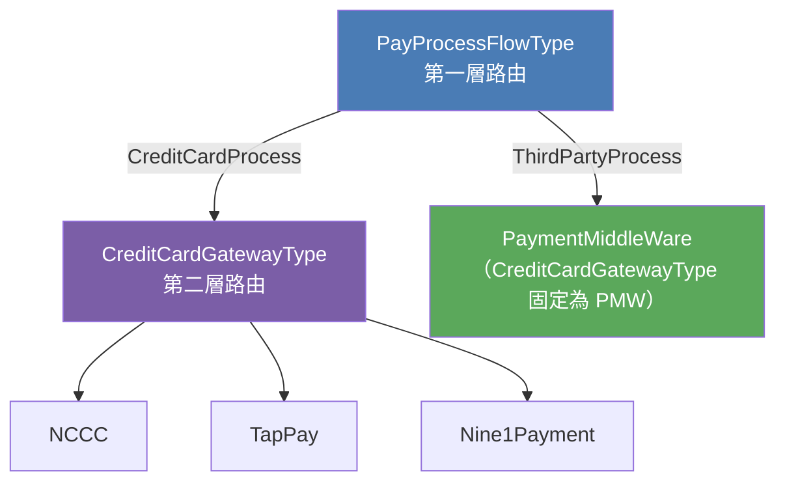
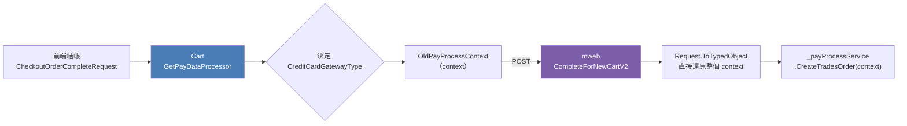
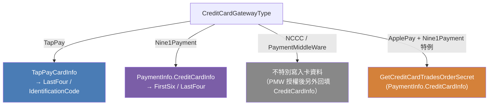
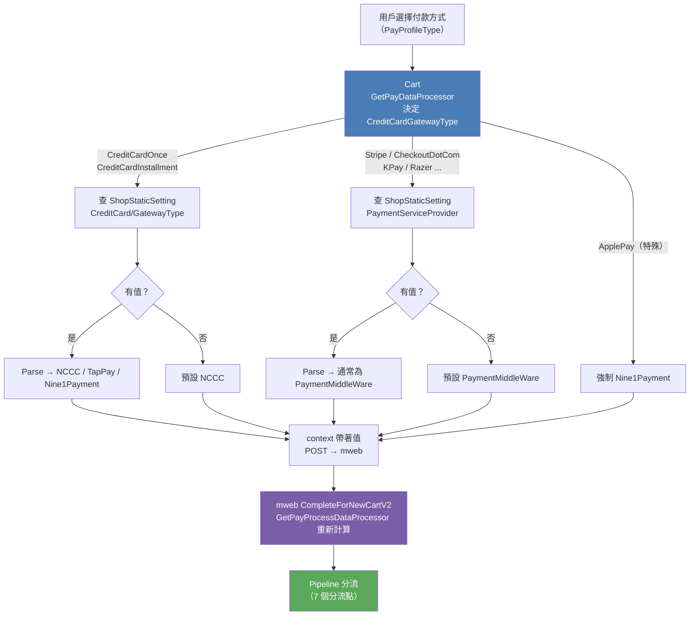




<!-- tab CreditCardGatewayType 是什麼？-->


`CreditCardGatewayType` 是一張**路由票**，決定這筆信用卡訂單要讓哪個 Gateway 執行實際授權。

```csharp
public enum PayProcessCreditCardGatewayTypeEnum
{
    /// <summary>聯卡中心（台灣本地信用卡，舊版主流）</summary>
    NCCC = 0,

    /// <summary>TapPay SDK（帶 Prime Token）</summary>
    TapPay = 1,

    /// <summary>九一金流（帶 CardToken + IssuerBankCode）</summary>
    Nine1Payment = 2,

    /// <summary>PMW 跨國金流（Stripe / CheckoutDotCom / KPay...）</summary>
    PaymentMiddleWare = 3,
}
```

**預設值**：`PayProcessContextEntity` 初始化時預設 `NCCC`（context 第 57 行）


## 四個 Gateway 各代表什麼？

| 值 | 代表 Gateway | 授權方式 | 典型付款方式 |
|:---|:---|:---|:---|
| `NCCC` | 聯卡中心 | 直連 NCCC API | 台灣信用卡一次付清、分期 |
| `TapPay` | TapPay SDK | 帶 Prime Token 呼叫 TapPay | TapPay 刷卡、Apple Pay (TW) |
| `Nine1Payment` | 九一金流 | 帶 CardToken 呼叫 91Payments | 91Payments 信用卡 |
| `PaymentMiddleWare` | PMW 統一代理層 | 轉發到 PMW，由 PMW 選 Plugin | Stripe、CheckoutDotCom、KPay、Razer... |


## 和 FlowType 的關係

`CreditCardGatewayType` 是在 `FlowType` 框架內的**第二層路由**。



- `ThirdPartyProcess`（PMW 金流）→ CreditCardGatewayType 幾乎固定為 `PaymentMiddleWare`
- `CreditCardProcess`（台灣信用卡直連）→ 才需要進一步看是 NCCC / TapPay / Nine1Payment


<!-- endtab -->


<!-- tab 決定邏輯：Cart → mweb-->


`CreditCardGatewayType` 由 **Cart 端**的 `GetPayDataProcessor` 決定，透過 `CompleteForNewCartV2` POST body 帶給 mweb。




## Step 1：查 ShopStaticSetting → OriginalCreditCardGatewayType

```
group: PaymentServiceProvider
key:   <PayProfileType>（如 CreditCardOnce_Stripe）
```

- 有值 → Parse 為 enum，設為 `OriginalCreditCardGatewayType`
- 無值 → 預設 `PaymentMiddleWare`

## Step 2：決定最終 CreditCardGatewayType

```csharp
if (checkoutContext.Request.CreditCardGatewayType.IsNullOrWhiteSpace())
{
    // 前端沒帶 → 使用 Step 1 的值
    payProcessContext.CreditCardGatewayType = payProcessContext.OriginalCreditCardGatewayType;
}
else
{
    // 前端有帶 → 以前端傳入的值為主
    payProcessContext.CreditCardGatewayType = (PayProcessCreditCardGatewayTypeEnum)
        Enum.Parse(typeof(PayProcessCreditCardGatewayTypeEnum),
                   checkoutContext.Request.CreditCardGatewayType, true);
}
```

## 特殊情境：Apple Pay 強制 Nine1Payment

```csharp
// Cart 端直接強制覆蓋
payProcessContext.CreditCardGatewayType = PayProcessCreditCardGatewayTypeEnum.Nine1Payment;
```


## GetCreditCardGateway 優先序

```
1. ShopStaticSetting (shopId=0 全域)
   group: CreditCard / key: PaymentServiceProviderSetting
   → IsActive=true 且 shopId 不在 ExcludeShopIdList
   → 回傳 PaymentServiceProvider

2. Fallback → ShopDefault
   group: CreditCard / key: PaymentGatewayType

3. 若以上皆空 → 預設 NCCC
```


<!-- endtab -->


<!-- tab Pipeline 分流影響-->


`CreditCardGatewayType` 在 mweb 的 Processor Pipeline 裡共有 **7 個分流點**，每個點的行為完全不同。


## CheckCreditCardProcessor — 格式驗證

```csharp
// TapPay / Nine1Payment → 不做 NCCC 格式驗證，直接略過
if (CreditCardGatewayType == TapPay || CreditCardGatewayType == Nine1Payment)
{
    return;
}
// NCCC / PaymentMiddleWare → 繼續做卡號格式驗證
```


## ArrangeDataProcessor — 收單行設定

```csharp
// 僅 TapPay / Nine1Payment 才從卡片資訊取 AcquiringBankCode
if (PayProcessFlowType == CreditCardProcess
    && (CreditCardGatewayType == TapPay || CreditCardGatewayType == Nine1Payment)
    && IsNeedCreditCheck == false)
{
    AcquiringBankInfo.AcquiringBankCode =
        CreditCardGatewayType == TapPay
            ? TapPayCardInfo.BankId
            : PaymentInfo.CreditCardInfo.IssuerBankCode;
}
// NCCC / PaymentMiddleWare → 使用預設收單行代號
```


## AuthProcessor — 實際發起授權（核心分流）

```csharp
// 設定 PaymentServiceProvider 欄位（下游路由依據）
paymentRequest.PaymentServiceProvider = context.CreditCardGatewayType.ToString();

// NCCC / TapPay → 查 ShopPaymentGateway 取 MerchantId / TerminalId
if (CreditCardGatewayType == NCCC || CreditCardGatewayType == TapPay)
{
    paymentRequest.GatewayName    = shopPaymentGateway.AcquiringBankCode;
    paymentRequest.MerchantId     = shopPaymentGateway.MerchantId;
    paymentRequest.TerminalId     = shopPaymentGateway.TerminalId;
    paymentRequest.ProxyMerchantId = (CreditCardGatewayType == TapPay)
        ? shopPaymentGateway.ProxyMerchantId : null;
}
// Nine1Payment / PaymentMiddleWare → 不查 ShopPaymentGateway

switch (CreditCardGatewayType)
{
    case TapPay:
        → GetPaymentResponseAndProcessAuthDataByTapPay()
    case Nine1Payment:
        → GetPaymentResponseAndProcessAuthDataByNine1Payment()
    default: // NCCC + PaymentMiddleWare 共用
        → PaymentService.CreateAuth(paymentRequest)
        // paymentRequest.PaymentServiceProvider = "PaymentMiddleWare"
        // 讓下游知道要路由到 PMW
}
```

> **PMW 核心**：走 `default` 分支，`paymentRequest.PaymentServiceProvider = "PaymentMiddleWare"` 告知下游路由到 PMW，而非 NCCC 直連。


## MapToTradesOrderProcessor — 訂單 Secret 寫入




## AfterOrderProcessor — 快速結帳卡資訊組裝

訂單成立後，組 `PayTypeExpressCreditCardEntity` 的資料來源因 Gateway 不同而完全不同：

```csharp
switch (CreditCardGatewayType)
{
    case TapPay:
    case NCCC:
        → TapPayCardInfo.LastFour / IdentificationCode / BankId

    case Nine1Payment:
        → PaymentInfo.CreditCardInfo.FirstSix + LastFour + ExpiryDate

    case PaymentMiddleWare:
        → context.CreditCardInfo.Brand          // 卡組織（Visa / MasterCard...）
          context.CreditCardInfo.CreditCardNo   // 遮罩卡號
          context.CreditCardInfo.CreditCardDate // 效期

    default:
        → 空資料
}
```


## CreateRegularOrderProcessor — 定期購 Token 記錄

```csharp
switch (CreditCardGatewayType)
{
    case TapPay:
    case NCCC:
        → TapPayCardInfo.CreditCardToken / CreditCardKey / IdentificationCode

    case Nine1Payment:
        → PaymentInfo.CreditCardInfo.CardToken + IssuerBankCode + FirstSix + LastFour
        // Nine1Payment 額外記錄 bank_code / first_six / last_four

    // PaymentMiddleWare → 無 case
    // 定期購目前不支援 PMW
}
```


## 分流影響總覽

| Processor | NCCC | TapPay | Nine1Payment | PaymentMiddleWare |
|:---|:---:|:---:|:---:|:---:|
| `CheckCreditCardProcessor` | ✅ 驗證格式 | ❌ 跳過 | ❌ 跳過 | ✅ 驗證格式 |
| `ArrangeDataProcessor`（收單行） | ❌ 不設定 | ✅ 從 TapPayCardInfo 取 | ✅ 從 CreditCardInfo 取 | ❌ 不設定 |
| `AuthProcessor`（查 ShopGateway） | ✅ 查 MerchantId | ✅ 查 MerchantId | ❌ 不查 | ❌ 不查 |
| `AuthProcessor`（授權方法） | `CreateAuth` (default) | `ByTapPay` | `ByNine1Payment` | `CreateAuth` (default) |
| `MapToTradesOrderProcessor` | ❌ 不寫卡資料 | ✅ TapPayCardInfo | ✅ CreditCardInfo | ❌ 不寫（PMW 另回填）|
| `AfterOrderProcessor`（卡資訊來源） | TapPayCardInfo | TapPayCardInfo | CreditCardInfo | **context.CreditCardInfo** |
| `CreateRegularOrderProcessor` | ✅ TapPay Token | ✅ TapPay Token | ✅ Nine1Payment Token | ❌ 不支援 |


<!-- endtab -->


<!-- tab PMW（PaymentMiddleWare）的具體行為-->


`PaymentMiddleWare` 是四個 Gateway 中**設計最不一樣**的一個


## PMW 授權後的特殊回填：context.CreditCardInfo

NCCC / TapPay / Nine1Payment 在建單前就知道卡資訊（帶進 context），但 **PMW 的卡資訊是授權後才由 PMW 回傳**。

```
NCCC / TapPay / Nine1Payment：
  前端 → 帶卡資訊進 context → 建單 → 授權
  （建單前就有卡號）

PaymentMiddleWare：
  前端 → 帶卡資訊進 context → 建單 → 呼叫 PMW 授權 → PMW 回傳卡資訊
  → 授權成功後回填 context.CreditCardInfo
  （建單前卡資料尚未確認）
```

因此 `AfterOrderProcessor` 對 PMW 要從 **`context.CreditCardInfo`** 取資料，而非 `TapPayCardInfo` 或 `PaymentInfo.CreditCardInfo`。


<!-- endtab -->


<!-- tab 完整流程總覽-->




<!-- endtab -->


<!-- tab 設計缺點-->

## 🔴 純 Enum 無行為封裝 — 違反 OCP

`PayProcessCreditCardGatewayTypeEnum` 是純 int enum，所有分流邏輯散落在 7 個 Processor 的 `if` / `switch` 中。新增第 5 個 Gateway 時，**每個 Processor 都要同時修改**：

```
CheckCreditCardProcessor.cs   → if TapPay || Nine1Payment
ArrangeDataProcessor.cs       → if TapPay || Nine1Payment
AuthProcessor.cs              → if NCCC || TapPay
AfterOrderProcessor.cs        → 3 個獨立 switch
CreateRegularOrderProcessor.cs → switch
```


## 🔴 `default` 分支靜默吸收未知 GatewayType

`AuthProcessor` 的 `default` 同時涵蓋 NCCC 和 PaymentMiddleWare，未來新增 Gateway 若忘記加 case，**不會有編譯錯誤，會靜默走 `CreateAuth`**：

```csharp
switch (context.CreditCardGatewayType)
{
    case TapPay:       ...
    case Nine1Payment: ...
    default:           // NCCC + PMW 都走這裡，第 5 個也會靜默進來
        paymentResponse = this.PaymentService.CreateAuth(paymentRequest);
}
```


## 🟠 Enum 預設值 0 = NCCC 的隱形陷阱

未初始化或 JSON 反序列化時欄位缺失，int 預設值 0 靜默對應 NCCC。若跨版本部署時 context cache 結構不一致，PMW 訂單可能靜默降級走 NCCC 授權路徑。


## 🟠 前端可竄改 GatewayType — 缺乏服務端驗證

Cart 端若前端帶入 `CreditCardGatewayType`，mweb 直接 Parse 使用，**沒有驗證該值是否與商店的 PayProfileType 設定相符**，存在惡意繞過授權路徑的風險。


<!-- endtab -->


<!-- tab 改善策略-->


## 改善方向：Gateway 策略介面

將每個 Gateway 的差異行為抽成實作同一介面的策略類別，Processor 只依賴介面，不再散落 switch。


## 介面設計

```csharp
public interface ICreditCardGatewayStrategy
{
    PayProcessCreditCardGatewayTypeEnum GatewayType { get; }

    // CheckCreditCardProcessor
    bool ShouldSkipCardFormatValidation();

    // ArrangeDataProcessor
    string GetAcquiringBankCode(PayProcessContextEntity context);
    void ArrangeRegularOrderCreditCardInfo(PayProcessContextEntity context);

    // AuthProcessor
    bool ShouldQueryShopPaymentGateway();
    string GetProxyMerchantId(ShopPaymentGatewayEntity shopPaymentGateway);
    PaymentResponseEntity Authorize(PayProcessContextEntity context, PaymentRequestEntity request);

    // AfterOrderProcessor
    string GetMemberExpressCreditCardJson(PayProcessContextEntity context);
    PayTypeExpressCreditCardEntity<T> GetPayTypeExpressCreditCardData<T>(
        PayProcessContextEntity context,
        Func<PayProfileTypeDefEnum, string, string> maskFunc);
    string GetCreditCardIssuer(PayProcessContextEntity context);
    string GetCreditCardBrand(PayProcessContextEntity context);

    // CreateRegularOrderProcessor（不支援定期購時回傳 null）
    RegularOrderCreditCardData? GetRegularOrderCreditCardData(PayProcessContextEntity context);
}
```

## 工廠：讓未知型別拋例外而非靜默

```csharp
public class CreditCardGatewayStrategyFactory
{
    private readonly IReadOnlyDictionary<PayProcessCreditCardGatewayTypeEnum,
                                         ICreditCardGatewayStrategy> _map;

    public CreditCardGatewayStrategyFactory(IEnumerable<ICreditCardGatewayStrategy> strategies)
        => _map = strategies.ToDictionary(s => s.GatewayType);

    public ICreditCardGatewayStrategy Get(PayProcessCreditCardGatewayTypeEnum type)
        => _map.TryGetValue(type, out var s) ? s
           : throw new NotSupportedException($"不支援的 CreditCardGatewayType: {type}");
}
```

## Processor 改寫示意

```csharp
// CheckCreditCardProcessor — Before
if (context.CreditCardGatewayType == TapPay || context.CreditCardGatewayType == Nine1Payment)
    return;
this.Validator.ValidateAndThrow(context.CreditCardInfo);

// CheckCreditCardProcessor — After
var strategy = _factory.Get(context.CreditCardGatewayType);
if (!strategy.ShouldSkipCardFormatValidation())
    this.Validator.ValidateAndThrow(context.CreditCardInfo);
```

```csharp
// AuthProcessor — Before
if (context.CreditCardGatewayType == NCCC || context.CreditCardGatewayType == TapPay)
{
    var gw = GetShopPaymentGateway(context);
    paymentRequest.MerchantId      = gw.MerchantId;
    paymentRequest.ProxyMerchantId = context.CreditCardGatewayType == TapPay
                                     ? gw.ProxyMerchantId : null;
}
switch (context.CreditCardGatewayType)
{
    case TapPay:       paymentResponse = ByTapPay(...);       break;
    case Nine1Payment: paymentResponse = ByNine1Payment(...); break;
    default:           paymentResponse = CreateAuth(...);     break;
}

// AuthProcessor — After
var strategy = _factory.Get(context.CreditCardGatewayType);
if (strategy.ShouldQueryShopPaymentGateway())
{
    var gw = GetShopPaymentGateway(context);
    paymentRequest.MerchantId      = gw.MerchantId;
    paymentRequest.ProxyMerchantId = strategy.GetProxyMerchantId(gw);
}
paymentResponse = strategy.Authorize(context, paymentRequest);
```


### 改善效果

| 面向 | 改前 | 改後 |
|:---|:---|:---|
| 新增第 5 個 Gateway | 改 7 個 Processor | 新增 1 個策略類別 |
| PMW issuer 靜默回空 | bug 存在 | 介面強制實作，顯式處理 |
| 未知 GatewayType | `default` 靜默吸收 | Factory 拋出 `NotSupportedException` |
| NCCC + TapPay 語意混用 | 共用 case 導致混淆 | 各自獨立實作 |
| PMW 定期購不支援 | 靠缺少 case 隱性排除 | `return null` 明確表達 |


<!-- endtab -->



