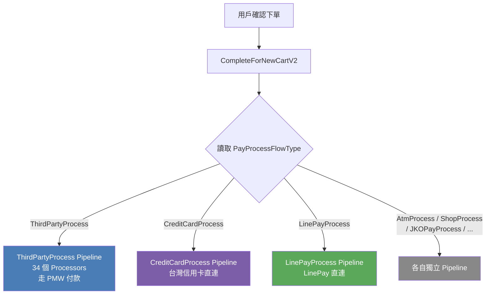
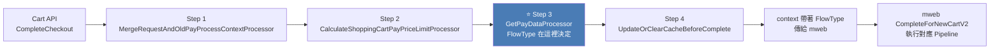
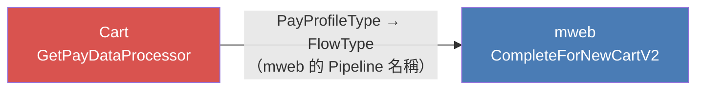
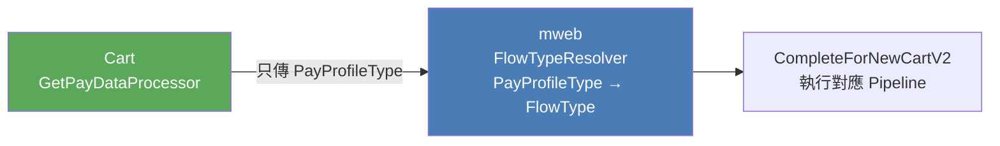
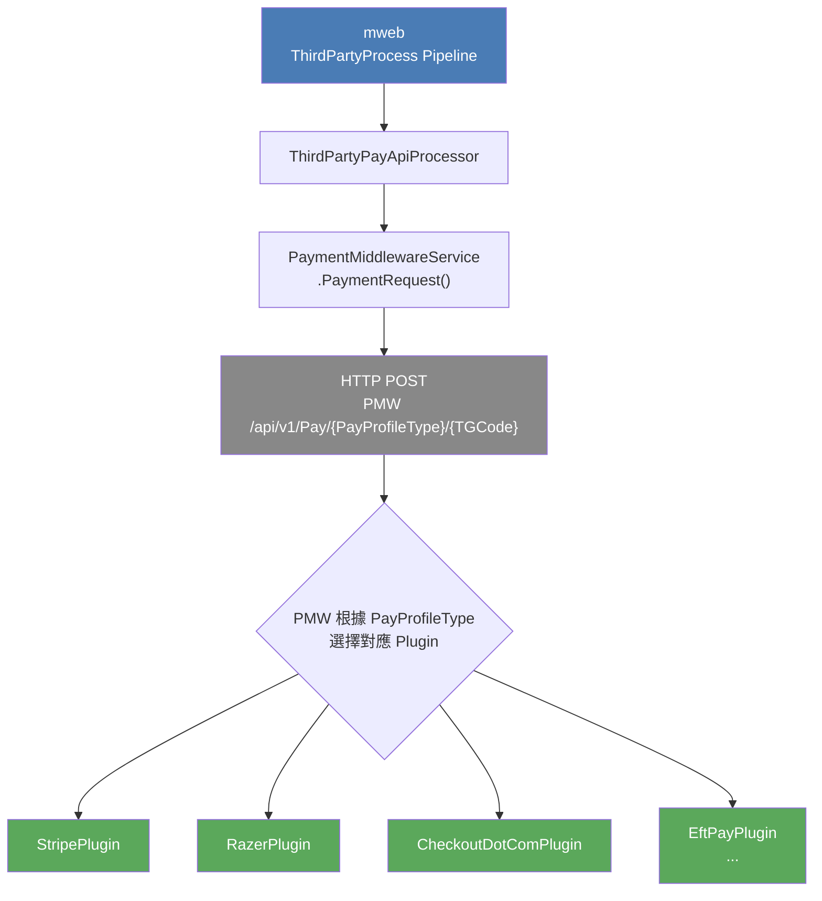
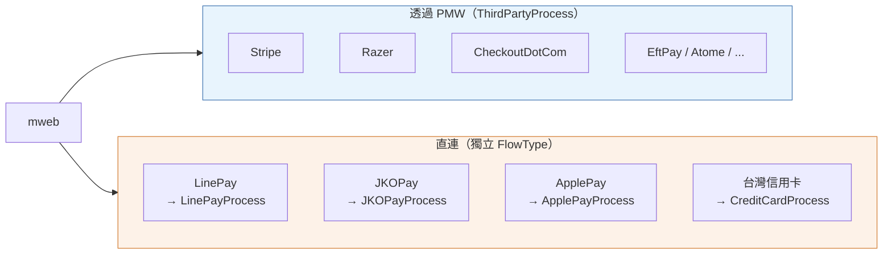



<!-- tab FlowType 是什麼？-->

`PayProcessFlowType` 是 mweb 下單流程的 **Pipeline 路由鍵**

用戶按下確認下單後，`CompleteForNewCartV2` 做的第一件事就是讀取 `context.PayProcessFlowType`，然後決定要跑哪一套 Processor Pipeline

**FlowType 一旦決定，後面這些全部跟著走：**

- 跑哪些 Processor（每條 Pipeline 組成完全不同）
- 用哪種方式呼叫金流 API（直連 / 轉發 PMW）
- 付款失敗、3D 驗證、Redirect 的處理方式
- Callback / QueryPayment 的接收路徑

<!-- endtab -->

<!-- tab FlowType 在哪裡被決定？-->

**Cart 專案**的 `GetPayDataProcessor`，在用戶按下結帳的最前期就設定好了

`GetPayDataProcessor` 的邏輯：

1. 讀購物車的 `SelectedCheckoutPayTypeGroup.StatisticsTypeDef`（用戶選的付款方式）
2. 解析成 `PayProfileType`（e.g. `CreditCardOnce_Stripe`）
3. switch `PayProfileType` → 設定 `PayProcessFlowType`

## 這個設計的問題：Cart 洩漏了對 mweb 的認知

`FlowType` 的語意是「mweb 要跑哪條 Pipeline」，這是 mweb 的內部實作細節。但現在 **Cart 的 GetPayDataProcessor 卻持有這份 mapping**，代表：

- Cart 必須知道 mweb 有哪些 Pipeline 名稱
- mweb 新增或重構 Pipeline 時，Cart 也要跟著改
- 兩個服務之間產生了隱性的結構耦合

## 改善方向：Cart 只傳語意，FlowType 由 mweb 自己推導

`PayProfileType` 是業務語意（用戶選了什麼付款方式），`FlowType` 是實作語意（mweb 要走哪條路）。這兩個概念應該在 **mweb 的邊界內完成轉換**。

**遷移步驟（不破壞現有行為）：**

1. **mweb 新增 FlowTypeResolver**，在 `CompleteForNewCartV2` 入口自行推導 FlowType，忽略 request 帶進來的值
2. **確認行為一致**後，Cart 的 `GetPayDataProcessor` 移除 switch → FlowType 那段
3. **清理 API Contract**，將 `PayProcessFlowType` 從 request DTO 移除

改完後，mweb 的 Pipeline 結構變成純粹的內部實作，Cart 只需要知道「用戶選了什麼付款方式」即可

## FlowType 全貌

| FlowType | 代表付款方式 | 性質 |
|:---|:---|:---:|
| `ThirdPartyProcess` | Stripe、Razer、CheckoutDotCom、AsiaPay、KPay、Cybersource、EftPay、SwiftPass、Atome、2C2P、QFPay、PayMe、LinePay（新）… | PMW 統一抽象層 |
| `CreditCardProcess` | CreditCardOnce、CreditCardInstallment（台灣） | 直連 |
| `LinePayProcess` | LinePay（舊） | 直連（逐步棄用） |
| `JKOPayProcess` | 街口支付 | 直連 |
| `ApplePayProcess` | Apple Pay（TW） | 直連 |
| `GooglePayProcess` | Google Pay（TW） | 直連 |
| `GlobalPayProcess` | GlobalPay | 直連 |
| `CathayPayProcess` | 國泰 Pay | 直連 |
| `PXPayProcess` | 全聯 PXPay | 直連 |
| `AfteePayProcess` | Aftee | 直連 |
| `icashPayProcess` | icash Pay | 直連 |
| `EasyWalletProcess` | 悠遊付 | 直連 |
| `PoyaPayProcess` | 全聯 Poya Pay | 直連 |
| `AtmProcess` | ATM 轉帳 | 直連 |
| `ShopProcess` | 超商取貨付款 | 直連 |
| `CashOnDeliveryProcess` | 貨到付款 | 直連 |
| `FreeOfChargeProcess` | 免費訂單 | 特殊 |
| `CustomOfflinePaymentProcess` | 自訂離線付款 | 特殊 |

<!-- endtab -->

<!-- tab 為什麼 PaymentMiddleware 的金流都走同一個 ThirdPartyProcess-->

Stripe、Razer、CheckoutDotCom、EftPay、Atome 是完全不同的公司和 API，但它們在 mweb 眼中都走同一條 `ThirdPartyProcess`。

**關鍵在於 mweb 不直接和這些 provider 說話，中間隔著 PaymentMiddleware（PMW）這一層。**

PMW 的職責就是**抹平各家金流 API 的差異**。mweb 只需要三件事：

1. 知道「這筆要走 PMW」
2. 把 `PayProfileType` 傳給 PMW（讓 PMW 選正確的 Plugin）
3. 處理 PMW 回傳的統一結果格式（`ReturnCode`）

所以 mweb 不需要為每個 PMW provider 各自建一套 Pipeline。`ThirdPartyProcess` 就是「**委託 PMW 處理**」的統一代名詞

<!-- endtab -->

<!-- tab 為什麼其他金流反而有自己獨立的 FlowType？-->

獨立 FlowType 的金流有一個共同特點：**它們不走 PMW，mweb 自己負責與對方的協議**

這些通常是在 PMW 架構成熟前就已整合的直連方式，每家差異太大：

- `LinePay` — 有自己的 SDK 與 Redirect 機制
- `JKOPay` — 有自己的訂單建立 → 付款 → Callback 協議
- `ApplePay` / `GooglePay`（TW）— 走 TapPay SDK，需要特定的 Prime 驗證流程
- `GlobalPay` — 多種付款子類型（信用卡 / 網路銀行 / 電子錢包），各需獨立 Processor

因為每條流程的 Processor 組成和 API 呼叫邏輯都不同，拆成獨立 FlowType 讓每條路徑可以**完全獨立維護、互不影響**。

<!-- endtab -->

<!-- tab summary-->

<!-- endtab -->


