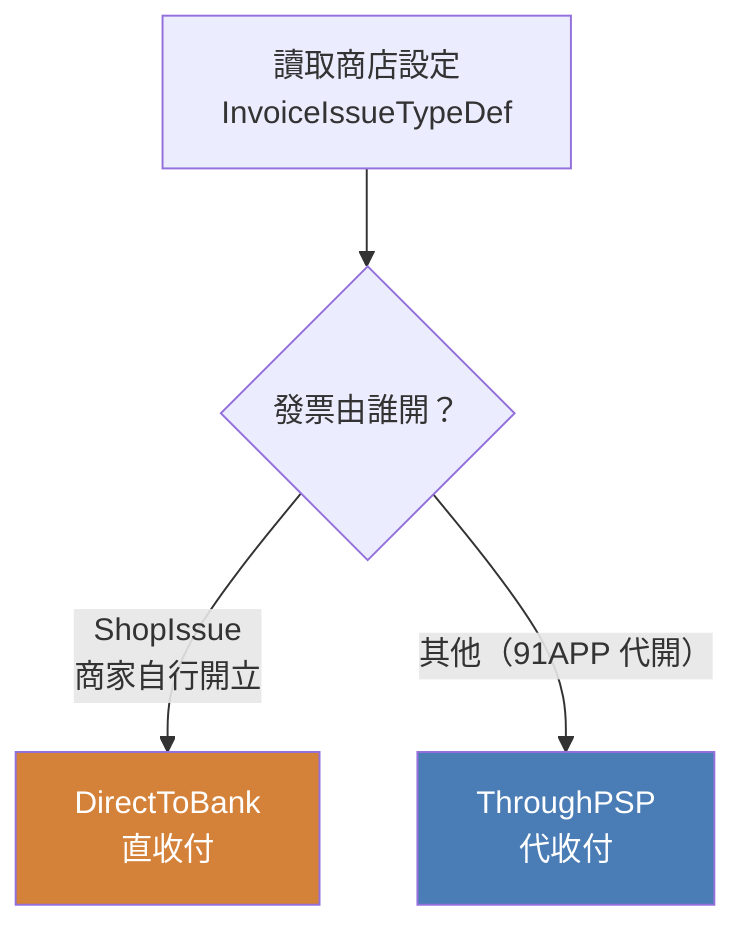
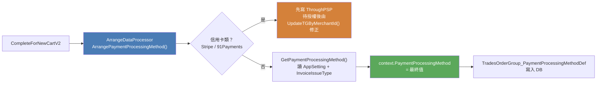
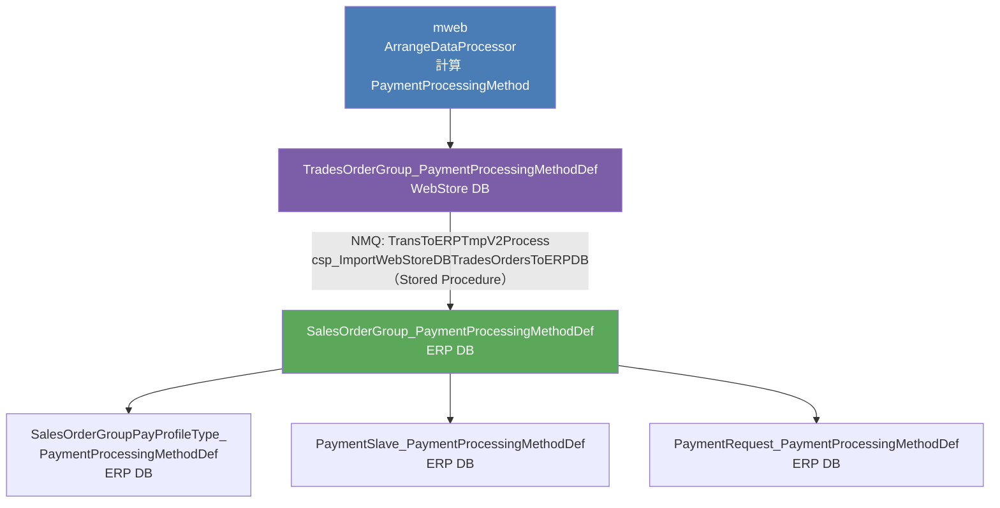
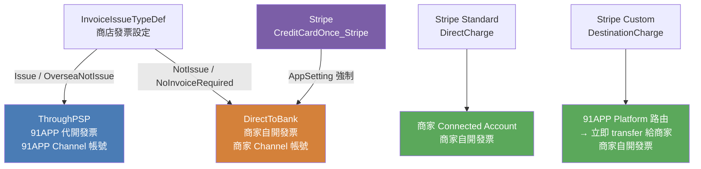




<!-- tab PaymentProcessingMethod在說什麼？-->


> **這筆錢，是先流過 91APP 的信託帳戶，還是直接進商家的銀行？**


```csharp
public enum PaymentProcessingMethodEnum
{
    /// <summary>直收付 — 錢直接進商家銀行</summary>
    DirectToBank,

    /// <summary>代收付 — 錢先進 91APP 信託帳戶</summary>
    ThroughPSP
}
```

這個決策影響的不只是金流 API 的選擇，更影響到**發票開立方**、**財務對帳範圍**，以及整個 ERP 的付款單計算邏輯


## 兩條路的核心差異

| 維度 | ThroughPSP（代收付） | DirectToBank（直收付） |
|:---|:---|:---|
| 錢的流向 | 消費者 → 91APP 信託 → 商家 | 消費者 → 商家銀行（直接） |
| 發票開立方 | **91APP 代開** | **商家自行開立** |
| ERP 付款單 | ✅ 納入對帳 | ❌ 完全跳過 |
| 退款申請 | 91APP 處理 | 商家自行處理 |
| 適用場景 | 多數電商模式 | 商家自有金流（如特定第三方帳號）|


## 判斷依據：發票開立方式

核心判斷邏輯在 `ArrangeDataProcessor.DetermineDefaultPaymentProcessingMethod()`：



白話說：**只要發票是 91APP 開的，錢就走 91APP 信託（代收付）**。商家自己開發票代表他們有自己的金流帳號，91APP 就不介入資金流動


<!-- endtab -->


<!-- tab 計算時機：ArrangeDataProcessor-->


在 mweb 建單流程（`CompleteForNewCartV2`）的 Processor Pipeline 中，`ArrangeDataProcessor` 負責計算並寫入 context：




## 信用卡的特殊兩階段（僅限 91Payments）

**91Payments**（`CreditCardOnce` / `CreditCardInstallment`）因為授權後才能拿到 `MerchantId`，所以：

1. 建單時先填 `ThroughPSP`（預設）
2. 授權成功後，`AuthorizedService` 取得 `Authorized_MerchantId`，呼叫 `PaymentProcessingMethodService.UpdateTGByMerchantId()` 根據實際 MerchantId 重新判斷並更新


<!-- endtab -->


<!-- tab 用哪個 API 帳號-->


## 對 LinePay / JKO / EasyWallet 的影響

這三種付款方式依賴 `PaymentProcessingMethod` 來決定**用哪個 API 帳號**：

```csharp
// 偽碼
if (paymentProcessingMethod == ThroughPSP)
    apiKey = config.NineYi91AppChannelKey;   // 91APP 自己的 Channel
else
    apiKey = config.ShopOwnChannelKey;       // 商家自己的 Channel
```

這是整個欄位**在金流 API 呼叫層面最直接的影響**：代收付用 91APP 的 API 帳號，直收付用商家自己的 API 帳號


<!-- endtab -->


<!-- tab 資料流向-->


## 怎麼流到 ERP？




## NMQ 搬運機制

WebStore 的 NMQ（`TransToERPTmpV2Process`）透過 Stored Procedure `csp_ImportWebStoreDBTradesOrdersToERPDBSourceTablesByOrderId_Mall` 將 TradesOrder 資料搬到 ERP 暫存表，再由 `TransToERPV2` Job 寫入正式 ERP DB


<!-- endtab -->


<!-- tab ERP 怎麼用這個欄位？-->


ERP 對 `PaymentProcessingMethod` 的使用集中在**財務邏輯**，有三個核心場景。

在看程式碼之前，先理解這兩份財務憑證的業務用意：


## 付款單（PaymentSlave）— 91APP 撥款給商家的憑證

**情境**：消費者用 LinePay 代收付結帳，錢先進 91APP 信託帳戶。出貨後，91APP 要把這筆錢「還」給商家。

```
消費者 → 91APP 信託帳戶（代收）
                  ↓ 出貨確認後
            付款單（PaymentSlave）= 91APP 要撥多少錢給商家的憑證
                  ↓
            商家銀行帳戶（撥款）
```

付款單本質是**91APP 對商家的應付帳款憑證**，只有 91APP 代收過這筆錢才會產生。


## 請款單（PaymentRequest）— 財務對帳的 CSV 報表

**信用卡的「請款」**（Capture）是另一個概念：信用卡授權（Auth）後，銀行只是預留額度，還沒真正扣款；出貨後才向銀行正式**請款**（Capture），錢才真的動。

```
授權（Auth）  →  銀行預留額度，不扣款
請款（Capture）→  正式向銀行請求扣款

// TapPay / 91Payments 設定：-1 = 手動請款（出貨後才 Capture）
DelayCaptureDays = -1
```

ERP 的「請款單」是財務匯出的 **CSV 對帳報表**，含括退款申請與請款紀錄，讓財務人員核帳用


## 付款單對帳 — 直收付直接排除

直收付的錢沒有流過 91APP 信託，91APP 從未持有這筆錢，自然沒有「要還給商家」的義務 → 完全跳過付款單計算。

```csharp
// PaymentManager.cs
foreach (var paymentSlave in paymentV2.PaymentSlaveList)
{
    // 若直收付則跟付款單無關，略過
    if (paymentSlave.PaymentSlave_PaymentProcessingMethodDef != "ThroughPSP")
    {
        continue;
    }
    // ... 後續才計入付款單金額
}
```


## 請款單 / 退款申請匯出 — 帶入 CSV 欄位

```csharp
// RefundRequestManager.cs — 退款申請 CSV 匯出
PaymentRequest_PaymentProcessingMethodDef = a.PaymentRequest_PaymentProcessingMethodDefDesc
```

退款申請和請款單的匯出 CSV 最後都有一欄「**代收付/直收付**」，讓財務在對帳時清楚知道這筆錢的資金流向，決定要不要跟 91APP 的信託帳戶對帳。


<!-- endtab -->


<!-- tab 發票、直代收、Stripe 的三角關係-->


## Stripe 的特殊性：跳脫這個邏輯

Stripe（`CreditCardOnce_Stripe`）完全繞過上述判斷，由 AppSetting 強制指定：

```xml
<add key="Prod.PayType.DirectToBank"
     value="CreditCardOnce_Stripe,..." />
```

不管商店的 `InvoiceIssueTypeDef` 是什麼，Stripe 永遠是 `DirectToBank`。


## DirectCharge vs DestinationCharge 的發票影響

| Stripe 帳號類型 | payment_flow | Charge 建在哪 | 發票開立方 |
|:---|:---|:---|:---|
| Standard | DirectCharge | **商家 Connected Account** | 商家自行開立 |
| Custom | DestinationCharge | **91APP Platform**（技術路由）| 商家自行開立 |

兩種模式下發票都是商家開，原因如下：

- **DirectCharge**：Charge 本身就在商家帳戶，商家是法律上的收款方，自然自開發票。
- **DestinationCharge**：雖然 Charge 建在 91APP Platform，但**資金立即 transfer 給商家**，91APP 只收 `application_fee`（手續費），從未持有貨款。法律上的銷售行為仍屬商家，發票應由商家開立。

```
DestinationCharge 的發票邏輯：

  誰持有貨款？   → 商家（Connected Account）
  誰是銷售方？   → 商家
  誰開發票？     → 商家
  91APP 角色？   → 平台技術服務提供者（收 application_fee）
```


## 三者關係總覽




<!-- endtab -->


<!-- tab 發票、直代收、Stripe 的三角關係-->


<!-- endtab -->



