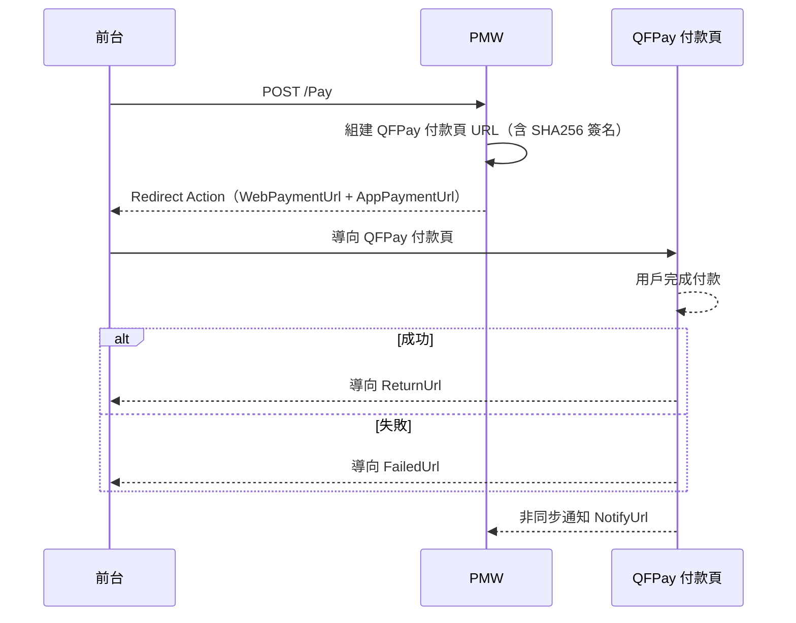
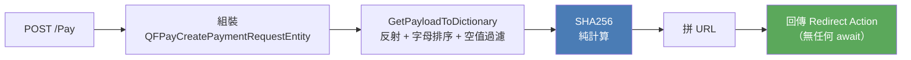
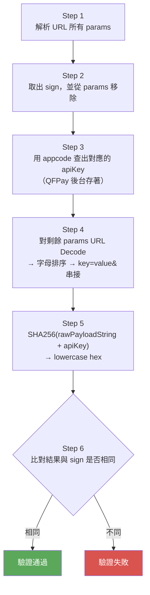
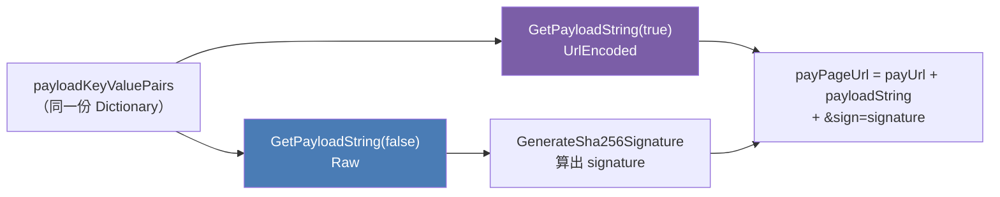
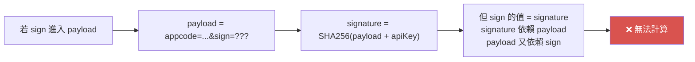




<!-- tab Pay() 是純計算函式 — 整個流程沒有任何網路 IO-->

與 Cybersource 類似，QFPay 的 Pay **不直接呼叫 API**。PMW 只負責組建帶有 SHA256 簽名的付款頁 URL，並回傳 `Redirect` action 讓前台導向。



與大多數金流串接不同，QFPay 的 Pay 步驟**完全不走網路**。整個流程就是「收到請求 → 組裝 Entity → 計算簽名 → 拼 URL → 回傳」，全程在記憶體中完成，沒有任何 `await`：



這是 **Hosted Payment Page** 模式的本質：我方後端不初始化交易，只是「組出一個合法的付款入口 URL」，讓瀏覽器帶著這個 URL 跳轉過去，消費者在 QFPay 頁面完成付款。


**這個設計的優點：**
- 極低延遲：不受 QFPay 服務狀態影響，Pay 永遠快速回應
- 無 Timeout 風險：不會因 QFPay API 慢而讓消費者等待
- 易測試：Pay 邏輯可以完全 unit test，不需要 mock HTTP


**這個設計的代價：**
- 失敗無感：Pay 永遠成功（只要能算出 URL）
- 錯誤延後：簽名錯誤、參數錯誤要等消費者打開 URL 後才發現（QFPay 頁面回傳 QFSign_Error）
- 可觀測性差：無法在 Pay 時期知道 QFPay 是否可用


> 監控重點因此從「Pay API 成功率」轉移到「付款頁面的 QFSign_Error 發生率」與「QueryPayment 的成功率」。
> 這是與 Stripe、Cybersource 等 API-first 模式金流截然不同的觀測維度。


<!-- endtab -->

<!-- tab 雙金鑰認證設計 — appcode（公開識別）vs apiKey（私密簽名）-->


QFPay 的認證設計將「身份識別」與「請求完整性驗證」分成兩把 Key，各司其職：

| Key | 出現位置 | 目的 | 可見性 |
|:---|:---|:---|:---|
| `X-Api-Code`（appcode） | payload 的 `appcode` 欄位，進入 URL | 識別是哪一個商戶 | **公開**（出現在 URL） |
| `X-Api-Key`（apiKey） | 只用於 SHA256 計算尾端，不進 payload | 防偽造，驗證請求完整性 | **私密**（不出現在 URL） |

QFPay 收到付款頁請求後的驗證邏輯：



**appcode 進入 payload 並被簽名的意義**：這樣可以防止「替換 appcode 攻擊」。若攻擊者截取到一個合法 URL，嘗試把 appcode 換成自己的，簽名會立刻失效，因為 sign 是針對「含原始 appcode 的 payload + 原始 apiKey」計算的


<!-- endtab -->


<!-- tab 雙 Payload String 設計 — Raw（簽名用）vs UrlEncoded（URL 用）-->


程式碼中有一段乍看之下很費解：

```csharp
var payloadKeyValuePairs       = GetPayloadToDictionary(qfPayPayload);

// 組了兩次，只差一個 bool
var payloadStringWithoutEncode = GetPayloadString(payloadKeyValuePairs, false); // Raw
var payloadString              = GetPayloadString(payloadKeyValuePairs, true);  // UrlEncoded

var signature  = GenerateSha256Signature(payloadStringWithoutEncode, apiKey); // Raw 算簽名
var payPageUrl = $"{payUrl}{payloadString}&sign={signature}";                 // Encoded 組 URL
```

同樣一份 Payload，為什麼要組兩次？

**這是傳輸空間與計算空間的分離。**

URL 要能被瀏覽器安全傳遞，所有特殊字符（`:`、`/`、`=`、`&`）都必須被 URL Encode。但簽名計算需要的是原始字符串，不能是 Encoded 過後的版本。兩者的差異如下：

| | Raw String（簽名計算用） | UrlEncoded String（URL query string 用） |
|:---|:---|:---|
| `return_url` | `https://shop.91dev.tw/V2/...?shopId=2&k=xxx` | `https%3A%2F%2Fshop.91dev.tw%2FV2%2F...%3FshopId%3D2%26k%3Dxxx` |
| `txdtm` | `2024-06-18 13:00:00` | `2024-06-18+13%3A00%3A00` |
| 特徵 | `:`、`/`、空格皆保留原樣 | 所有特殊字符皆被編碼 |




**為什麼 sign 放在最末端、且不進入簽名計算？**

這是避免循環依賴的必要設計：



sign 必須在 payload 排序完成、簽名計算結束之後才能附加。這也意味著 QFPay 在驗證時必須先取出 sign，再對剩餘欄位計算，不能把 sign 也納入驗算。


**隱藏的 UrlEncode 對稱性風險：**

PMW 用 `WebUtility.UrlEncode()` 編碼，空格會被編碼為 `+`。QFPay 在驗證時若把 `+` 解讀為 `%20`（URL Decode 的標準行為），則能還原成空格，驗簽成功。但若 QFPay 直接把 `+` 當成 `+`，Raw 字串就與我方計算的不同，驗簽永遠失敗。這個不對稱問題極難 debug


<!-- endtab -->


<!-- tab Spec-->


## URL

```
https://openapi-hk.qfapi.com/checkstand/#/?{qstring}
```


## Request Header（所有 REST API 通用）

```
Content-Type: application/x-www-form-urlencoded
X-QF-APPCODE: {apiCode}         ← 來自 header X-Api-Code
X-QF-SIGN: {sha256_signature}
X-QF-SIGNTYPE: SHA256
```


## Pay Payload 欄位對照

| QFPay 欄位 | 說明 | 來源 | 必填 |
|-----------|------|------|------|
| `appcode` | API 憑證 | header `X-Api-Code` | ✅ |
| `sign_type` | 簽名類型，固定 `"sha256"` | 硬碼 | ✅ |
| `paysource` | 付款來源，固定 `"91App_checkout"` | 硬碼 | ✅ |
| `txamt` | 付款金額（× 100 最小單位） | `request.Amount * 100` | ✅ |
| `txcurrcd` | 幣別（如 `HKD`） | `request.Currency` | ✅ |
| `out_trade_no` | 外部訂單號（TG Code） | `request.TradesOrderGroupCode` | ✅ |
| `txdtm` | 訂單時間（`yyyy-MM-dd hh:mm:ss`） | `ExtendInfo.OrderDateTime` | ✅ |
| `return_url` | 付款成功導向 URL | `ExtendInfo.ReturnUrl` | ✅ |
| `failed_url` | 付款失敗導向 URL | `ExtendInfo.FailedUrl` | ✅ |
| `notify_url` | 非同步通知 URL | `ExtendInfo.NotifyUrl` | ✅ |
| `goods_name` | 商品名稱（最大 64 字，不含特殊字元） | `ExtendInfo.GoodsName` | ✅ |
| `mchntid` | 代理商商戶識別碼（最大 16 字元） | `ExtendInfo.Mchntid` | ❌ |
| `txzone` | 時區（預設 `+0800`） | `ExtendInfo.TimeZone` | ❌ |
| `lang` | UI 語言（`zh-hk`/`zh-cn`/`en`） | `ExtendInfo.Lang` | ❌ |
| `expired_time` | QR Code 到期時間（分鐘，5~120） | `ExtendInfo.ExpiredTime` | ❌ |
| `checkout_expired_time` | 客戶端結帳到期時間（毫秒） | `ExtendInfo.CheckoutExpiredTime` | ❌ |


## Pay 回傳結構

```json
{
  "ReturnCode": "2003",
  "ReturnMessage": "付款頁面成功產出",
  "TransactionId": "",
  "Action": {
    "Action": "Redirect",
    "WebPaymentUrl": "https://o2-hk.qfapi.com/...?appcode=xxx&...&sign=abc123",
    "AppPaymentUrl": "https://o2-hk.qfapi.com/...?appcode=xxx&...&sign=abc123",
    "RedirectHttpMethod": "POST"
  },
  "ExtendInfo": {
    "paymantPageUrl": "https://o2-hk.qfapi.com/..."
  }
}
```


<!-- endtab -->



