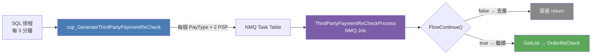
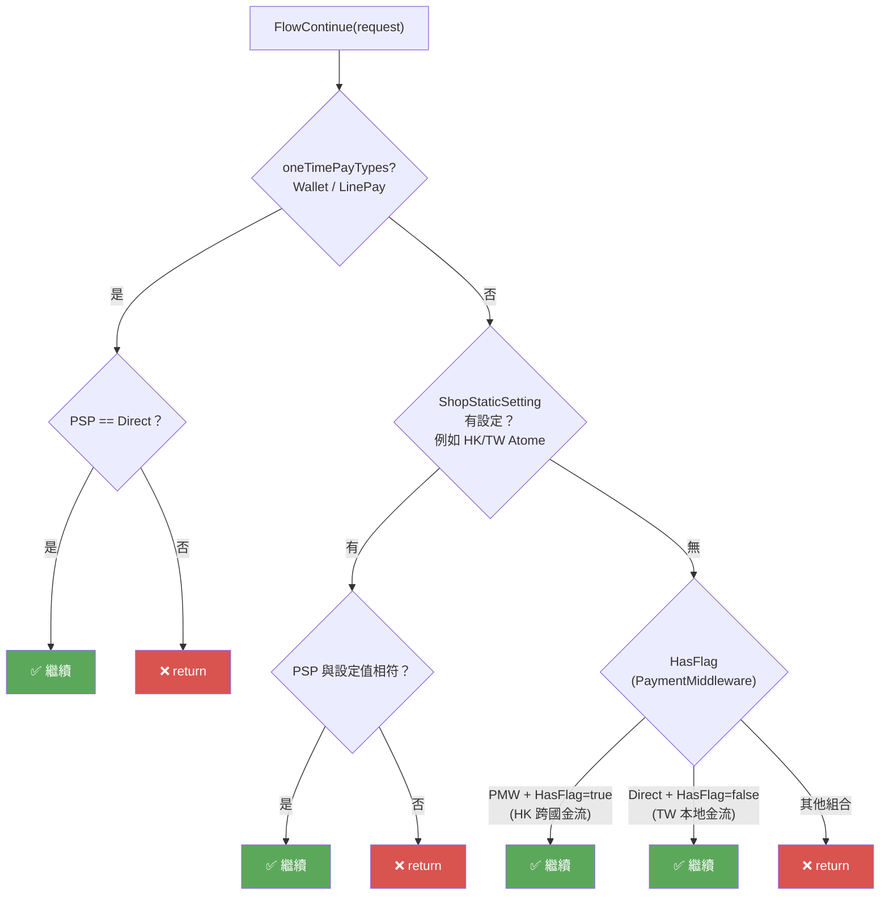
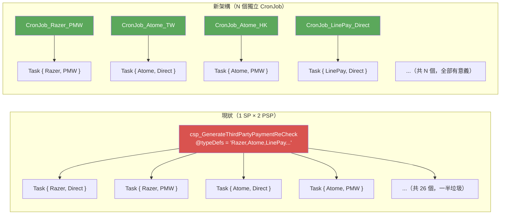




<!-- tab 觸發-->


消費者付款後，若路線一（PayChannelReturn）沒有成功回打（或回打時金流仍是 WaitingToPay），由 SQL 排程定期觸發 NMQ Job 在背景主動去查詢第三方付款狀態。

## 觸發機制

```bash
SQL 每 3 分鐘執行排程，傳入金流清單字串並觸發 csp：
  csp_GenerateThirdPartyPaymentReCheck
    └─ 撈取所有 WaitingToPay 狀態的 TradesOrderThirdPartyPayment
    └─ 每筆塞一個 NMQ Job 進 Task Table
```




> 為什麼每個 PayType 建兩個 Task？因為現行設計 SQL 不知道每個 PayType 實際走哪個 PSP，所以 Direct 和 PaymentMiddleware 都建，再靠應用層的 `FlowContinue()` 過濾掉不該跑的那一個。


<!-- endtab -->


<!-- tab Job 資訊-->


## 入口

```bash
NMQ Job   : ThirdPartyPaymentReCheckProcess
路徑      : SCM/Frontend/NMQV2/ThirdPartyPayment/ThirdPartyPaymentReCheckProcess.cs

呼叫      : POST /Internal/FinishPayment
Service   : PaymentMiddlewareReCheckService
路徑      : WebStore/Backend/BLV2/ThirdPartyPayment/PaymentMiddlewareReCheckService.cs
```

## 呼叫鏈

```bash
ThirdPartyPaymentReCheckProcess（NMQ Job）
  └─ FlowContinue()           # 判斷要用哪個 PSP 路線
  └─ GetList(WaitingToPay)
  └─ foreach OrderReCheck
        └─ POST /Internal/FinishPayment（PMW 路線）
              └─ TradesOrderPaymentService.FinishPayment(isFromWorker: true)
                    └─ PaymentMiddlewareService.QueryPayment()
                          └─ 依 ReturnCode 分流處理
```

## DoJob() 完整流程

```
ThirdPartyPaymentReCheckProcess.DoJob(taskInfo)
  │
  ├─ 1. 解析 TaskInfo.Data → TradesOrderThirdPartyPaymentReCheckEntity
  │        ThirdPartyPaymentType, StartTime, EndTime,
  │        IsOnlyCheckPaySuccessful, PaymentServiceProvider
  │
  ├─ 2. ResolveService(paymentType, paymentServiceProvider)
  │        → 取得對應的 IIThirdPartyPaymentServicve 實作
  │
  ├─ 3. FlowContinue(request)
  │        → false：log 並直接 return，不執行補查
  │
  ├─ 4. thirdPartyPaymentService.GetList(paymentType, startTime, endTime)
  │        → 撈出時間區間內仍在等待付款的訂單清單
  │
  └─ 5. foreach (item in list)
           try
             thirdPartyPaymentService.OrderReCheck(item, isOnlyCheckPaySuccessful)
           catch CancelRequestException → continue（訂單已被取消，跳過）
           catch Exception              → 加入 errorList

       6. 若 errorList 有資料 → 對 errorList 中每筆再執行一次 OrderReCheck（Redo）
```

## Task Data 格式

| 欄位 | 說明 |
|:---|:---|
| `ThirdPartyPaymentType` | 付款方式名稱（字串，對應 enum） |
| `PaymentServiceProvider` | PSP 類型：`PaymentMiddleware` 或 `Direct` |
| `StartTime` | 撈取訂單的起始時間 |
| `EndTime` | 撈取訂單的結束時間 |
| `IsOnlyCheckPaySuccessful` | 是否只確認付款成功（傳入 OrderReCheck） |

## PayType → Service 對照表

| PayType | Service 實作 |
|:---|:---|
| CathayPay | CathayPaymentService |
| JKOPay | JKOPaymentService |
| PXPay | PXPayPaymentService |
| Aftee | AfteePayPaymentService |
| icashPay | ICashPayV2PaymentService |
| EasyWallet | EasyWalletPaymentService |
| PoyaPay | PoyaPayPaymentService |
| **PaymentMiddleware** | **PaymentMiddlewareReCheckService**（跨國金流統一入口）|
| Atome | AtomePaymentService |
| PXPayPlus（全支付）| PXPayPlusPaymentService |
| FamilyMartOnlinePay | FamilyMartOnlinePayService |
| **Wallet、PlusPay、OpenWallet、RazerPay、LinePay、OPPayLater** | **ThroughN1PaymentService**（直接查 Nine1Payment）|


<!-- endtab -->


<!-- tab PSP 路由-->

同一個 PayType 可能在不同環境（TW / HK）使用不同的 PSP，例如：

- **TW Atome** → `PSP = Direct`（直接呼叫 Atome API）
- **HK Atome** → `PSP = PaymentMiddleware`（透過 PMW）

SQL 排程不知道這個差異，所以對每個 PayType 都建兩個 Task（Direct + PMW），由 NMQ Job 的 `FlowContinue()` 決定哪一個繼續執行、哪一個直接 return。


## FlowContinue 三層判斷



**第一層：oneTimePayTypes（hardcode）**
```
PaymentServiceProvider == "Direct" → true（繼續）
PaymentServiceProvider == 其他    → false（結束）
```

**第二層：ShopStaticSetting（Atome 跨市場）**
```
ShopStaticSetting.Value == request.PaymentServiceProvider → true
不符合 → false
```

**第三層：HasFlag 判斷（其他 PayType）**

| PSP | PayType 有 PaymentMiddleware flag？ | 結果 |
|:---:|:---:|:---:|
| PaymentMiddleware | ✅ 是 | true（HK 跨國金流）|
| Direct | ❌ 否 | true（TW 本地金流）|
| PaymentMiddleware | ❌ 否 | false |
| Direct | ✅ 是 | false |


## OrderReCheck 兩種 PSP 各自實作


#### PaymentMiddlewareReCheckService（跨國金流）

```
OrderReCheck(payment, isOnlyCheckPaySuccessful)
  │
  ├─ 組裝 InternalFinishPaymentRequestEntity
  │    ShopId, MemberId, TradesOrderGroupCode, UniqueKey, PayProfileType
  │
  ├─ POST /Internal/FinishPayment（透過 IPayChannelApiHttpClient）
  │    實際的 QueryPayment + 狀態分流在 PayChannel 端執行
  │
  └─ Thread.Sleep(250ms)（批次間流控）
```

**GetList 撈取條件：** `Status = WaitingToPay`


#### ThroughN1PaymentService（Nine1Payment 直呼叫）

```
OrderReCheck(payment, isOnlyCheckPaySuccessful)
  │
  ├─ GetPaymentDetails(transactionId, shopId)
  │    └─ 呼叫 Nine1Payment API（最多 retry 3 次）
  │
  ├─ IsSuccessfulOrder(response)
  │    CaptureStatus == Success → true
  │    CaptureStatus == Processing/Unprocessed/ProcessRequested
  │      └─ RecordStatus == Pending/Failed/Canceled/Processing → false
  │      └─ 其他 RecordStatus → true
  │
  ├─ [成功] FinishPayProcess → UpdateThirdPartyPayment → CreateTransferTask → TakeSnapShot
  │    OPPayLater：額外更新分期資訊（InstalmentInfo）
  │    LinePay：額外更新 PaymentProcessingMethodDef
  │
  └─ [失敗] CancelRequest + CancelTradesOrderGroup → Status = Timeout
       OPPayLater 專審中（Processing）且已逾期 → 額外建立 CancelThirdPartyPaymentJob
```

**GetList 撈取條件：** `Status = New | WaitingToPay`（比 PMW 多撈 New 狀態）


<!-- endtab -->


<!-- tab 改善策略-->


## 前提：時間窗口由呼叫端傳入是對的

NMQ Job 被排入佇列後不一定立即執行，若由 NMQ Job 自己計算時間窗口，實際執行時基準點會偏移：

```
SQL Job 建立 Task：08:00  → startTime = 06-27 08:00（正確基準）
NMQ 排隊延遲執行：08:12  → 若自己算則 startTime = 06-27 08:12（偏移）
```

`startTime` / `endTime` 由 SQL Job 固定傳入是正確設計，應予以保留


## 新架構：每個 PayType 一個獨立 CronJob




每個 CronJob SQL 邏輯極簡，無 WHILE 迴圈、無 COUNT、無字串拆解：

```sql
-- CronJob_Razer_PMW（只負責 Razer）
DECLARE @startTime DATETIME = DATEADD(DAY, -3, GETDATE());
DECLARE @endTime   DATETIME = DATEADD(MINUTE, -3, GETDATE());

INSERT INTO Task ([Task_Data], ...)
VALUES (CONCAT('{"ThirdPartyPaymentType":"Razer","PSP":"PaymentMiddleware","startTime":"',
               FORMAT(@startTime,'yyyy-MM-dd HH:mm:00'),
               '","endTime":"',
               FORMAT(@endTime,'yyyy-MM-dd HH:mm:00'), '"}'), ...)
```


## 現狀 vs 新架構對比

| 項目 | 現狀 | 新架構 |
|:---|:---|:---|
| DB 查詢次數（MY 13 PayType）| 26 次 | **13 次** |
| Task 數量/次 | 26（一半垃圾）| **N（全部有意義）** |
| FlowContinue | 需要（三層複雜規則）| **不需要（直接消失）** |
| @typeDefs 字串維護 | 兩處，容易不同步 | **不存在** |
| PayType 並行處理 | ✅ 理論上可以 | **✅ 天然並行** |
| 一個 PayType 卡住影響其他 | 無影響 | **完全隔離** |
| 各 PayType 排程頻率 | ❌ 統一 3 分鐘 | **✅ 各自獨立設定** |
| 新增 PayType 改動點 | SP + DB Job + NMQ DI | **CronJob + NMQ DI** |
| Atome TW/HK 區分 | 靠 ShopStaticSetting 全域設定 | **部署不同 CronJob 自然分開** |

> 新架構的核心思想：讓「CronJob 的存在」本身就是路由決策，不再需要應用層過濾。


<!-- endtab -->


<!-- tab 設計缺點分析-->


## 缺點全覽

| 嚴重度 | 問題 | 根本原因 | 新架構下的影響 |
|:---:|:---|:---|:---|
| 🔴 | SQL 每 PayType 建立 2 Task，一半是垃圾 | 路由邏輯從 SQL 移到應用層，SQL 不知道 | ✅ 直接消滅 |
| 🔴 | FlowContinue 三層不同規則 | 歷史疊加，缺乏統一路由設計 | ✅ 整個方法消失 |
| 🔴 | oneTimePayTypes hardcode | PSP 切換路徑沒有統一設定機制 | ✅ 概念消失 |
| 🟠 | GetList status 不一致且無說明 | 介面契約不完整 | ⚠️ 需把 statusFilter 設計進 Task Data |
| 🟠 | ThroughN1 承擔多 PayType 特殊邏輯 | 共用 Service 回到 if-else 分岔 | ⚠️ 搭配 CronJob 拆分一起拆 Service |
| 🟠 | @typeDefs 字串維護兩個地方 | SP 設計缺乏型別約束 | ✅ SP 整個廢棄 |
| 🟡 | 流控只在 PMW Service | 兩個 Service 實作不對稱 | ⚠️ 統一放到 DoJob foreach 層 |
| 🟡 | retry 只 catch WebException | 例外處理範圍不完整 | ❌ 搭配 Service 拆分時一起補 |


<!-- endtab -->



