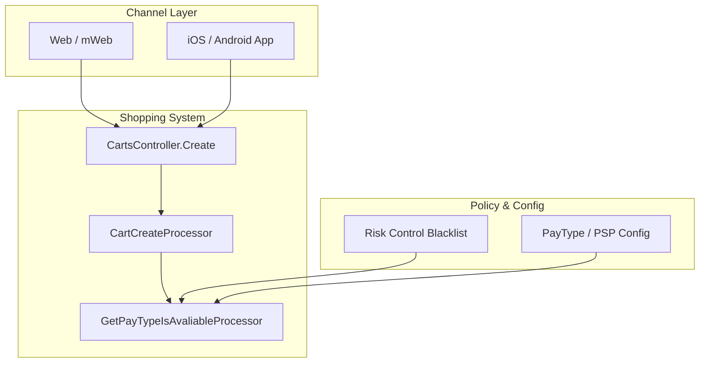
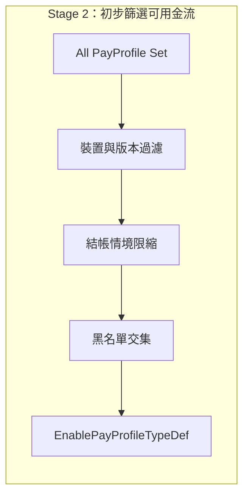



<!-- tab 系統架構 -->

System Guide

`carts/create` 金流裁決在系統中的位置

目前討論的是 `Shopping carts/create` 這條購物車建立與結帳前置裁決鏈。這條鏈的設計重點，是在正式進入促銷換價與金物流重算前，先完成一次可用付款方式的安全裁決。本文聚焦的位置在 `GetPayTypeIsAvaliableProcessor`，它位在 `CartCreateProcessor` 之後，位在初始金物流交集與後續重算之前。

🎯

<strong>本文討論定位</strong>

`GetPayTypeIsAvaliableProcessor` 的本質意義，是把「商店理論上可開放的付款方式」轉成「這一次請求在當下情境可安全放行的付款方式」。它輸出的 `EnablePayProfileTypeDef` 不是顯示資料，而是後續所有金物流裁決共同遵守的邊界條件。

<!-- endtab -->

<!-- tab 核心流程 -->

GetCart Pipeline · Stage 2

`GetPayTypeIsAvaliableProcessor` 在做的事

`carts/create` 進入促銷與金物流計算之前，會先跑一層「初步篩選可用金流」。這一層的目標只有一件事，產出當下情境真正可用的 `EnablePayProfileTypeDef`，避免前端看到可點選但其實不支援的付款方式。

目標輸出：`EnablePayProfileTypeDef`
執行位置：GetCart Pipeline 第二階段
核心策略：全集合起手，逐步剔除

ℹ️

<strong>初步篩選可用金流的本質邏輯</strong>

系統先把 `PayProfileTypeDefEnum.All` 當作初始集合，再用條件判斷逐步排除不符合的金流。主體用 `^=` 做位元剔除，特定情境則直接覆寫成純白名單。這個設計同時兼顧擴充性與安全性。

起點：`All` 全集合

➜

條件不符：`^=` 剔除位元

➜

特殊情境：直接覆寫白名單

➜

輸出：`EnablePayProfileTypeDef`

01

裝置與版本相容性過濾

像 `GooglePay`、`OpenWallet`、`FamilyMartOnlinePay`、`RazerPay`、`OPPayLater` 這類支付，會先檢查來源裝置與 `AppVersion`。版本不足或環境不符時，直接從集合中剔除。

02

結帳情境限縮

`Express` 情境直接限縮為 `CreditCardOnce | LinePay | PoyaPay`。`PayPage` 情境只保留 `CreditCardOnce`。這是後端硬裁決，不依賴前端偏好。

03

風控黑名單交集

若會員命中風控限制，系統把已過濾集合再與黑名單允許清單做交集，只保留風控允許的金流，風控規則優先度最高。

🧮

<strong>三種常見運算模式</strong>

<ul class="hl-checklist">
<li><strong>模式 A，負向排除：</strong>以 `All` 起手，條件不符就 `^=` 關閉位元。</li>
<li><strong>模式 B，白名單條件取反：</strong>先判斷是否在支援白名單內，不在白名單才剔除，例如 `ApplePay`。</li>
<li><strong>模式 C，定向覆寫：</strong>特殊結帳情境直接寫死白名單，略過一般剔除流程。</li>
</ul>

<!-- endtab -->

<!-- tab 裝置環境與 App 版本矩陣 -->

🧭

Section 1

重點一：裝置環境與 App 版本矩陣

版本檢查不是字串比較，而是把版號轉成 `System.Version` 再比對。判斷原則是 App 來源才做下限檢查，非 App 環境走安全放行。香港 `GooglePay` 另有最低版本門檻。

<table class="hl-table">
<tr><th>付款方式</th><th>環境限制</th><th>版本門檻</th><th>補充</th></tr>
<tr><td><code>GooglePay</code></td><td>Android App</td><td>市場條件版號門檻</td><td>HK 額外要求版本下限</td></tr>
<tr><td><code>OpenWallet</code></td><td>App 專用</td><td><code>24.1.0</code></td><td>低於門檻剔除</td></tr>
<tr><td><code>FamilyMartOnlinePay</code></td><td>App 專用</td><td><code>24.1.0</code></td><td>低於門檻剔除</td></tr>
<tr><td><code>RazerPay</code></td><td>App 專用</td><td><code>24.2.05</code></td><td>跨境市場常見</td></tr>
<tr><td><code>OPPayLater</code></td><td>App 專用</td><td><code>25.7.0</code></td><td>台灣市場先買後付</td></tr>
</table>

<!-- endtab -->

<!-- tab `PaymentServiceProvider` 解耦與版本分流 -->

Section 2

重點二：`PaymentServiceProvider` 解耦與版本分流

前端看到的付款方式代碼，與後端實際收單通道已解耦。系統依 `MinAppVer` 與 `MaxAppVer` 做版本區間比對，選出對應 PSP。若設定缺失或版本異常，退回 `FallbackProfiles`，確保流程不會中斷。

1

讀取 PSP 設定清單

讀取 `PaymentServiceProviderProfileEntity`，每筆定義一段可用版本區間。

2

版本區間比對

以 `currentVersion >= MinAppVer` 且 `currentVersion < MaxAppVer` 進行匹配。

3

無匹配時安全降級

改用 `FallbackProfiles`，在舊版與新版 PSP 之間自動回退。

<!-- endtab -->

<!-- tab `Express` 與 `PayPage` 的強制限縮 -->

Section 3

重點三：`Express` 與 `PayPage` 的強制限縮

這一段不是做交集，是直接覆寫。`Express` 目標是縮短授權路徑並降低中斷點。`PayPage` 目標是失敗訂單補款成功率，因此只留信用卡一次付。

<table class="hl-table">
<tr><th>結帳型態</th><th>策略</th><th>最終可用金流</th></tr>
<tr><td><code>Normal</code></td><td>走一般過濾規則</td><td>依商店與環境條件決定</td></tr>
<tr><td><code>Express</code></td><td>後端直接覆寫白名單</td><td><code>CreditCardOnce</code>、<code>LinePay</code>、<code>PoyaPay</code></td></tr>
<tr><td><code>PayPage</code></td><td>後端直接覆寫白名單</td><td><code>CreditCardOnce</code></td></tr>
</table>

<!-- endtab -->

<!-- tab 黑名單會員的最終交集限制 -->

Section 4

重點四：黑名單會員的最終交集限制

當風控回傳黑名單允許清單後，系統對目前可用集合做最後交集。實作是把不在允許清單中的項目移除，等同把高風險金流全面關閉。

🛑

<strong>交集實作重點</strong>

<code>enabledPayProfileTypeList.RemoveAll(i =&gt; allowPayTypeList.Contains(i) == false);</code>

這段保證黑名單限制一定生效，即使商店本身有開啟更多付款方式也不會放行。

<!-- endtab -->

<!-- tab 輸出 `EnablePayProfileTypeDef` 串接下游 -->

Section 5

重點五：輸出 `EnablePayProfileTypeDef` 串接下游

初步篩選結果會寫入 `context.Data.EnablePayProfileTypeDef`，後續處理器都以它為金流母集，不再回頭看未過濾的原始支付集合。

P1

分期計算處理器

先看 `EnablePayProfileTypeDef` 是否包含分期型態，再決定是否查期數與利率資料。

P2

初始金物流交集

把商品頁支援的付款方式，與 `EnablePayProfileTypeDef` 再做一次對齊，剔除環境不允許組合。

P3

整車重算與最終展示

後續重算流程在這個母集內再套入運費、促銷與折抵規則，輸出前端最終顯示清單。

📌

<strong>這份整理對應的範圍</strong>

<ul class="hl-checklist">
<li>第 1 點，初步篩選可用金流的集合運算邏輯。</li>
<li>第 2 點，裝置與版本相容性過濾。</li>
<li>第 3 點，`PaymentServiceProvider` 解耦與版本分流。</li>
<li>第 4 點，結帳情境限縮與黑名單交集。</li>
<li>第 5 點，結果寫回 `EnablePayProfileTypeDef` 並串接下游。</li>
</ul>

<!-- endtab -->


