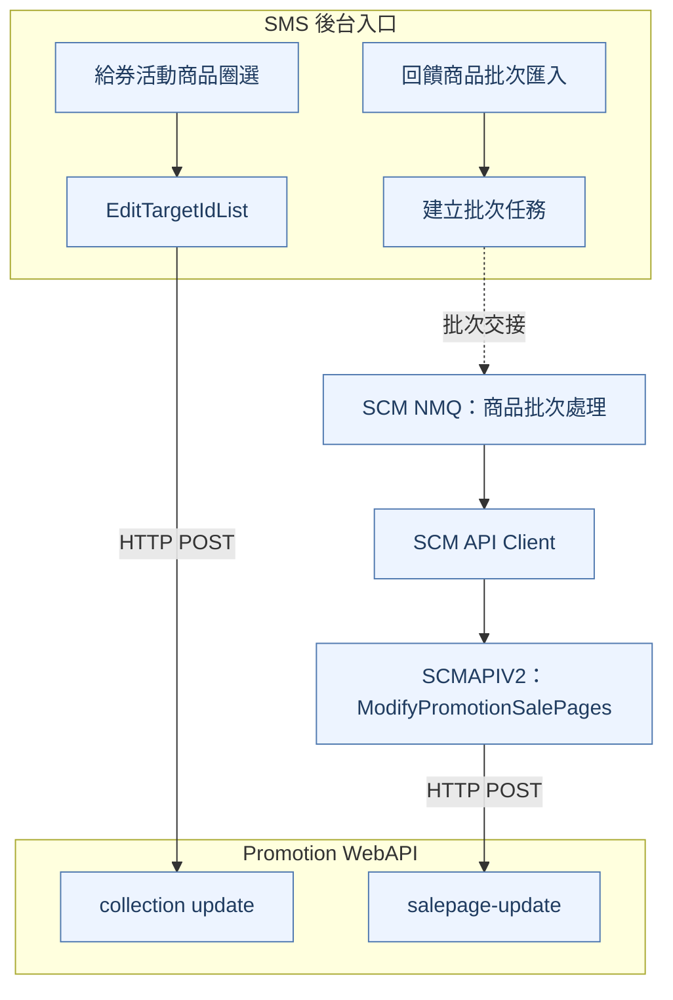
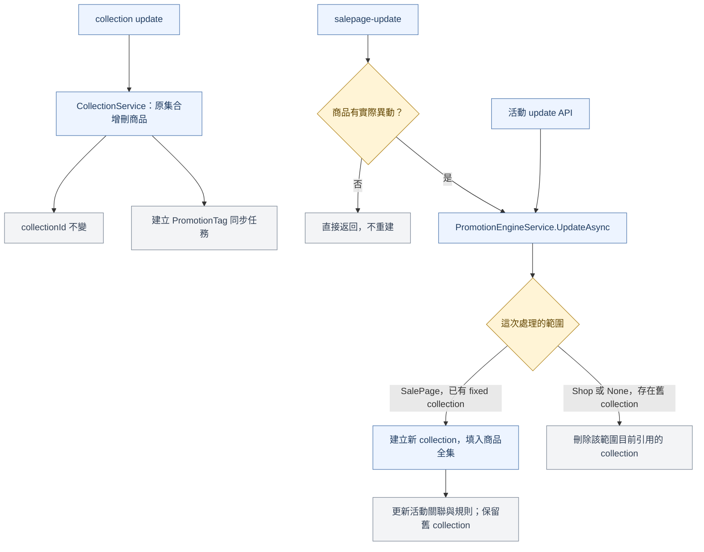

## 全貌鏈路

同樣是修改回饋給券活動的商品，從後台畫面圈選與從批次匯入進入，會走到不同的 API。畫面圈選直接修改原商品集合；批次異動會先比較商品清單，再更新活動引用的集合。

這裡的商品集合是 `collection`，由 `collectionId` 識別。以下聚焦 `RewardReachPriceWithCoupon` 已有指定／排除商品集合的流程；實際執行仍需通過 API 驗證。

### 呼叫來源：SMS 畫面與 SCM NMQ 批次

實線表示呼叫方向，虛線表示批次任務交接。第二條路徑由 SCMAPIV2 直接呼叫 Promotion WebAPI，SCM NMQ 是它的上游批次來源。

| 呼叫端 | 接收端與方法 | 完整 API 路徑 |
|---|---|---|
| SMS 前端 | SMS `EditTargetIdList` | `Api/PromotionEngine/EditTargetIdList` |
| SMS 後端 | Promotion WebAPI，`POST` | `/api/salepage-collections/update` |
| SCM API Client | SCMAPIV2，`POST` | `/v2/Promotion/ModifyPromotionSalePages` |
| SCMAPIV2 | Promotion WebAPI，`POST` | `/api/promotion-rules/salepage-update` |

SCM NMQ 由 `BatchModifyPromotionSalePageService.DoProcess` 呼叫 Client 的 `ModifyPromotionSalePages`。給券活動符合 SCMAPIV2 的轉送條件，因此進入 `salepage-update`。

### 處理分支：原集合增刪、重建與刪除

藍色為處理步驟，菱形為判斷，灰色為結果。圖中只展開給券活動的既有 fixed 商品集合，以及切換成全站或取消排除範圍的分支。

`CollectionService` 直接增刪原集合，並建立 `SyncCollectionToPromotionTagJob`。這條路徑不經過活動的 `UpdateAsync`。

`salepage-update` 會比較異動前後的商品清單。有實際新增或移除才進入 `UpdateAsync`；重複新增已有商品、移除不存在的商品，都不會在這個差異分支重建集合。

**活動儲存也能直接進入更新流程。** `POST /api/promotion-rules/update` 直接呼叫 `UpdateAsync`，沒有經過上述商品差異判斷。給券活動處理既有 fixed collection 時，即使商品清單相同，也會進入重建分支。`salepage-update` 呼叫 `UpdateAsync` 則是內部方法呼叫，不會再發送一次 HTTP update 請求。

範圍由「全站排除商品」改成「全站活動」時，排除類型從 `SalePage` 變為 `None`，會刪除目前排除範圍引用的集合。這與一般商品異動重建後保留舊集合，是不同分支。

純全站且尚無排除集合時，`salepage-update` 的新增操作會先建立排除範圍，再進入商品比較；這個前置情境不包含在上圖的既有集合主線中。

#### 鏈路來源對照

- SMS：`rewardCoupon.config.tsx:187` 的 `onUpdate` → `PromotionEngineService.EditTargetIdList:3641` → `Nine1PromotionWebApiHttpClient.UpdateCollectionSalepages:166`。
- SCM NMQ：`BatchModifyPromotionSalePageService.cs:182` → SCM Client `PromotionClient.cs:65`。
- SCMAPIV2：`PromotionService.ModifyPromotionSalePages:788` → `Nine1PromotionWebApiHttpClient.UpdateSalepageScopes:238`。
- Promotion WebAPI：`CollectionService.cs:76` 處理原集合；`PromotionEngineService.cs:421` 比較商品，`:2819` 分流範圍，`:3049` 重建集合。

來源為 2026-09-16 的「回饋給券活動商品異動與 Collection 生命週期鏈路分析」。以上為本機程式碼所確認的呼叫鏈，未比對線上部署版本。

